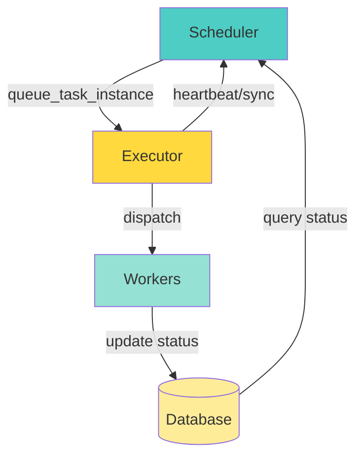
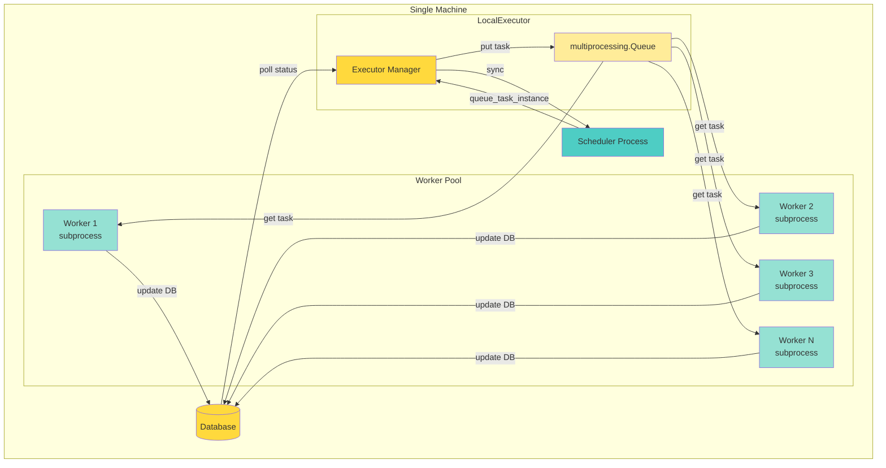
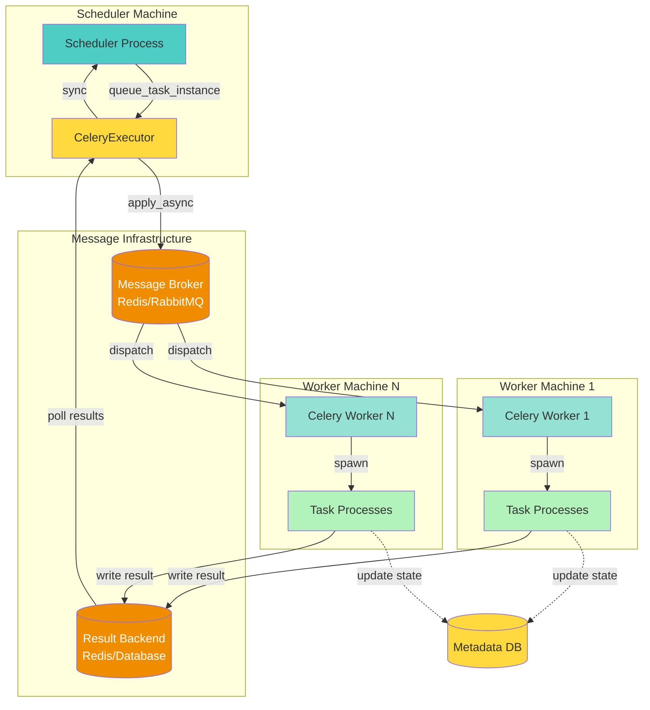
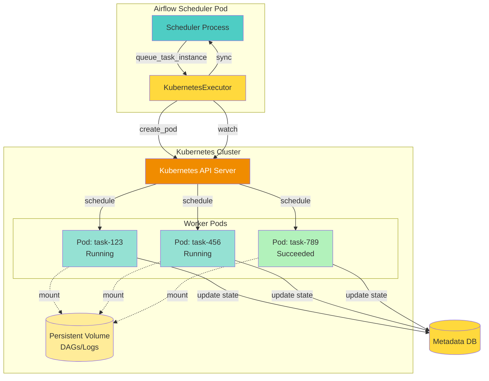
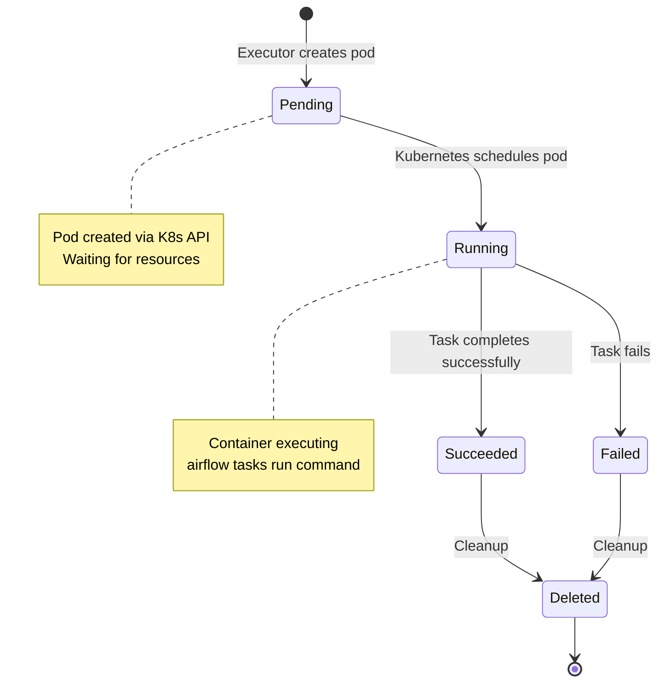
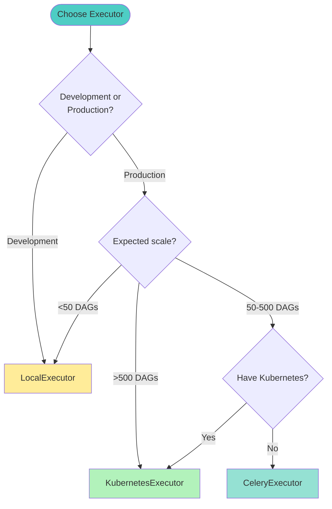

# Executors Comparison - Task Execution Across Different Backends

This document compares how different executors handle task execution in Apache Airflow, from queuing to completion.

## Table of Contents

1. [Executor Overview](#executor-overview)
2. [LocalExecutor](#localexecutor)
3. [CeleryExecutor](#celeryexecutor)
4. [KubernetesExecutor](#kubernetesexecutor)
5. [Comparison Matrix](#comparison-matrix)
6. [Selection Guide](#selection-guide)

---

## Executor Overview

Executors are responsible for running Airflow tasks. They receive task instances from the scheduler and execute them on workers.

### Common Architecture



### Base Executor Interface

**File**: `airflow-core/src/airflow/executors/base_executor.py`

```python
class BaseExecutor:
    def queue_task_instance(self, task_instance, ...) -> None:
        """Queue a task for execution."""
        
    def heartbeat(self) -> None:
        """Sync executor state, trigger tasks."""
        
    def sync(self) -> None:
        """Return completed tasks to scheduler."""
        
    def execute_async(self, key, command, ...) -> None:
        """Execute task asynchronously."""
```

---

## LocalExecutor

**File**: `airflow-core/src/airflow/executors/local_executor.py`

### Architecture

LocalExecutor runs tasks in parallel using Python's `multiprocessing` library on a single machine.



### Key Characteristics

**Advantages**:
- Simple setup (no external dependencies)
- Low latency (no network overhead)
- Good for development and small deployments
- Shared filesystem access

**Limitations**:
- Limited to single machine capacity (~32 parallel tasks)
- No high availability (single point of failure)
- Scaling limited by machine resources

**Use Cases**:
- Development environments
- Testing
- Small production workloads (<50 DAGs)


---

## CeleryExecutor

**File**: `providers/celery/src/airflow/providers/celery/executors/celery_executor.py`

### Architecture

CeleryExecutor distributes tasks across multiple worker machines using a message broker (Redis/RabbitMQ).



### Key Characteristics

**Advantages**:
- Horizontal scalability (add more worker machines)
- High availability (multiple workers)
- Queue-based routing (priority, resource-specific)
- Battle-tested (Celery is mature)

**Limitations**:
- Requires broker infrastructure (Redis/RabbitMQ)
- More complex setup and monitoring
- Network latency between components

**Use Cases**:
- Medium to large production deployments (50-1000 DAGs)
- Need for high availability
- Heterogeneous worker pools (CPU/GPU optimized)

---

## KubernetesExecutor

**File**: `providers/cncf/kubernetes/src/airflow/providers/cncf/kubernetes/executors/kubernetes_executor.py`

### Architecture

KubernetesExecutor creates a new pod for each task, providing complete isolation.



### Pod Lifecycle



### Key Characteristics

**Advantages**:
- Complete isolation (each task in separate pod)
- Massive scalability (limited only by K8s cluster)
- Resource efficiency (pods created/destroyed on demand)
- Custom environments (per-task images, resources)

**Limitations**:
- Higher startup latency (pod creation + image pull)
- Requires Kubernetes cluster
- More complex troubleshooting

**Use Cases**:
- Cloud-native deployments
- Large-scale production (1000+ DAGs)
- Tasks requiring different environments
- Need for strong task isolation

---

## Comparison Matrix

| Feature | LocalExecutor | CeleryExecutor | KubernetesExecutor |
|---------|---------------|----------------|--------------------|
| **Deployment Complexity** | Low | Medium | High |
| **External Dependencies** | None | Broker + Backend | Kubernetes Cluster |
| **Scalability** | Vertical | Horizontal | Horizontal |
| **Parallel Tasks** | ~32 | 100s-1000s | 1000s-10000s |
| **Task Isolation** | Process-level | Process-level | Container-level |
| **Startup Latency** | Low (<1s) | Low-Medium (1-5s) | Medium-High (5-30s) |
| **High Availability** | No | Yes | Yes |
| **Best For** | Dev/small | Production/medium | Cloud/large |

---

## Selection Guide

### Decision Flowchart



### Recommendations by Use Case

| Use Case | Recommended Executor | Rationale |
|----------|---------------------|----------|
| Local development | LocalExecutor | Simple, no dependencies |
| Small production | LocalExecutor | Cost-effective |
| Medium production | CeleryExecutor | Good balance |
| Large production | KubernetesExecutor | Scalability, isolation |
| Cloud-native | KubernetesExecutor | Native K8s integration |

**Next Steps**: See `lifecycle_overview.md` for complete DAG run flow and `state_machines.md` for state transitions.
