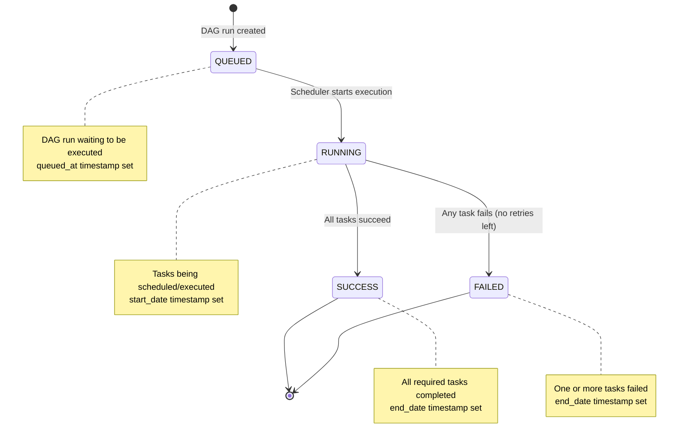
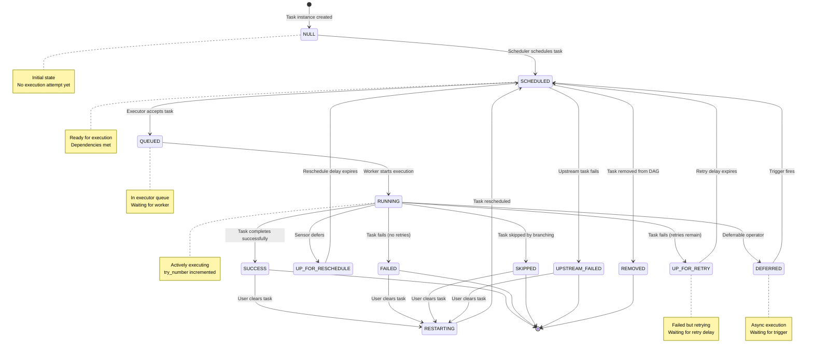
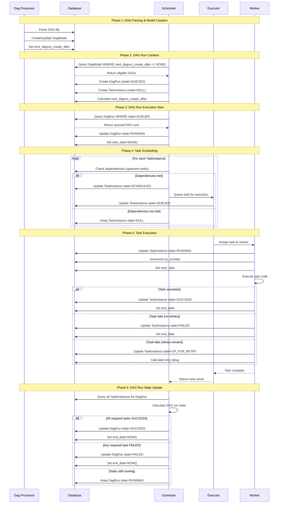
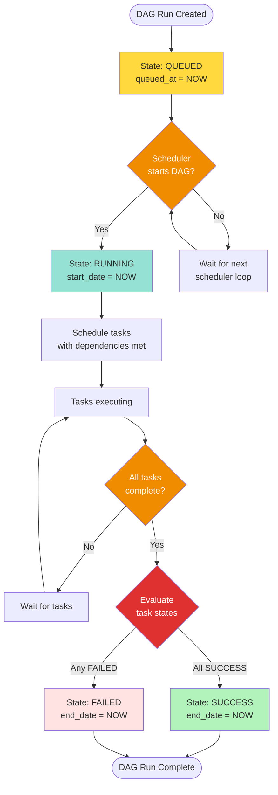
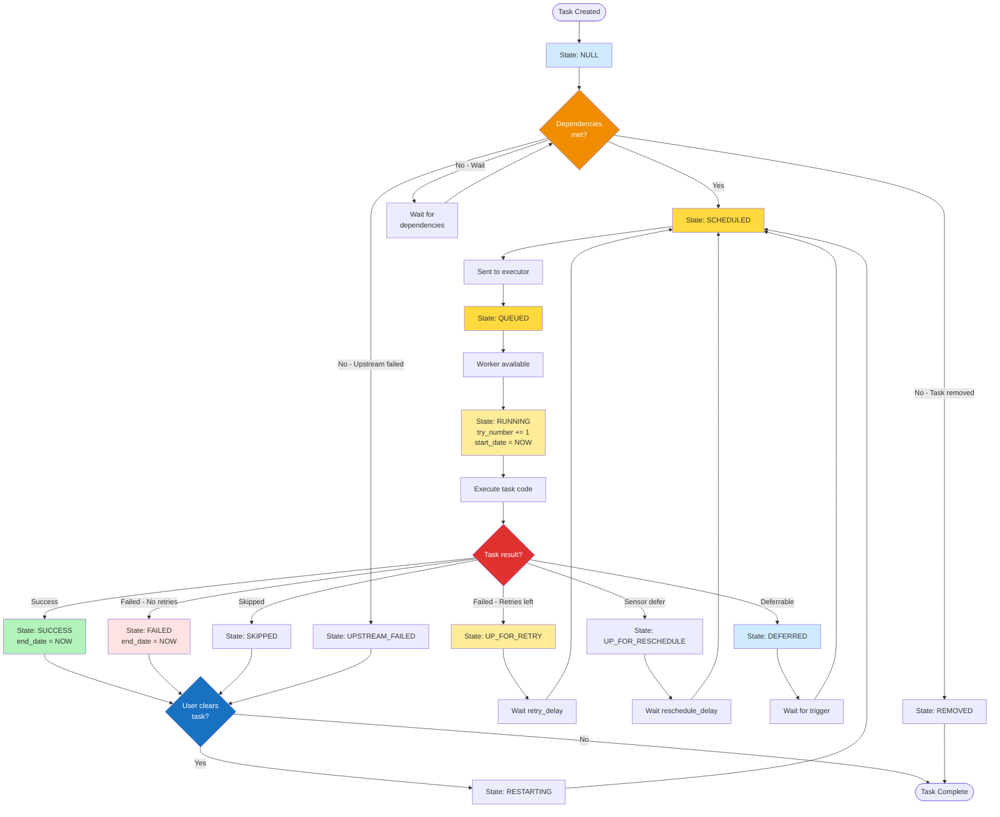
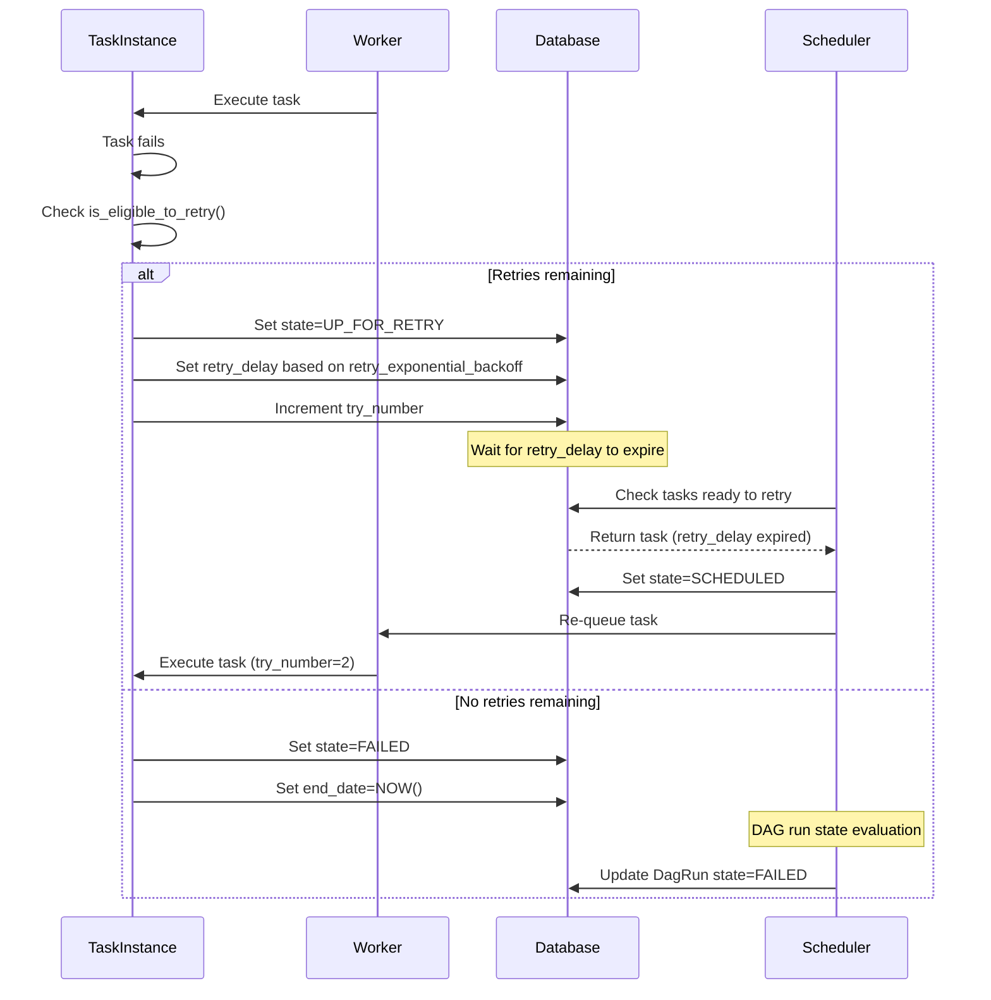
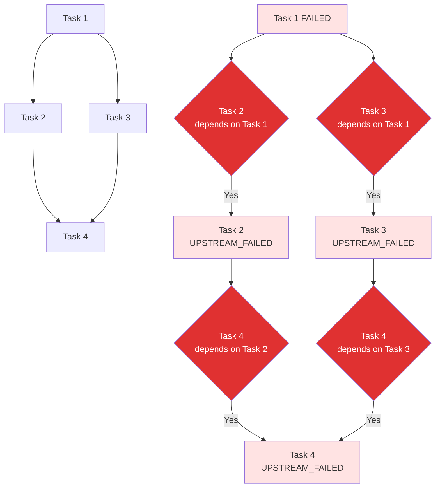

# DAG Run Lifecycle - Complete Overview

This document provides a comprehensive view of how DAG runs progress through their lifecycle in Apache Airflow, from creation to completion.

## Table of Contents

1. [DAG Run States](#dag-run-states)
2. [Task Instance States](#task-instance-states)
3. [Complete Lifecycle Flow](#complete-lifecycle-flow)
4. [State Transitions](#state-transitions)
5. [Key Components](#key-components)
6. [Timestamps and Timing](#timestamps-and-timing)
7. [Error Handling](#error-handling)

---

## DAG Run States

A DAG run can be in one of four states:



**State Definitions** (from `airflow-core/src/airflow/utils/state.py:81`):

- **QUEUED**: DAG run created but not yet started. Waiting for scheduler to pick it up.
- **RUNNING**: At least one task has been scheduled or is running.
- **SUCCESS**: All required tasks (non-skipped) completed successfully.
- **FAILED**: One or more required tasks failed with no retries remaining.

---

## Task Instance States

Task instances have 14 possible states throughout their lifecycle:



**State Definitions** (from `airflow-core/src/airflow/utils/state.py:50`):

| State | Description | Terminal |
|-------|-------------|----------|
| **NULL** | Task created, not yet scheduled | No |
| **SCHEDULED** | Task ready to run, dependencies met | No |
| **QUEUED** | Task sent to executor, waiting for worker | No |
| **RUNNING** | Task actively executing on worker | No |
| **SUCCESS** | Task completed successfully | Yes |
| **FAILED** | Task failed with no retries remaining | Yes |
| **UP_FOR_RETRY** | Task failed, retry scheduled | No |
| **SKIPPED** | Task skipped (e.g., by branching logic) | Yes |
| **UPSTREAM_FAILED** | Upstream dependency failed | Yes |
| **UP_FOR_RESCHEDULE** | Sensor waiting to reschedule | No |
| **DEFERRED** | Deferrable operator waiting for trigger | No |
| **REMOVED** | Task removed from DAG | Yes |
| **RESTARTING** | Task cleared by user, will reschedule | No |
| **SHUTDOWN** | Task shutdown during executor shutdown | No |

---

## Complete Lifecycle Flow

This sequence diagram shows the complete flow from DAG creation to task execution:



---

## State Transitions

### DAG Run State Machine



### Task Instance State Machine



---

## Key Components

### 1. DagRun Class

**File**: `airflow-core/src/airflow/models/dagrun.py`

**Key Methods**:

```python
# Line ~462
def set_state(self, state: DagRunState) -> None:
    """Set the DAG run state and update timestamps."""
    if self.state != state:
        self.state = state
        if state == DagRunState.RUNNING and not self.start_date:
            self.start_date = timezone.utcnow()
        if state in State.finished and not self.end_date:
            self.end_date = timezone.utcnow()

# Line ~1200
def update_state(self, session: Session | None = None) -> tuple[list, bool]:
    """Update the DAG run state based on task states."""
    # Query all task instances
    # Calculate overall state
    # Update self.state if changed
    # Return (list of tasks to run, state changed boolean)
```

**Key Fields**:
- `state`: Current DAG run state (QUEUED, RUNNING, SUCCESS, FAILED)
- `queued_at`: When DAG run was queued
- `start_date`: When execution started (state → RUNNING)
- `end_date`: When execution completed (state → SUCCESS/FAILED)
- `run_id`: Unique identifier for this run
- `logical_date`: Logical execution date (formerly execution_date)

### 2. TaskInstance Class

**File**: `airflow-core/src/airflow/models/taskinstance.py`

**Key Methods**:

```python
def run(self, ...) -> TaskReturnCode:
    """Execute the task instance."""
    # Set state to RUNNING
    # Increment try_number
    # Execute task operator
    # Handle result (success/failure)
    # Set final state

def is_eligible_to_retry(self) -> bool:
    """Check if task can be retried."""
    return self.task.retries and self.try_number <= self.max_tries
```

**Key Fields**:
- `state`: Current task state (NULL, SCHEDULED, QUEUED, RUNNING, etc.)
- `try_number`: Current execution attempt (starts at 1)
- `max_tries`: Maximum retry attempts (retries + 1)
- `start_date`: When current execution started
- `end_date`: When current execution ended
- `duration`: Execution time in seconds
- `hostname`: Worker that executed the task
- `queued_dttm`: When task was queued by executor

### 3. Scheduler Job Runner

**File**: `airflow-core/src/airflow/jobs/scheduler_job_runner.py`

**Key Methods**:

```python
# Line ~1900
def _start_queued_dagruns(self, session: Session) -> int:
    """Start queued DAG runs by setting them to RUNNING."""
    dag_runs = session.scalars(
        select(DagRun)
        .where(DagRun.state == DagRunState.QUEUED)
        .where(DagRun.run_type != DagRunType.BACKFILL_JOB)
        .limit(self.max_dagruns_to_create_per_loop)
    ).all()
    
    for dag_run in dag_runs:
        dag_run.state = DagRunState.RUNNING
        dag_run.start_date = timezone.utcnow()
    
    return len(dag_runs)

# Line ~2000
def _schedule_dag_run(self, dag_run: DagRun, session: Session) -> int:
    """Schedule tasks for a DAG run."""
    # Get all task instances
    # Check dependencies for each task
    # Set eligible tasks to SCHEDULED
    # Send to executor
```

### 4. Executors

Executors handle the actual task execution. See `executors_comparison.md` for detailed comparison.

**Base Executor** (`airflow-core/src/airflow/executors/base_executor.py`):

```python
def queue_task_instance(self, task_instance: TaskInstance, ...) -> None:
    """Queue a task for execution."""
    self.queued_tasks[key] = (command, priority, queue, task_instance)

def heartbeat(self) -> None:
    """Check for executor events and update task states."""
    # Called periodically by scheduler
    # Sync running tasks
    # Trigger new tasks

def sync(self) -> None:
    """Sync executor state with database."""
    # Return completed tasks to scheduler
```

---

## Timestamps and Timing

### DAG Run Timestamps

```mermaid
gantt
    title DAG Run Timeline
    dateFormat HH:mm:ss
    axisFormat %H:%M:%S
    
    section DAG Run
    QUEUED (queued_at set)       :queued, 00:00:00, 00:00:05
    RUNNING (start_date set)     :active, running, 00:00:05, 00:02:00
    SUCCESS (end_date set)       :done, 00:02:00, 00:02:01
    
    section Task 1
    NULL → SCHEDULED             :t1_sched, 00:00:05, 00:00:10
    SCHEDULED → QUEUED           :t1_queue, 00:00:10, 00:00:15
    QUEUED → RUNNING             :active, t1_run, 00:00:15, 00:01:00
    RUNNING → SUCCESS            :done, 00:01:00, 00:01:01
    
    section Task 2 (Depends on Task 1)
    NULL (waiting)               :t2_wait, 00:00:05, 00:01:00
    NULL → SCHEDULED             :t2_sched, 00:01:00, 00:01:05
    SCHEDULED → QUEUED           :t2_queue, 00:01:05, 00:01:10
    QUEUED → RUNNING             :active, t2_run, 00:01:10, 00:02:00
    RUNNING → SUCCESS            :done, 00:02:00, 00:02:01
```



**Key Timing Fields**:

| Field | Set When | Object |
|-------|----------|--------|
| `queued_at` | DAG run created (state=QUEUED) | DagRun |
| `start_date` | DAG run started (state=RUNNING) | DagRun |
| `end_date` | DAG run completed (SUCCESS/FAILED) | DagRun |
| `queued_dttm` | Task sent to executor (state=QUEUED) | TaskInstance |
| `start_date` | Task execution starts (state=RUNNING) | TaskInstance |
| `end_date` | Task execution ends (terminal state) | TaskInstance |
| `duration` | Calculated: end_date - start_date | TaskInstance |

---

## Error Handling

### Retry Mechanism



**Retry Configuration** (in DAG task definition):

```python
task = PythonOperator(
    task_id=''example'',
    retries=3,                          # Number of retries
    retry_delay=timedelta(minutes=5),   # Delay between retries
    retry_exponential_backoff=True,     # Exponential backoff
    max_retry_delay=timedelta(hours=1), # Max delay
)
```

**Retry Delay Calculation** (with exponential backoff):

```
retry_delay = min(
    retry_delay * (2 ** (try_number - 1)),
    max_retry_delay
)
```

### Upstream Failure Handling



**Trigger Rules** (control upstream failure behavior):

| Trigger Rule | Description | Use Case |
|--------------|-------------|----------|
| `all_success` | All upstream tasks succeeded | Default behavior |
| `all_failed` | All upstream tasks failed | Error handling tasks |
| `all_done` | All upstream tasks finished (any state) | Cleanup tasks |
| `one_success` | At least one upstream succeeded | OR logic |
| `one_failed` | At least one upstream failed | Alert on any failure |
| `none_failed` | No upstream tasks failed | Skip on failure |
| `none_skipped` | No upstream tasks skipped | Require all execution |
| `dummy` | Always run | Independent tasks |

---

## Summary

**DAG Run Lifecycle Phases**:

1. **Creation**: Scheduler creates DAG run (QUEUED state)
2. **Start**: Scheduler sets DAG run to RUNNING
3. **Task Scheduling**: Tasks with met dependencies set to SCHEDULED
4. **Task Execution**: Executor runs tasks (QUEUED → RUNNING → terminal state)
5. **State Evaluation**: Scheduler evaluates overall state (SUCCESS/FAILED)
6. **Completion**: DAG run reaches terminal state, end_date set

**Key State Changes**:

- **DAG Run**: QUEUED → RUNNING → SUCCESS/FAILED
- **Task Instance**: NULL → SCHEDULED → QUEUED → RUNNING → SUCCESS/FAILED (or retry states)

**Critical Components**:

- `DagRun.update_state()` - Calculates DAG run state from task states
- `TaskInstance.run()` - Executes task logic
- Scheduler - Orchestrates state transitions
- Executor - Manages task execution on workers

**Next Steps**: See `executors_comparison.md` for executor-specific details and `state_machines.md` for detailed state transition rules.
