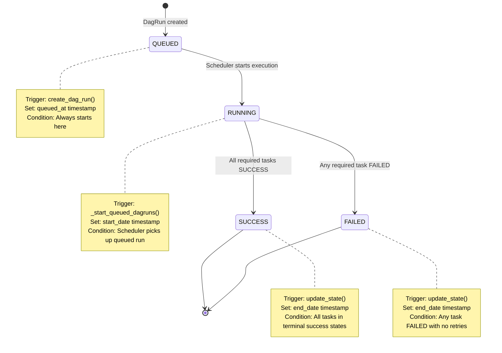
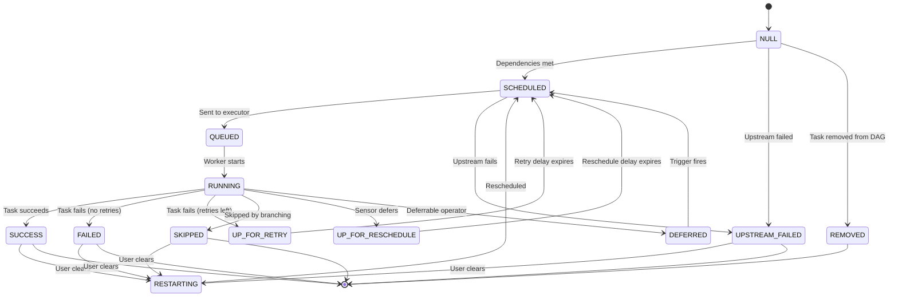
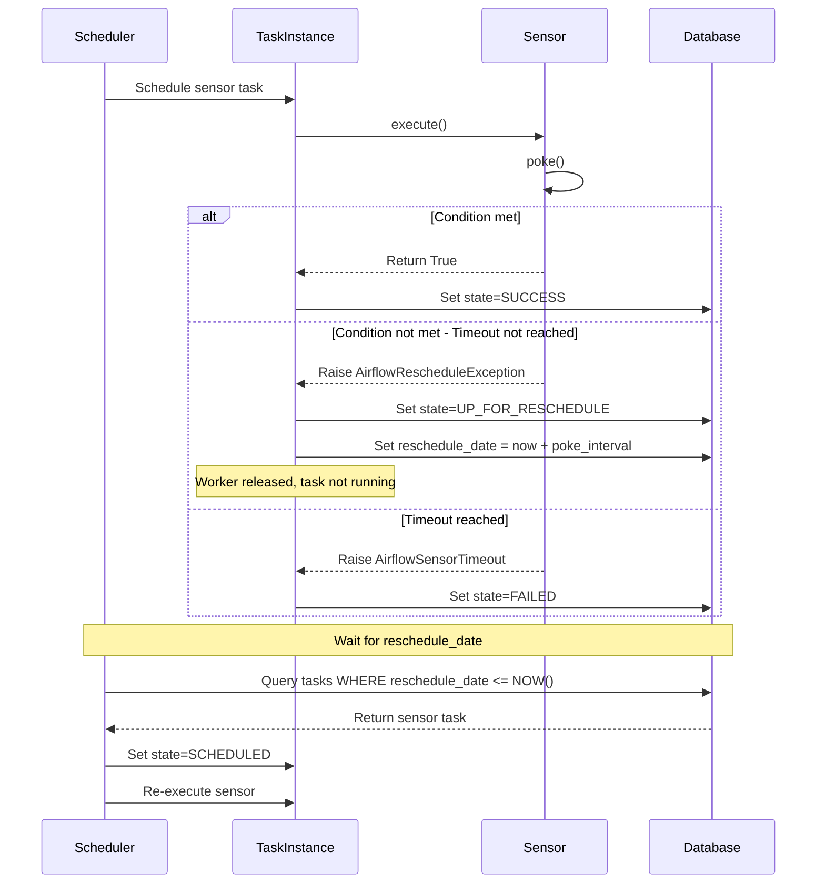
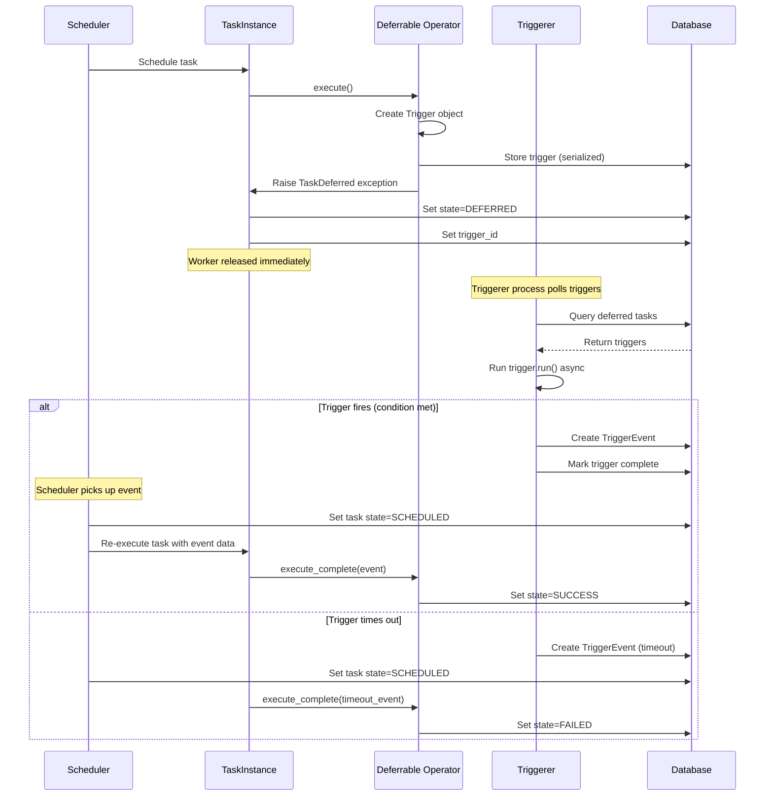
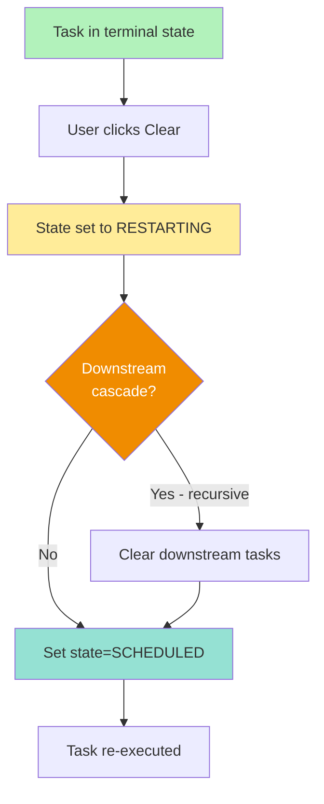
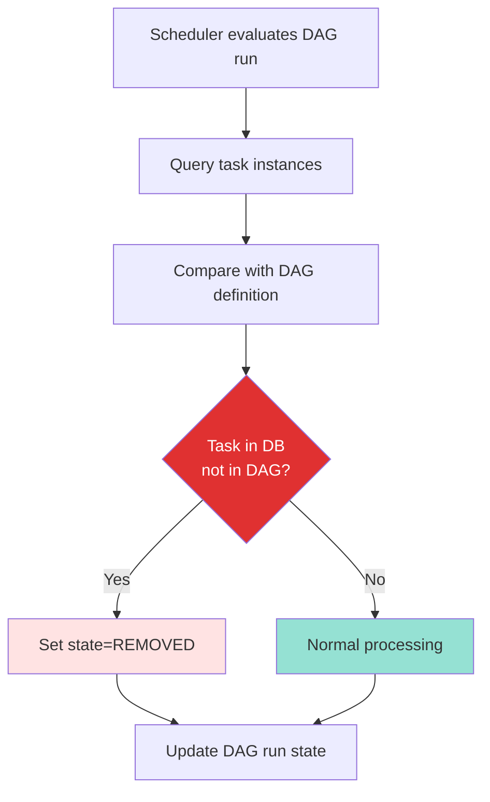
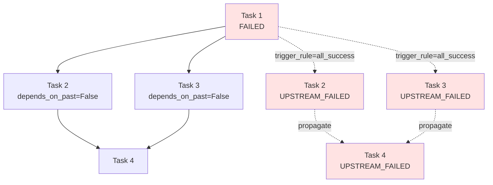
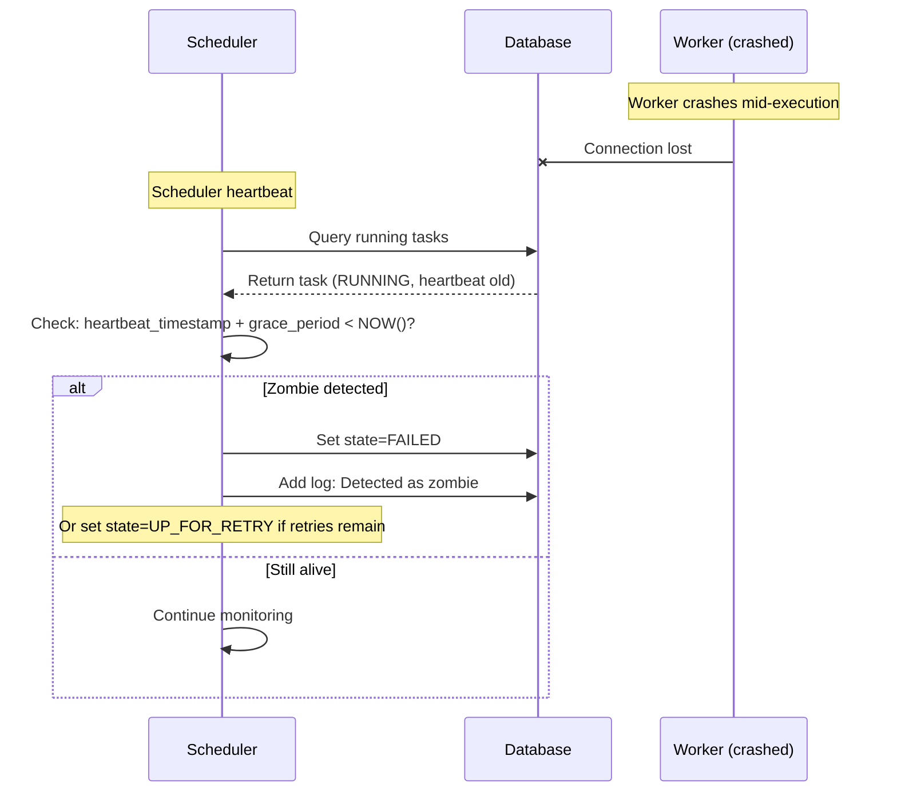

# State Machines - Detailed Transition Rules

This document provides detailed state transition rules for DAG runs and task instances in Apache Airflow.

## Table of Contents

1. [DAG Run State Machine](#dag-run-state-machine)
2. [Task Instance State Machine](#task-instance-state-machine)
3. [Retry Logic](#retry-logic)
4. [Sensor Reschedule](#sensor-reschedule)
5. [Deferrable Operators](#deferrable-operators)
6. [Edge Cases](#edge-cases)

---

## DAG Run State Machine

### State Definitions

**Source**: `airflow-core/src/airflow/utils/state.py:81`

```python
class DagRunState(str, Enum):
    QUEUED = "queued"      # Created, waiting to start
    RUNNING = "running"    # Actively executing tasks
    SUCCESS = "success"    # All required tasks succeeded
    FAILED = "failed"      # At least one required task failed
```

### State Transition Diagram



### Transition Rules

#### QUEUED → RUNNING

**Trigger**: `SchedulerJobRunner._start_queued_dagruns()` (line ~1900)

**Conditions**:
- DAG run state is QUEUED
- DAG run run_type is not BACKFILL_JOB
- Scheduler has capacity (max_dagruns_to_create_per_loop)

**Actions**:
```python
dag_run.state = DagRunState.RUNNING
dag_run.start_date = timezone.utcnow()
session.flush()
```

#### RUNNING → SUCCESS

**Trigger**: `DagRun.update_state()` (line ~1200)

**Conditions**:
- All required task instances are in SUCCESS or SKIPPED state
- No task instances in RUNNING, QUEUED, SCHEDULED states
- No task instances in UP_FOR_RETRY or UP_FOR_RESCHEDULE

**Actions**:
```python
dag_run.state = DagRunState.SUCCESS
dag_run.end_date = timezone.utcnow()
session.flush()
```

**Logic**:
```python
# Required tasks = tasks not skipped by branching
required_tasks = [ti for ti in task_instances if ti.state != State.SKIPPED]

if all(ti.state == State.SUCCESS for ti in required_tasks):
    dag_run.set_state(DagRunState.SUCCESS)
```

#### RUNNING → FAILED

**Trigger**: `DagRun.update_state()`

**Conditions**:
- At least one required task instance is in FAILED state
- Task has no retries remaining
- Or task is marked as fail_stop

**Actions**:
```python
dag_run.state = DagRunState.FAILED
dag_run.end_date = timezone.utcnow()
session.flush()
```

---

## Task Instance State Machine

### State Definitions

**Source**: `airflow-core/src/airflow/utils/state.py:50`

```python
class TaskInstanceState(str, Enum):
    # Initial state
    NULL = None
    
    # Execution states
    SCHEDULED = "scheduled"          # Ready to run
    QUEUED = "queued"                # In executor queue
    RUNNING = "running"              # Actively executing
    
    # Terminal states
    SUCCESS = "success"              # Completed successfully
    FAILED = "failed"                # Failed (no retries)
    SKIPPED = "skipped"              # Skipped by branching
    UPSTREAM_FAILED = "upstream_failed"  # Upstream dependency failed
    REMOVED = "removed"              # Task removed from DAG
    
    # Intermediate states
    UP_FOR_RETRY = "up_for_retry"    # Failed, will retry
    UP_FOR_RESCHEDULE = "up_for_reschedule"  # Sensor waiting
    DEFERRED = "deferred"            # Deferrable operator
    RESTARTING = "restarting"        # User cleared task
    SHUTDOWN = "shutdown"            # Executor shutdown
```

### Complete State Diagram



---

## Retry Logic

### Retry Decision Flow

```mermaid
flowchart TD
    Start[Task execution fails] --> Check{is_eligible_to_retry?}
    
    Check -->|No - retries=0| Failed[Set state=FAILED]
    Check -->|No - try_number > max_tries| Failed
    Check -->|Yes| Retry[Set state=UP_FOR_RETRY]
    
    Retry --> CalcDelay[Calculate retry_delay]
    
    CalcDelay --> ExpBackoff{exponential_backoff?}
    ExpBackoff -->|Yes| Exponential[delay = base_delay * 2^(try_number-1)]
    ExpBackoff -->|No| Linear[delay = base_delay]
    
    Exponential --> Clamp[delay = min(delay, max_retry_delay)]
    Linear --> Clamp
    
    Clamp --> SetNext[Set next_try_date = now + delay]
    SetNext --> Wait[Wait for delay]
    Wait --> Reschedule[Scheduler sets state=SCHEDULED]
    Reschedule --> Execute[Execute again with try_number+1]
    
    style Check fill:#f08c00,color:#fff
    style Failed fill:#ffe3e3
    style Retry fill:#ffec99
    style ExpBackoff fill:#f08c00,color:#fff
    style Reschedule fill:#95e1d3
```

### Retry Configuration

**Task definition**:
```python
task = PythonOperator(
    task_id='example',
    retries=3,                          # Number of retries
    retry_delay=timedelta(minutes=5),   # Base delay
    retry_exponential_backoff=True,     # Enable exponential backoff
    max_retry_delay=timedelta(hours=1), # Maximum delay
)
```

### Retry Calculation

**Source**: `airflow-core/src/airflow/models/taskinstance.py`

```python
def get_retry_delay(self) -> timedelta:
    retry_delay = self.task.retry_delay
    
    if self.task.retry_exponential_backoff:
        # Exponential backoff: delay * 2^(try_number - 1)
        min_backoff = int(retry_delay.total_seconds() * (2 ** (self.try_number - 2)))
        retry_delay = timedelta(seconds=min_backoff)
        
        if self.task.max_retry_delay:
            retry_delay = min(retry_delay, self.task.max_retry_delay)
    
    return retry_delay
```

**Example retry delays** (base_delay=5min, exponential=True):
- Try 1 fails → Wait 5 minutes (5 * 2^0)
- Try 2 fails → Wait 10 minutes (5 * 2^1)
- Try 3 fails → Wait 20 minutes (5 * 2^2)
- Try 4 fails → Wait 40 minutes (5 * 2^3)

---

## Sensor Reschedule

### Reschedule Mode

Sensors can operate in two modes:

1. **Poke mode** (default): Blocks worker, polls continuously
2. **Reschedule mode**: Releases worker, reschedules later

### Reschedule Flow



**Configuration**:
```python
sensor = FileSensor(
    task_id='wait_for_file',
    filepath='/path/to/file',
    mode='reschedule',           # Enable reschedule mode
    poke_interval=60,            # Check every 60 seconds
    timeout=3600,                # Fail after 1 hour
)
```

---

## Deferrable Operators

### Deferrable Execution Flow



**Example**:
```python
from airflow.providers.http.sensors.http import HttpSensorAsync
from airflow.triggers.temporal import TimeDeltaTrigger

task = HttpSensorAsync(
    task_id='wait_for_api',
    endpoint='/api/status',
    # Deferrable - releases worker while waiting
)
```

---

## Edge Cases

### Cleared Tasks



### Removed Tasks

**Scenario**: Task removed from DAG definition but TaskInstance exists in DB



### Upstream Failed Propagation



**Trigger rule effects**:

```python
# Task runs only if all upstream succeeded (default)
task_a = PythonOperator(..., trigger_rule='all_success')

# Task runs even if upstream failed
task_b = PythonOperator(..., trigger_rule='all_done')

# Task runs only if all upstream failed
task_c = PythonOperator(..., trigger_rule='all_failed')
```

### Zombie Tasks

**Scenario**: Task marked RUNNING but worker crashed



**Configuration**:
```yaml
[scheduler]
# Consider task zombie if no heartbeat for this duration
scheduler_zombie_task_threshold = 300
```

---

## Summary

### Key State Transition Methods

**DagRun**:
- `set_state()` - Manually set state with timestamps
- `update_state()` - Calculate state from task instances

**TaskInstance**:
- `run()` - Execute task, handle state transitions
- `is_eligible_to_retry()` - Check if retry possible
- `refresh_from_db()` - Sync with database state

### Terminal States

**DAG Run**: SUCCESS, FAILED

**Task Instance**: SUCCESS, FAILED, SKIPPED, UPSTREAM_FAILED, REMOVED

**No further transitions possible from terminal states unless user intervention (clear task).**

### State Change Triggers

1. **Scheduler**: NULL → SCHEDULED, QUEUED → RUNNING
2. **Executor**: SCHEDULED → QUEUED
3. **Worker**: RUNNING → terminal states
4. **User**: Terminal → RESTARTING → SCHEDULED

**Next Steps**: See `lifecycle_overview.md` for complete flow and `executors_comparison.md` for executor-specific behavior.
