# Airflow Listeners and OpenLineage Lifecycle

## Table of Contents

1. [Overview](#overview)
2. [Listener Architecture](#listener-architecture)
3. [Complete Lifecycle Flow](#complete-lifecycle-flow)
4. [Listener Registration](#listener-registration)
5. [Hook Invocation](#hook-invocation)
6. [OpenLineage Integration](#openlineage-integration)
7. [Event Extraction](#event-extraction)
8. [Event Emission](#event-emission)
9. [Database Operations](#database-operations)
10. [Configuration](#configuration)
11. [Debugging Guide](#debugging-guide)
12. [Performance Considerations](#performance-considerations)

---

## Overview

### What Are Airflow Listeners?

Airflow listeners are a pluggable system for monitoring and reacting to lifecycle events in Airflow. They use the **pluggy** plugin framework to provide hooks at critical points:

- **DAG Run events**: Running, success, failure
- **Task Instance events**: Running, success, failure
- **Asset events**: Asset changes
- **Import errors**: DAG parsing failures
- **Lifecycle events**: Component startup/shutdown

### What Is OpenLineage?

**OpenLineage** is an open framework for data lineage collection and analysis. It standardizes the way metadata about data pipelines is collected and transmitted. The OpenLineage Airflow integration:

- Tracks data inputs/outputs for each task
- Records job metadata (start time, end time, state)
- Captures facets (additional metadata like SQL queries, data quality metrics)
- Sends events to configured backends (HTTP, Kafka, file, etc.)

### Key Components


**Flow Summary**:
1. TaskInstance/DagRun state changes trigger listener hooks
2. ListenerManager broadcasts to all registered listeners
3. OpenLineageListener extracts lineage metadata
4. OpenLineageAdapter formats and emits events
5. Events sent to configured transport backend

---

## Listener Architecture

### ListenerManager

The **ListenerManager** is a singleton that manages all listener registrations and provides a hook relay for calling them.

**Source**: `airflow/listeners/listener.py`

```python
class ListenerManager:
    def __init__(self):
        self.pm = pluggy.PluginManager("airflow")
        self.pm.add_hookspecs(lifecycle)
        self.pm.add_hookspecs(dagrun)
        self.pm.add_hookspecs(asset)
        self.pm.add_hookspecs(taskinstance)
        self.pm.add_hookspecs(importerrors)
        
    @property
    def hook(self) -> _HookRelay:
        return self.pm.hook
        
    def add_listener(self, listener):
        if not self.pm.is_registered(listener):
            self.pm.register(listener)
```

**Key Features**:
- Uses **pluggy** for plugin management
- Supports multiple listeners registered simultaneously
- Hook call monitoring for debugging (before/after hooks)
- Thread-safe singleton pattern

### Hook Specifications

Hook specifications define the contract for listeners. Each specification uses the `@hookspec` decorator.

**TaskInstance Hooks** (`airflow/listeners/spec/taskinstance.py`):
```python
@hookspec
def on_task_instance_running(previous_state, task_instance):
    """Execute when task state changes to RUNNING."""

@hookspec
def on_task_instance_success(previous_state, task_instance):
    """Execute when task state changes to SUCCESS."""

@hookspec
def on_task_instance_failed(previous_state, task_instance, error):
    """Execute when task state changes to FAIL."""
```

**DagRun Hooks** (`airflow/listeners/spec/dagrun.py`):
```python
@hookspec
def on_dag_run_running(dag_run, msg):
    """Execute when dag run state changes to RUNNING."""

@hookspec
def on_dag_run_success(dag_run, msg):
    """Execute when dag run state changes to SUCCESS."""

@hookspec
def on_dag_run_failed(dag_run, msg):
    """Execute when dag run state changes to FAIL."""
```

### Architecture Diagram


---

## Complete Lifecycle Flow

### End-to-End Execution

This section covers the complete journey from a task state change to an OpenLineage event being emitted to a backend.


### Execution Timeline


**Total Overhead**: ~1-1.5 seconds for START + COMPLETE events (network latency dependent)

---

## Listener Registration

### Plugin Discovery

Listeners are registered through Airflow's plugin system. The discovery process:

1. **Scan plugins directory** (`$AIRFLOW_HOME/plugins/`)
2. **Load Python modules** from plugins
3. **Find AirflowPlugin subclasses**
4. **Extract listener classes** from plugin.listeners
5. **Register with ListenerManager**


### Registration Code Flow

**Source**: `airflow/plugins_manager.py`

```python
def integrate_listener_plugins(listener_manager: ListenerManager) -> None:
    """Add listeners from plugins."""
    ensure_plugins_loaded()
    
    if plugins:
        for plugin in plugins:
            for listener in plugin.listeners:
                listener_manager.add_listener(listener)
```

**Source**: `airflow/listeners/listener.py`

```python
def get_listener_manager() -> ListenerManager:
    """Get singleton listener manager."""
    global _listener_manager
    if not _listener_manager:
        _listener_manager = ListenerManager()
        integrate_listener_plugins(_listener_manager)
    return _listener_manager
```

### OpenLineage Plugin Registration

**Source**: `providers/openlineage/src/airflow/providers/openlineage/plugins/openlineage.py`

```python
class OpenLineageProviderPlugin(AirflowPlugin):
    """OpenLineage plugin for Airflow."""
    name = "openlineage"
    listeners = [OpenLineageListener()]
    macros = [openlineage_macros]
```

**Registration Sequence**:


---

## Hook Invocation

### Where Hooks Are Called

Hooks are invoked at critical state transition points in Airflow core code:

#### TaskInstance State Changes

**Source**: `airflow/models/taskinstance.py`

**1. Task Running** (when task starts execution):
```python
def _run_execute_callback(self, context, test_mode=False):
    # ... task execution logic ...
    try:
        get_listener_manager().hook.on_task_instance_running(
            previous_state=previous_state,
            task_instance=self,
            session=session
        )
    except Exception:
        log.exception("error calling listener")
```

**2. Task Success** (when task completes successfully):
```python
def _handle_success_callback(self, context):
    # ... success handling ...
    try:
        get_listener_manager().hook.on_task_instance_success(
            previous_state=TaskInstanceState.RUNNING,
            task_instance=self
        )
    except Exception:
        log.exception("error calling listener")
```

**3. Task Failure** (when task fails):
```python
def _handle_failure(self, error, session=None):
    # ... failure handling ...
    try:
        get_listener_manager().hook.on_task_instance_failed(
            previous_state=TaskInstanceState.RUNNING,
            task_instance=self,
            error=error
        )
    except Exception:
        log.exception("error calling listener")
```

#### DagRun State Changes

**Source**: `airflow/models/dagrun.py`

```python
def _emit_dag_run_state_changed_event(self, msg: str):
    if self.state == DagRunState.RUNNING:
        get_listener_manager().hook.on_dag_run_running(dag_run=self, msg=msg)
    elif self.state == DagRunState.SUCCESS:
        get_listener_manager().hook.on_dag_run_success(dag_run=self, msg=msg)
    elif self.state == DagRunState.FAILED:
        get_listener_manager().hook.on_dag_run_failed(dag_run=self, msg=msg)
```

### Hook Invocation Flow


### Error Handling

All listener invocations are **wrapped in try-except**:

```python
try:
    get_listener_manager().hook.on_task_instance_running(...)
except Exception:
    log.exception("error calling listener")
```

**Implications**:
- **Listener failures don't crash tasks** - errors are logged but swallowed
- **Other listeners continue** - one broken listener doesn't affect others
- **Debugging requires log inspection** - check scheduler/worker logs for listener errors

---

## OpenLineage Integration

### OpenLineageListener

The **OpenLineageListener** is the bridge between Airflow listener hooks and OpenLineage event emission.

**Source**: `providers/openlineage/src/airflow/providers/openlineage/plugins/listener.py`

```python
class OpenLineageListener:
    """OpenLineage listener sends events on task instance and dag run starts, completes and failures."""
    
    def __init__(self):
        self._executor = None
        self.log = logging.getLogger(__name__)
        self.extractor_manager = ExtractorManager()
        self.adapter = OpenLineageAdapter()
```

### Key Methods

**1. on_task_instance_running**:
```python
@hookimpl
def on_task_instance_running(self, previous_state, task_instance, session):
    # Check if operator is disabled
    if is_operator_disabled(task.task_type):
        return
    
    # Check selective lineage
    if not is_selective_lineage_enabled(task):
        return
    
    # Extract lineage
    lineage = self.extractor_manager.extract_metadata(
        dagrun=dagrun,
        task=task,
        task_instance=task_instance,
        complete=False
    )
    
    # Build and emit START event
    self.adapter.start_task(
        run_id=task_uuid,
        job_name=job_name,
        event_time=start_date.isoformat(),
        task=lineage,
        ...
    )
```

**2. on_task_instance_success**:
```python
@hookimpl
def on_task_instance_success(self, previous_state, task_instance, session):
    # Extract completion lineage
    lineage = self.extractor_manager.extract_metadata(
        dagrun=dagrun,
        task=task,
        task_instance=task_instance,
        complete=True,
        task_instance_model=task_instance
    )
    
    # Build and emit COMPLETE event
    self.adapter.complete_task(
        run_id=task_uuid,
        end_time=timezone.utcnow().isoformat(),
        task=lineage
    )
```

**3. on_task_instance_failed**:
```python
@hookimpl
def on_task_instance_failed(self, previous_state, task_instance, error, session):
    # Extract failure lineage
    lineage = self.extractor_manager.extract_metadata(...)
    
    # Build and emit FAIL event with error facet
    self.adapter.fail_task(
        run_id=task_uuid,
        end_time=timezone.utcnow().isoformat(),
        task=lineage,
        error=error
    )
```

### OpenLineage Event States

```mermaid
stateDiagram-v2
    [*] --> START: on_task_instance_running
    START --> RUNNING: Event Emitted
    RUNNING --> COMPLETE: on_task_instance_success
    RUNNING --> FAIL: on_task_instance_failed
    COMPLETE --> [*]
    FAIL --> [*]
    
    START --> FAIL: Task fails before START emitted
    
    note right of START
        RunState.START
        eventType = START
    end note
    
    note right of COMPLETE
        RunState.COMPLETE
        eventType = COMPLETE
    end note
    
    note right of FAIL
        RunState.FAIL
        eventType = FAIL
        includes error facet
    end note
```



---

## Event Extraction

### ExtractorManager

The **ExtractorManager** is responsible for finding the appropriate extractor for each operator and extracting lineage metadata.

**Source**: `providers/openlineage/src/airflow/providers/openlineage/extractors/manager.py`

```python
class ExtractorManager:
    def __init__(self):
        self.extractors = {}
        self.default_extractor = DefaultExtractor
        self._load_custom_extractors()
    
    def extract_metadata(
        self,
        dagrun,
        task,
        task_instance,
        complete: bool = False,
        task_instance_model = None
    ) -> OperatorLineage | None:
        extractor = self.get_extractor_for_operator(task)
        if complete:
            return extractor.extract_on_complete(task_instance_model)
        return extractor.extract()
```

### Extractor Types


### OperatorLineage Structure

**Source**: `providers/openlineage/src/airflow/providers/openlineage/extractors/base.py`

```python
@define
class OperatorLineage:
    """Structure returned from lineage extraction."""
    inputs: list[Dataset] = Factory(list)
    outputs: list[Dataset] = Factory(list)
    run_facets: dict[str, RunFacet] = Factory(dict)
    job_facets: dict[str, JobFacet] = Factory(dict)
```

**Example from BigQueryOperator**:
```python
def get_openlineage_facets_on_complete(self, task_instance):
    return OperatorLineage(
        inputs=[
            Dataset(
                namespace="bigquery",
                name="project.dataset.source_table",
                facets={}
            )
        ],
        outputs=[
            Dataset(
                namespace="bigquery",
                name="project.dataset.destination_table",
                facets={
                    "schema": SchemaDatasetFacet(
                        fields=[...]
                    )
                }
            )
        ],
        run_facets={
            "externalQuery": ExternalQueryRunFacet(
                externalQueryId="job_id_12345",
                source="bigquery"
            )
        },
        job_facets={}
    )
```

### Extraction Decision Flow


### Built-in Extractors

**Common extractors in the provider**:

| Operator | Extractor | Lineage Extracted |
|----------|-----------|-------------------|
| `BashOperator` | `BashExtractor` | Command, exit code |
| `PythonOperator` | `PythonExtractor` | Function name, source code |
| `BigQueryOperator` | Operator method | Tables, queries, schema |
| `SnowflakeOperator` | Operator method | Tables, warehouses, queries |
| `S3ToRedshiftOperator` | Operator method | S3 files, Redshift tables |
| Custom operators | `DefaultExtractor` | User-defined facets |

---

## Event Emission

### OpenLineageAdapter

The **OpenLineageAdapter** translates Airflow metadata into OpenLineage events and emits them.

**Source**: `providers/openlineage/src/airflow/providers/openlineage/plugins/adapter.py`

```python
class OpenLineageAdapter:
    def __init__(self, client=None, secrets_masker=None):
        self._client = client
        self._redacter = OpenLineageRedactor.from_masker(secrets_masker)
    
    def emit(self, event: RunEvent):
        if not self._client:
            self._client = self.get_or_create_openlineage_client()
        
        # Redact secrets
        redacted_event = self._redacter.redact(event, max_depth=20)
        
        try:
            self._client.emit(redacted_event)
            self.log.info("Successfully emitted OpenLineage event")
        except Exception as e:
            self.log.warning(f"Failed to emit event: {e}")
```

### Event Construction

**START Event**:
```python
def start_task(self, run_id, job_name, event_time, job_description,
               nominal_start_time, nominal_end_time, owners, tags,
               task: OperatorLineage | None, run_facets=None):
    
    event = RunEvent(
        eventType=RunState.START,
        eventTime=event_time,
        run=Run(
            runId=run_id,
            facets={
                **run_facets,
                "nominalTime": nominal_time_run(
                    nominalStartTime=nominal_start_time,
                    nominalEndTime=nominal_end_time
                ),
                "airflowRun": get_airflow_run_facet(...),
                **task.run_facets if task else {}
            }
        ),
        job=Job(
            namespace=conf.namespace(),
            name=job_name,
            facets={
                "jobType": job_type_job(jobType="TASK"),
                "documentation": documentation_job(description=job_description),
                "ownership": ownership_job(owners=owners),
                "tags": tags_job(tags=tags),
                **task.job_facets if task else {}
            }
        ),
        inputs=task.inputs if task else [],
        outputs=task.outputs if task else []
    )
    
    return self.emit(event)
```

**COMPLETE Event**:
```python
def complete_task(self, run_id, end_time, task: OperatorLineage | None):
    event = RunEvent(
        eventType=RunState.COMPLETE,
        eventTime=end_time,
        run=Run(
            runId=run_id,
            facets={
                "airflowState": get_airflow_state_run_facet("success"),
                **task.run_facets if task else {}
            }
        ),
        job=Job(...),
        inputs=task.inputs if task else [],
        outputs=task.outputs if task else []
    )
    
    return self.emit(event)
```

**FAIL Event**:
```python
def fail_task(self, run_id, end_time, task, error):
    event = RunEvent(
        eventType=RunState.FAIL,
        eventTime=end_time,
        run=Run(
            runId=run_id,
            facets={
                "airflowState": get_airflow_state_run_facet("failed"),
                "errorMessage": error_message_run(
                    message=str(error),
                    programmingLanguage="python"
                ),
                **task.run_facets if task else {}
            }
        ),
        job=Job(...),
        inputs=task.inputs if task else [],
        outputs=task.outputs if task else []
    )
    
    return self.emit(event)
```

### Event Structure

```mermaid
classDiagram
    class RunEvent {
        +eventType: RunState
        +eventTime: string
        +run: Run
        +job: Job
        +inputs: Dataset[]
        +outputs: Dataset[]
        +producer: string
        +schemaURL: string
    }
    
    class Run {
        +runId: UUID
        +facets: RunFacet{}
    }
    
    class Job {
        +namespace: string
        +name: string
        +facets: JobFacet{}
    }
    
    class Dataset {
        +namespace: string
        +name: string
        +facets: DatasetFacet{}
    }
    
    class RunFacet {
        <<interface>>
        +nominalTime
        +airflowRun
        +airflowState
        +errorMessage
        +processing_engine
    }
    
    class JobFacet {
        <<interface>>
        +jobType
        +documentation
        +ownership
        +tags
        +sourceCode
        +sql
    }
    
    class DatasetFacet {
        <<interface>>
        +schema
        +dataSource
        +version
        +dataQuality
    }
    
    RunEvent --> Run
    RunEvent --> Job
    RunEvent --> Dataset
    Run --> RunFacet
    Job --> JobFacet
    Dataset --> DatasetFacet
```

### OpenLineageClient and Transports

**Source**: OpenLineage Python client library

```python
class OpenLineageClient:
    def __init__(self, config=None):
        self.transport = self._get_transport(config)
    
    def emit(self, event: RunEvent):
        self.transport.emit(event)
```

**Transport Types**:

1. **HTTP Transport** - POST to HTTP endpoint
```python
{
    "transport": {
        "type": "http",
        "url": "http://openlineage-backend:5000",
        "auth": {
            "type": "api_key",
            "apiKey": "your-api-key"
        },
        "timeout": 5.0,
        "verify": true
    }
}
```

2. **Kafka Transport** - Produce to Kafka topic
```python
{
    "transport": {
        "type": "kafka",
        "config": {
            "bootstrap.servers": "kafka:9092",
            "topic": "openlineage-events"
        }
    }
}
```

3. **File Transport** - Write to local file
```python
{
    "transport": {
        "type": "file",
        "path": "/tmp/openlineage-events.json",
        "append": true
    }
}
```

4. **Console Transport** - Print to stdout (debugging)
```python
{
    "transport": {
        "type": "console"
    }
}
```

### Emission Flow


---

## Database Operations

### No Direct Database Storage

**Important**: OpenLineage events are **not stored in the Airflow database**. They are emitted to external systems.

However, listener invocations may query the database for metadata:

### Database Queries During Event Extraction

**1. Task Metadata**:
```sql
SELECT *
FROM task_instance
WHERE dag_id = %s
  AND task_id = %s
  AND run_id = %s
  AND map_index = %s;
```

**2. DAG Run Metadata**:
```sql
SELECT *
FROM dag_run
WHERE dag_id = %s
  AND run_id = %s;
```

**3. XCom Data (for lineage)**:
```sql
SELECT key, value
FROM xcom
WHERE dag_id = %s
  AND task_id = %s
  AND run_id = %s
  AND map_index = %s;
```

**4. Connection Information**:
```sql
SELECT conn_id, conn_type, host, schema, port
FROM connection
WHERE conn_id = %s;
```

### Database Access Pattern


### Session Management

**In Airflow 2.x** (listener receives session):
```python
@hookimpl
def on_task_instance_running(self, previous_state, task_instance, session):
    # Use provided session
    conn = session.query(Connection).filter_by(conn_id=conn_id).first()
```

**In Airflow 3.x** (listener must create session):
```python
@hookimpl
def on_task_instance_running(self, previous_state, task_instance):
    # Create new session
    from airflow.settings import Session
    with Session() as session:
        conn = session.query(Connection).filter_by(conn_id=conn_id).first()
```

---

## Configuration

### OpenLineage Configuration

**Configuration Section**: `[openlineage]` in `airflow.cfg`

**Key Options**:

| Option | Type | Default | Description |
|--------|------|---------|-------------|
| `disabled` | bool | `False` | Disable OpenLineage entirely |
| `config_path` | string | `""` | Path to YAML config file |
| `transport` | JSON | `{}` | Transport configuration (inline) |
| `namespace` | string | `"default"` | OpenLineage namespace |
| `disabled_for_operators` | string | `""` | Semicolon-separated operator types to skip |
| `selective_enable` | bool | `False` | Only emit events for explicitly enabled DAGs/tasks |
| `extractors` | string | `""` | Custom extractor classes |
| `custom_run_facets` | string | `""` | Custom run facet functions |
| `disable_source_code` | bool | `False` | Exclude source code from events |
| `dag_state_change_process_pool_size` | int | `1` | Process pool for DAG state changes |
| `execution_timeout` | int | `10` | Timeout for event emission (seconds) |
| `include_full_task_info` | bool | `False` | Include full task context in events |
| `debug_mode` | bool | `False` | Enable debug logging |

### Configuration File (YAML)

**`openlineage.yml`**:
```yaml
transport:
  type: http
  url: http://marquez:5000
  auth:
    type: api_key
    apiKey: ${MARQUEZ_API_KEY}
  timeout: 5.0
  verify: true

namespace: production
```

**Set config path in `airflow.cfg`**:
```ini
[openlineage]
config_path = /opt/airflow/config/openlineage.yml
```

### Environment Variables

**Legacy variables** (still supported but deprecated):
- `OPENLINEAGE_CONFIG` - Path to config file
- `OPENLINEAGE_URL` - HTTP endpoint URL
- `OPENLINEAGE_NAMESPACE` - Namespace
- `OPENLINEAGE_DISABLED` - Disable OpenLineage
- `OPENLINEAGE_AIRFLOW_DISABLE_SOURCE_CODE` - Disable source code

**New format** (using Python client env vars):
```bash
OPENLINEAGE__TRANSPORT__TYPE=http
OPENLINEAGE__TRANSPORT__URL=http://marquez:5000
OPENLINEAGE__TRANSPORT__AUTH__TYPE=api_key
OPENLINEAGE__TRANSPORT__AUTH__API_KEY=secret
OPENLINEAGE__TRANSPORT__TIMEOUT=5.0
```

### Disabling Specific Operators

**Disable by operator type**:
```ini
[openlineage]
disabled_for_operators = SnowflakeOperator;BigQueryOperator;DummyOperator
```

**Selective Enable Mode**:
```ini
[openlineage]
selective_enable = True
```

Then in DAG:
```python
dag = DAG(
    ...,
    tags=["openlineage"],  # Enable for this DAG
)

task = MyOperator(
    ...,
    outlet=[outlet1, outlet2],  # Enable for this task
)
```

### Configuration Loading Flow


---

## Debugging Guide

### Common Issues

#### 1. OpenLineage Events Not Being Emitted

**Symptoms**:
- No events in backend
- No log messages about event emission

**Diagnosis**:

```bash
# Check if OpenLineage is disabled
airflow config get-value openlineage disabled

# Check if transport is configured
airflow config get-value openlineage transport
airflow config get-value openlineage config_path

# Check scheduler logs
grep "OpenLineage" /opt/airflow/logs/scheduler/latest/*.log
```

**SQL Query** to check listener registration:
```python
from airflow.listeners.listener import get_listener_manager
lm = get_listener_manager()
print("Registered listeners:", lm.pm.get_plugins())
```

**Decision Tree**:


#### 2. Listener Errors in Logs

**Symptoms**:
```
ERROR - error calling listener
Traceback (most recent call last):
  ...
```

**Diagnosis**:

```bash
# Check full stack trace
grep -A 20 "error calling listener" /opt/airflow/logs/scheduler/latest/*.log

# Check OpenLineage specific errors
grep "OpenLineage" /opt/airflow/logs/scheduler/latest/*.log | grep -i error
```

**Common Causes**:
- **Import errors**: Missing dependencies for custom extractors
- **Configuration errors**: Invalid YAML, malformed JSON
- **Network errors**: Backend unreachable, timeout
- **Database errors**: Session closed, connection pool exhausted

**Solution**:
```bash
# Test configuration
python -c "from airflow.providers.openlineage import conf; print(conf.transport())"

# Test transport
python -c "
from airflow.providers.openlineage.plugins.adapter import OpenLineageAdapter
adapter = OpenLineageAdapter()
print(adapter.get_or_create_openlineage_client().transport)
"
```

#### 3. Missing Lineage Data

**Symptoms**:
- Events emitted but no inputs/outputs
- Incomplete facets

**Diagnosis**:

```python
# Check if operator has extraction method
from airflow.operators.bash import BashOperator
operator = BashOperator(task_id="test", bash_command="echo hello")
print(hasattr(operator, "get_openlineage_facets_on_start"))
print(hasattr(operator, "get_openlineage_facets_on_complete"))

# Test extractor
from airflow.providers.openlineage.extractors.manager import ExtractorManager
em = ExtractorManager()
extractor = em.get_extractor_for_operator(operator)
lineage = extractor.extract()
print(lineage)
```

**Solution**:
- Implement `get_openlineage_facets_on_complete` for dynamic lineage
- Use custom extractors for complex operators
- Check operator configuration (connection IDs, table names, etc.)

#### 4. Performance Issues

**Symptoms**:
- Tasks taking longer to start/complete
- High latency in event emission

**Diagnosis**:

```bash
# Check emission timing
grep "ol.emit.attempts" /opt/airflow/logs/scheduler/latest/*.log

# Check transport type
airflow config get-value openlineage transport
```

**Solutions**:

1. **Use async transport** (Kafka instead of HTTP)
2. **Increase timeout**:
   ```ini
   [openlineage]
   execution_timeout = 15
   ```
3. **Use file transport for development**:
   ```yaml
   transport:
     type: file
     path: /tmp/openlineage-events.json
   ```
4. **Disable for specific operators**:
   ```ini
   [openlineage]
   disabled_for_operators = SlowOperator;AnotherSlowOperator
   ```

#### 5. Secret Leakage in Events

**Symptoms**:
- Sensitive data visible in events
- Passwords/tokens in facets

**Diagnosis**:

```bash
# Check if secrets masker is active
grep "Redacting" /opt/airflow/logs/scheduler/latest/*.log

# Inspect emitted event
cat /tmp/openlineage-events.json | jq .
```

**Solution**:

1. **Configure secrets backend**:
   ```ini
   [secrets]
   backend = airflow.providers.hashicorp.secrets.vault.VaultBackend
   ```

2. **Add custom masks**:
   ```python
   from airflow.utils.log.secrets_masker import mask_secret
   mask_secret("my-api-key")
   ```

3. **Disable source code** if it contains secrets:
   ```ini
   [openlineage]
   disable_source_code = True
   ```

### Debugging Commands

**1. Test listener registration**:
```python
from airflow.listeners.listener import get_listener_manager
lm = get_listener_manager()
print("Has listeners:", lm.has_listeners)
print("Registered plugins:", lm.pm.get_plugins())
```

**2. Test OpenLineage configuration**:
```python
from airflow.providers.openlineage import conf
print("Disabled:", conf.is_disabled())
print("Namespace:", conf.namespace())
print("Transport:", conf.transport())
print("Config path:", conf.config_path())
```

**3. Test event emission**:
```python
from airflow.providers.openlineage.plugins.adapter import OpenLineageAdapter
from openlineage.client.event_v2 import RunEvent, RunState, Run, Job
from datetime import datetime

adapter = OpenLineageAdapter()
event = RunEvent(
    eventType=RunState.START,
    eventTime=datetime.utcnow().isoformat(),
    run=Run(runId="test-run-id", facets={}),
    job=Job(namespace="test", name="test-job", facets={}),
    inputs=[],
    outputs=[]
)

adapter.emit(event)
```

**4. Test extractor**:
```python
from airflow.providers.openlineage.extractors.manager import ExtractorManager
from airflow.operators.python import PythonOperator

def my_func():
    pass

operator = PythonOperator(task_id="test", python_callable=my_func)
em = ExtractorManager()
extractor = em.get_extractor_for_operator(operator)
print("Extractor:", extractor.__class__.__name__)
lineage = extractor.extract()
print("Inputs:", lineage.inputs)
print("Outputs:", lineage.outputs)
print("Run facets:", lineage.run_facets)
print("Job facets:", lineage.job_facets)
```

**5. Enable debug logging**:
```ini
[logging]
logging_level = DEBUG

[openlineage]
debug_mode = True
```

```bash
# Restart scheduler
airflow scheduler --log-level DEBUG
```

### Monitoring Metrics

**StatsD metrics emitted**:

| Metric | Type | Description |
|--------|------|-------------|
| `ol.emit.attempts` | Timer | Total time for emission attempt |
| `ol.emit.attempts.<event_type>.<transport>` | Timer | Time per event type and transport |
| `ol.emit.failed` | Counter | Failed emission count |

**Grafana queries** (if using StatsD):
```
# Average emission time
avg(ol_emit_attempts_start_http)
avg(ol_emit_attempts_complete_http)

# Failure rate
rate(ol_emit_failed[5m])
```

---

## Performance Considerations

### Overhead Analysis

**Typical latency breakdown** (per task):

| Phase | Duration | Notes |
|-------|----------|-------|
| Listener hook call | 0.01-0.05s | Negligible |
| Check disabled operators | 0.001s | Fast lookup |
| Extract metadata | 0.1-0.3s | Depends on operator |
| Build event | 0.05-0.1s | JSON serialization |
| Emit to HTTP backend | 0.1-0.5s | Network dependent |
| **Total (START + COMPLETE)** | **0.5-2s** | Mostly network I/O |

### Optimization Strategies

#### 1. Use Async Transport

**Kafka** is non-blocking:
```yaml
transport:
  type: kafka
  config:
    bootstrap.servers: kafka:9092
    acks: 1  # Don't wait for all replicas
```

**Benefit**: Reduces emission time from 100-500ms to <10ms

#### 2. Disable for Heavy Operators

```ini
[openlineage]
disabled_for_operators = SparkSubmitOperator;DataprocSubmitJobOperator
```

**Benefit**: Skips extraction for operators with complex lineage

#### 3. Use Selective Enable

```ini
[openlineage]
selective_enable = True
```

Only emit events for explicitly tagged DAGs:
```python
dag = DAG(
    ...,
    tags=["openlineage", "production"],
)
```

**Benefit**: Reduces event volume by 80-90%

#### 4. Batch DAG State Changes

For DAG run events, use process pool:
```ini
[openlineage]
dag_state_change_process_pool_size = 4
```

**Benefit**: Parallel emission for DAG run events

#### 5. Reduce Facet Complexity

```ini
[openlineage]
include_full_task_info = False
disable_source_code = True
```

**Benefit**: Smaller event payloads, faster serialization

### Concurrency Considerations

**Listener execution is synchronous**:
- Blocks task state transition
- Multiple listeners run sequentially
- Errors are caught and logged (don't crash task)

**Database session management**:
- In Airflow 2.x: Session provided to listener
- In Airflow 3.x: Listener must create own session
- Avoid long-running queries in listeners

**Thread safety**:
- ListenerManager is singleton (shared across threads)
- OpenLineageAdapter is thread-safe
- OpenLineageClient handles concurrent emissions

### Resource Usage

**Memory**:
- Listener manager: ~1-5 MB
- Per-event overhead: ~10-50 KB (depends on facet count)
- Event queue (if using Kafka): ~100-500 MB

**CPU**:
- Extraction: ~5-10% per task (brief spike)
- Serialization: ~1-2% per task
- Emission: Mostly I/O wait

**Network**:
- Per-event payload: 1-10 KB (compressed)
- Bandwidth: ~10-100 KB/s per 100 tasks/sec

### Comparison: With vs Without OpenLineage


**Overhead**:
- HTTP: +0.6s per task (~6% for 10s task)
- Kafka: +0.3s per task (~3% for 10s task)

---

## Summary

This document covered the complete lifecycle of Airflow listeners and OpenLineage event emission:

1. **Listener Architecture** - Pluggy-based system for extensible monitoring
2. **Registration** - Plugin discovery and listener registration at startup
3. **Hook Invocation** - State change events trigger listener hooks
4. **OpenLineage Integration** - Listener implementation for data lineage
5. **Event Extraction** - ExtractorManager finds and runs extractors
6. **Event Emission** - OpenLineageAdapter builds and sends events
7. **Configuration** - Multiple config sources (YAML, airflow.cfg, env vars)
8. **Debugging** - Tools and techniques for troubleshooting
9. **Performance** - Overhead analysis and optimization strategies

**Key Takeaways**:
- Listeners are **non-blocking** and **failure-isolated**
- OpenLineage events are **not stored in Airflow DB**
- Events are emitted **synchronously** during state transitions
- Configuration is **flexible** (YAML, env vars, inline JSON)
- Overhead is **minimal** (0.3-1s per task with proper transport)
- **Debugging** requires log inspection and configuration validation

**Next Steps**:
- Review Excalidraw diagrams for visual flows
- Implement custom extractors for proprietary operators
- Configure transport for your lineage backend
- Enable selective lineage for production DAGs
- Monitor emission metrics and optimize as needed
