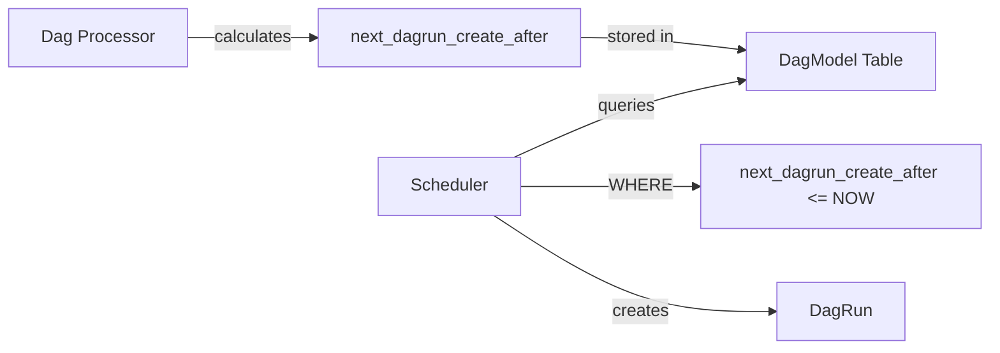
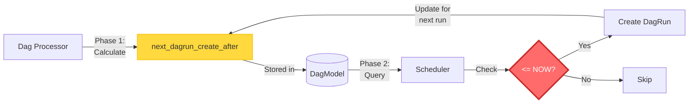
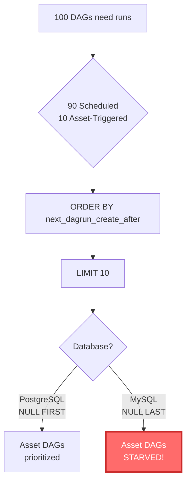
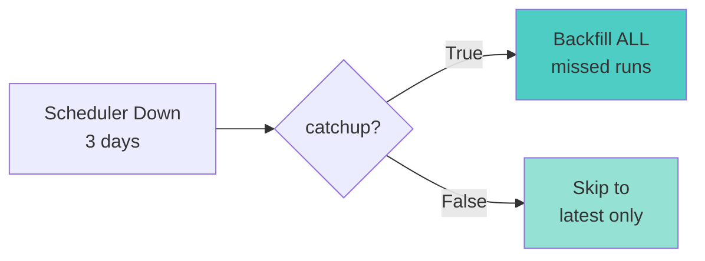
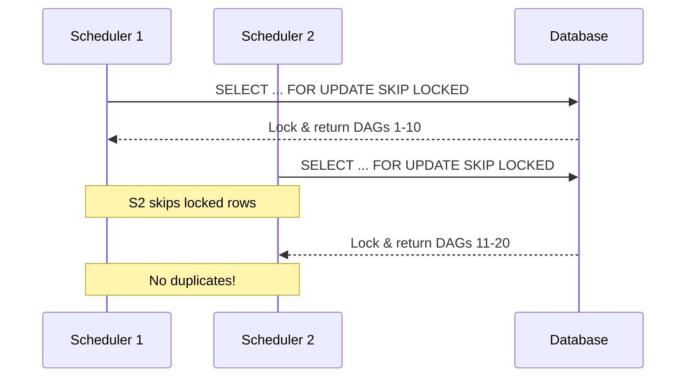

# Scheduler Documentation

This directory contains detailed documentation about Airflow's scheduler component.

## Documents

### dag_run_scheduling.md

**Topic**: How the scheduler determines when to create DAG runs

**Covers**:
- Complete flow from DAG parsing to DAG run creation (with Mermaid diagrams)
- Component responsibilities (Dag Processor, Timetable, Scheduler)
- The critical field: `next_dagrun_create_after`
- Database queries and SQL logic
- Configuration options
- Common scenarios (downtime, paused DAGs, multi-scheduler)
- Potential issues and bugs
- Database schema with ER diagrams

**Key Answer**: The scheduler uses a database query to find DAGs where `next_dagrun_create_after <= NOW()`, which is calculated by the dag processor based on the DAG's timetable and last run.

**Visual Content**:
- 11 Mermaid diagrams including:
  - High-level flow diagram
  - Sequence diagram of complete scheduling flow
  - Timetable decision flowchart
  - Scheduler loop flowchart
  - Timeline (Gantt) diagram
  - Multi-scheduler coordination sequence
  - Bug impact flowchart
  - Entity-relationship diagram
  - Summary visualization

## Quick Reference

### Critical Components



1. **Dag Processor**: Calculates WHEN runs should be created
   - File: `airflow-core/src/airflow/dag_processing/collection.py`
   - Updates: `DagModel.next_dagrun_create_after`

2. **Timetable**: Encapsulates scheduling logic
   - File: `airflow-core/src/airflow/timetables/interval.py`
   - Method: `next_dagrun_info()`

3. **Scheduler**: Creates runs at the right time
   - File: `airflow-core/src/airflow/jobs/scheduler_job_runner.py`
   - Query: `WHERE next_dagrun_create_after <= NOW()`

### Critical Database Fields

**DagModel table**:
- `next_dagrun_create_after`: When to create the next run (THE KEY FIELD)
- `next_dagrun`: Logical date of the next run
- `next_dagrun_data_interval`: Data interval for the next run

### Critical Config

```ini
[scheduler]
max_dagruns_to_create_per_loop = 10  # How many DAGs per loop
scheduler_heartbeat_sec = 1          # Loop frequency
```

## The Critical Decision



## Investigation Findings

### Potential Bug: Asset-Triggered DAG Ordering

**Location**: `airflow-core/src/airflow/models/dag.py:666`

**Issue**: Asset-triggered DAGs may have `next_dagrun_create_after = NULL`, causing unpredictable ordering in the query:
```python
.order_by(cls.next_dagrun_create_after)  # NULL order is database-dependent
.limit(cls.NUM_DAGS_PER_DAGRUN_QUERY)
```

**Impact Visualization**:



**Impact**: Asset-triggered DAGs without schedules might never run if 10+ scheduled DAGs are always due.

**Severity**: Medium - Can cause asset DAGs to not run in high-load scenarios

**Recommendation**: Use `NULLS LAST` in ORDER BY or separate asset-triggered DAGs into a different query.

## Common Scenarios

### Scheduler Downtime with catchup=True vs False



### Multi-Scheduler Coordination



## File Structure

```
files/docs/scheduler/
├── README.md                    # This file
└── dag_run_scheduling.md        # Detailed scheduling flow (633 lines)
```

## Key Takeaways

1. **Two-Phase Process**:
   - Phase 1 (Dag Processor): Calculate WHEN
   - Phase 2 (Scheduler): CREATE at the right time

2. **Critical Link**: `next_dagrun_create_after` field

3. **Simple Decision**: `WHERE next_dagrun_create_after <= NOW()`

4. **Decoupled Design**: Slow parsing separated from fast execution

5. **Multi-Scheduler Safe**: Row-level locking with SKIP LOCKED

6. **Known Bug**: Asset-triggered DAG ordering issue (see above)

---

## Excalidraw Diagrams

Detailed, editable diagrams are available in the `excalidraw/` directory:

### Available Diagrams:

1. **01_high_level_flow.excalidraw** - Complete flow from DAG file to run creation
2. **02_scheduler_loop_detailed.excalidraw** - Detailed scheduler loop with all checks
3. **03_critical_decision_point.excalidraw** - The key field and SQL query visualization

**How to use**:
- Open at https://excalidraw.com
- File → Open → Select `.excalidraw` file
- Fully editable, hand-drawn aesthetic
- Export as PNG/SVG for presentations

**See**: `excalidraw/README.md` for detailed documentation, color schemes, and usage guide

### Diagram Preview

**Critical Decision Point**:
The `next_dagrun_create_after` field is calculated by Dag Processor, stored in database, and queried by Scheduler using `WHERE next_dagrun_create_after <= NOW()`. This simple timestamp comparison is THE mechanism that determines when DAG runs are created.

**Color Coding**:
- Cyan: Dag Processor (calculation phase)
- Yellow: Critical field (`next_dagrun_create_after`)
- Red: Critical decision (SQL WHERE condition)
- Green: Scheduler (execution phase)

All diagrams maintain this consistent color scheme for easy understanding.
