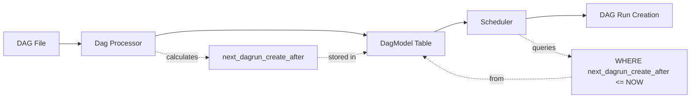
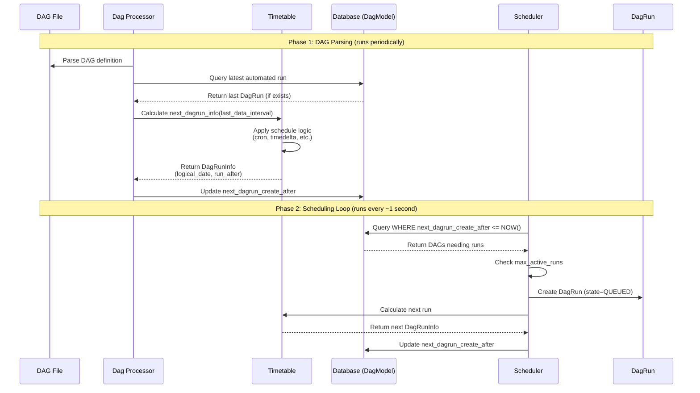
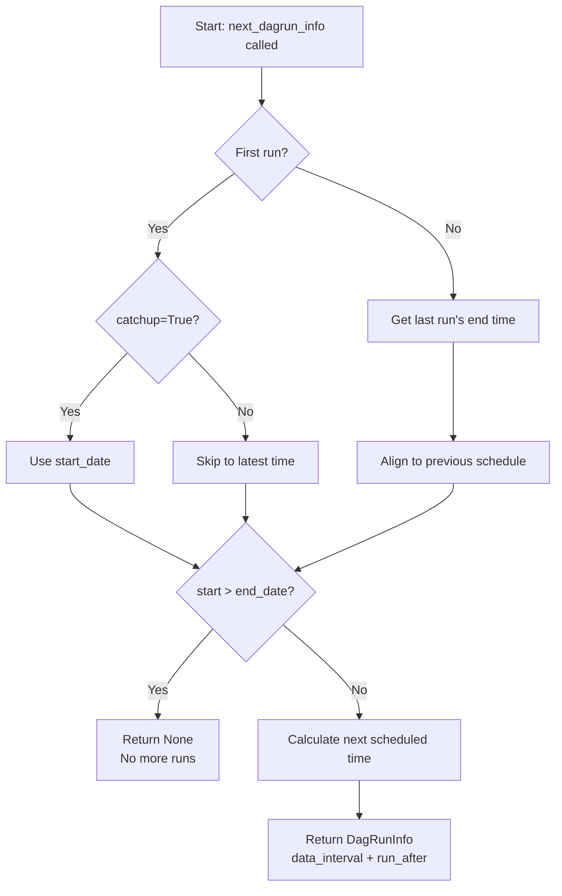
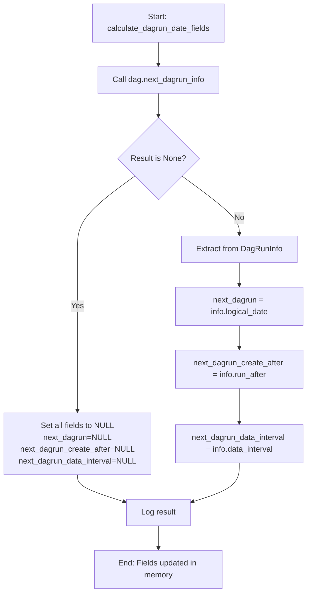
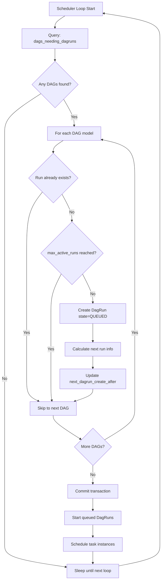
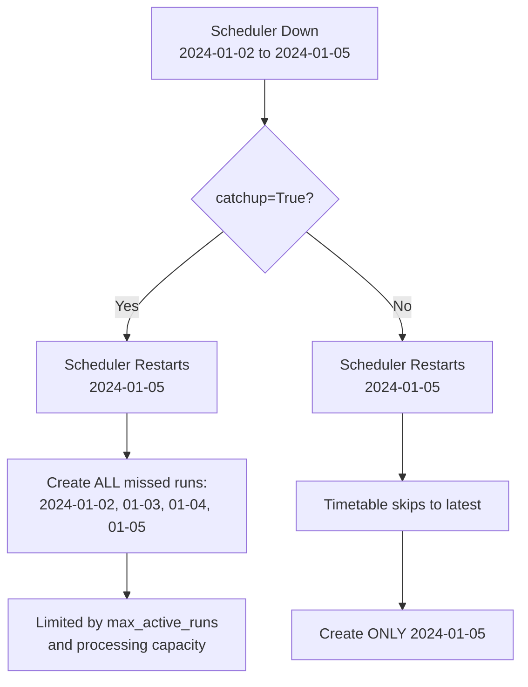
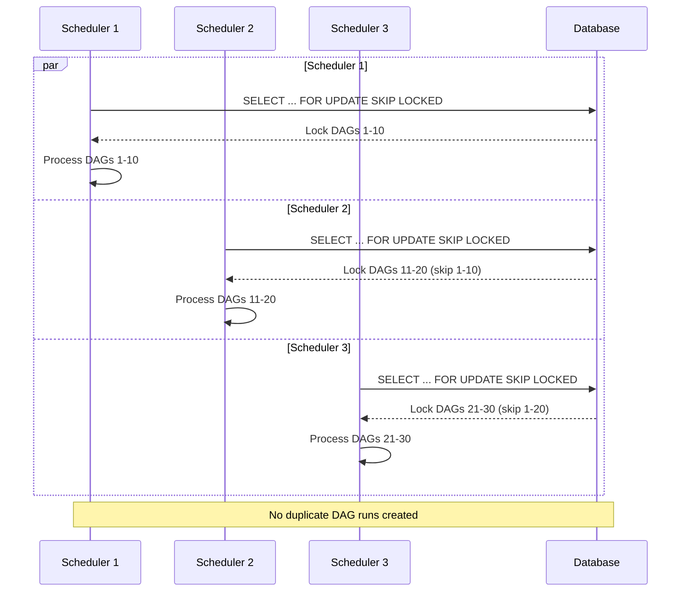
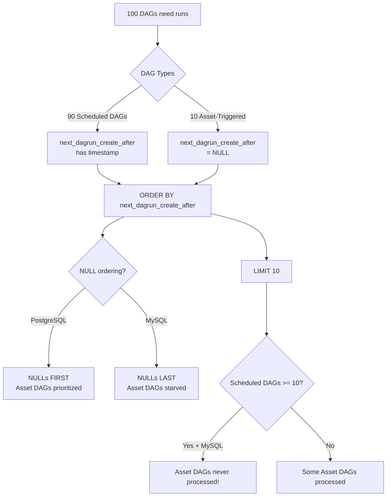
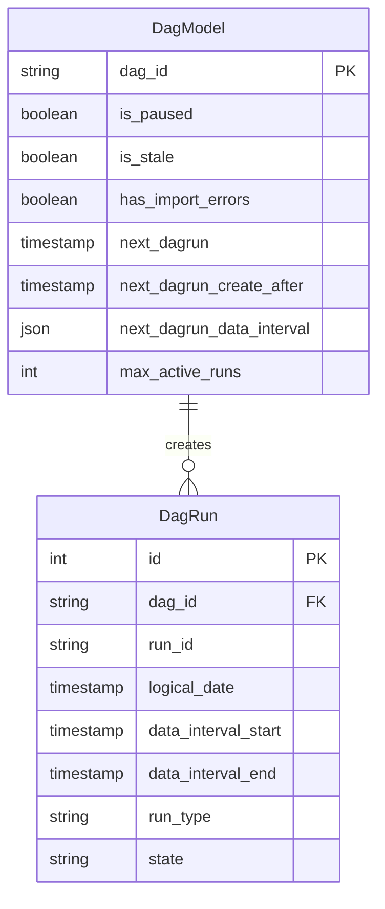
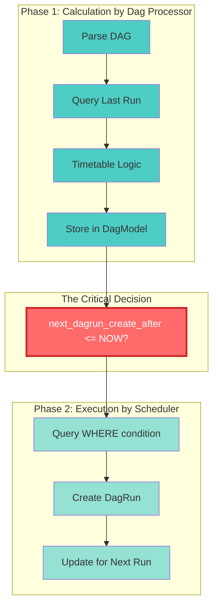

# DAG Run Scheduling: How Scheduler Determines When to Create DAG Runs

## Overview

This document explains the complete flow of how Airflow determines when a DAG run should be created, from DAG parsing to scheduler execution.

## High-Level Flow



## Complete Scheduling Flow



## Component Responsibilities

### 1. DAG Processor (Parsing Phase)

**File**: `airflow-core/src/airflow/dag_processing/collection.py`

**Responsibility**: Parse DAG files and calculate when the next DAG run should be created.

#### Key Steps:

1. **Parse DAG** from Python file
2. **Query Latest Automated Run**:
   - Fetches the most recent `SCHEDULED` or `BACKFILL_JOB` run (excludes manual runs)
   - Query: `SELECT * FROM dag_run WHERE dag_id = ? AND run_type IN ('scheduled', 'backfill') ORDER BY logical_date DESC LIMIT 1`
   - See `_get_latest_runs_stmt()` in `collection.py:95`

3. **Extract Last Data Interval**:
   - From the latest run, gets the `data_interval_start` and `data_interval_end`
   - This represents the time period the last run operated on

4. **Calculate Next Run Info**:
   - Calls `DagModel.calculate_dagrun_date_fields(dag, last_automated_data_interval)`
   - This delegates to the DAG's timetable

5. **Update DagModel Table** with three critical fields:
   - `next_dagrun`: The logical date (start of data interval) for the next run
   - `next_dagrun_create_after`: The actual timestamp when the run should be created
   - `next_dagrun_data_interval`: The data interval for the next run (JSON)

**Code Location**: `collection.py:554-556`
```python
if run_info.num_active_runs.get(dag.dag_id, 0) >= dm.max_active_runs:
    dm.next_dagrun_create_after = None  # Prevent new runs
else:
    dm.calculate_dagrun_date_fields(dag, last_automated_data_interval)
```

### 2. Timetable Logic (Schedule Calculation)

**File**: `airflow-core/src/airflow/timetables/interval.py`, `base.py`

**Responsibility**: Calculate when the next DAG run should occur based on the schedule.

#### Timetable Decision Flow



#### Timetable.next_dagrun_info() Flow:

**Input**:
- `last_automated_data_interval`: DataInterval from the previous run (start, end)
- `restriction`: TimeRestriction containing:
  - `earliest`: DAG's `start_date`
  - `latest`: DAG's `end_date`
  - `catchup`: Whether to backfill missed runs

**Processing** (for interval-based timetables like CronDataIntervalTimetable):

1. **Determine Start Time**:
   - **If catchup=False**: Skip to latest possible time (skip missed runs)
   - **If catchup=True**: Start from DAG's `start_date` or last run's end
   - **If first run**: Use DAG's `start_date`
   - **If subsequent run**: Start from end of previous data interval

2. **Align to Schedule**:
   - For fixed schedules (e.g., `0 0 * * *` - daily at midnight), align to the schedule
   - For relative schedules (e.g., `timedelta(hours=1)`), no alignment needed

3. **Calculate End Time**:
   - Call `_get_next(start)` to find the next scheduled time after start
   - For cron: use croniter to calculate next execution time
   - For timedelta: add the delta to start

4. **Check End Date**:
   - If `start > end_date`, return None (no more runs)

**Output**: `DagRunInfo`
- `data_interval`: DataInterval(start, end) - the time period this run will process
- `run_after`: DateTime - when the run should be created (typically equals `end`)

**Example for Daily Schedule (`0 0 * * *`)**:
```
Last run: DataInterval(2024-01-01 00:00, 2024-01-02 00:00)
          run_after: 2024-01-02 00:00

Next run: DataInterval(2024-01-02 00:00, 2024-01-03 00:00)
          run_after: 2024-01-03 00:00  <- This is when scheduler will create the run
```

**Code Location**: `interval.py:86-115`

### 3. DagModel.calculate_dagrun_date_fields()

**File**: `airflow-core/src/airflow/models/dag.py:675`

**Responsibility**: Bridge between timetable logic and database fields.



**Process**:
1. Call `dag.next_dagrun_info(last_automated_data_interval)`
2. If result is None:
   - Set `next_dagrun = None`
   - Set `next_dagrun_create_after = None`
   - Set `next_dagrun_data_interval = None`
3. If result is DagRunInfo:
   - Set `next_dagrun = info.logical_date` (start of data interval)
   - Set `next_dagrun_create_after = info.run_after` (when to create run)
   - Set `next_dagrun_data_interval = info.data_interval` (JSON)

**Code Location**: `dag.py:675-705`

### 4. Scheduler (Execution Phase)

**File**: `airflow-core/src/airflow/jobs/scheduler_job_runner.py`

**Responsibility**: Query DAGs that need runs and create them.

#### Scheduling Loop (_do_scheduling method)

The scheduler runs in a loop, typically every few seconds. In each iteration:



**Step 1: Query DAGs Needing Runs** (`DagModel.dags_needing_dagruns()`)

**File**: `dag.py:587-671`

**SQL Query** (simplified):
```sql
SELECT * FROM dag_model
WHERE 
    is_paused = FALSE
    AND is_stale = FALSE
    AND has_import_errors = FALSE
    AND (
        next_dagrun_create_after <= NOW()  -- Time to create the run!
        OR dag_id IN (asset_triggered_dags)  -- Asset triggered
    )
ORDER BY next_dagrun_create_after ASC  -- Earliest due first
LIMIT 10  -- Configurable: scheduler.max_dagruns_to_create_per_loop
FOR UPDATE SKIP LOCKED;  -- Multi-scheduler coordination
```

**Key Points**:
- **Time Check**: `next_dagrun_create_after <= NOW()` is THE critical check
- **Ordering**: Processes DAGs in order of due time (earliest first)
- **Limiting**: Only processes 10 DAGs per loop (configurable)
- **Locking**: Uses row-level locks with SKIP LOCKED for multi-scheduler support

**Code Location**: `dag.py:654-671`

**Step 2: Create DAG Runs** (`_create_dag_runs()`)

**File**: `scheduler_job_runner.py:1697-1780`

For each DAG model returned:

1. **Check if run already exists**:
   - Query: `SELECT dag_id, logical_date FROM dag_run WHERE (dag_id, logical_date) IN (...)`
   - Prevents duplicate runs if `next_dagrun_create_after` wasn't updated

2. **Check max_active_runs**:
   - Query: `SELECT dag_id, COUNT(*) FROM dag_run WHERE state IN ('queued', 'running') GROUP BY dag_id`
   - Skip if DAG already has max concurrent runs

3. **Create the run**:
   ```python
   dag.create_dagrun(
       run_id=dag.timetable.generate_run_id(...),
       logical_date=dag_model.next_dagrun,          # From DagModel
       data_interval=data_interval,                  # From DagModel
       run_after=dag_model.next_dagrun_create_after, # From DagModel
       run_type=DagRunType.SCHEDULED,
       triggered_by=DagRunTriggeredByType.TIMETABLE,
       state=DagRunState.QUEUED,
       creating_job_id=self.job.id,
       session=session,
   )
   ```

4. **Update DagModel for next run**:
   - Calls `dag_model.calculate_dagrun_date_fields(dag, data_interval)` again
   - This calculates when the NEXT run after this one should be created
   - Updates `next_dagrun_create_after` to the future

## Complete Example: Daily DAG at Midnight

### DAG Definition:
```python
from airflow import DAG
from datetime import datetime

dag = DAG(
    dag_id="example_daily",
    schedule="0 0 * * *",  # Daily at midnight UTC
    start_date=datetime(2024, 1, 1),
    catchup=False,
)
```

### Timeline Diagram

```mermaid
gantt
    title Daily DAG Scheduling Timeline
    dateFormat YYYY-MM-DD HH:mm
    axisFormat %Y-%m-%d %H:%M
    
    section Dag Processor
    Parse DAG & Calculate next_dagrun_create_after :milestone, 2024-01-01 12:00, 0m
    
    section DagModel
    next_dagrun_create_after = 2024-01-02 00:00 :2024-01-01 12:00, 12h
    
    section Scheduler
    Create Run 1 :milestone, 2024-01-02 00:00, 0m
    Update next_dagrun_create_after = 2024-01-03 00:00 :milestone, 2024-01-02 00:01, 0m
    Create Run 2 :milestone, 2024-01-03 00:00, 0m
    Update next_dagrun_create_after = 2024-01-04 00:00 :milestone, 2024-01-03 00:01, 0m
```

### Timeline:

**Time: 2024-01-01 12:00 UTC** (DAG first parsed)
- Dag Processor runs:
  - No previous runs exist
  - Timetable calculates: next run at 2024-01-02 00:00
  - DagModel updated:
    - `next_dagrun = 2024-01-01 00:00` (logical date)
    - `next_dagrun_create_after = 2024-01-02 00:00` (when to create)

**Time: 2024-01-02 00:00:05 UTC** (Scheduler loop runs)
- Scheduler checks: `next_dagrun_create_after (2024-01-02 00:00) <= NOW (2024-01-02 00:00:05)` ✓
- Scheduler creates DAG run:
  - `run_id = scheduled__2024-01-01T00:00:00+00:00`
  - `logical_date = 2024-01-01 00:00`
  - `data_interval_start = 2024-01-01 00:00`
  - `data_interval_end = 2024-01-02 00:00`
  - `state = QUEUED`
- Scheduler updates DagModel:
  - `next_dagrun = 2024-01-02 00:00`
  - `next_dagrun_create_after = 2024-01-03 00:00` (tomorrow)

**Time: 2024-01-03 00:00:05 UTC** (Next day)
- Scheduler checks: `next_dagrun_create_after (2024-01-03 00:00) <= NOW (2024-01-03 00:00:05)` ✓
- Creates next run...
- Updates: `next_dagrun_create_after = 2024-01-04 00:00`

## Key Configuration Options

### Scheduler Config (`airflow.cfg`):

```ini
[scheduler]
# How many DAGs to process per scheduling loop (default: 10)
max_dagruns_to_create_per_loop = 10

# How often the scheduler runs (seconds, default: 1)
scheduler_heartbeat_sec = 1
```

### DAG Config:

```python
DAG(
    schedule="0 0 * * *",      # When runs should occur
    start_date=datetime(...),  # Earliest possible run
    end_date=datetime(...),    # Latest possible run (optional)
    catchup=False,             # Skip missed runs (default: True)
    max_active_runs=16,        # Max concurrent runs (default: 16)
)
```

## Common Scenarios

### Scenario 1: Scheduler Downtime



**Situation**: Scheduler is down from 2024-01-02 to 2024-01-05.

**With catchup=True**:
- When scheduler restarts, it will create runs for:
  - 2024-01-02 00:00
  - 2024-01-03 00:00
  - 2024-01-04 00:00
  - 2024-01-05 00:00
- Limited by `max_active_runs` and processing capacity

**With catchup=False**:
- When scheduler restarts, timetable skips to latest
- Only creates run for 2024-01-05 00:00
- Missed runs are skipped

### Scenario 2: DAG Paused Then Unpaused

**Situation**: DAG paused on 2024-01-02, unpaused on 2024-01-05.

- While paused:
  - `next_dagrun_create_after` is not updated
  - Scheduler skips the DAG (query filters `is_paused = FALSE`)
- When unpaused:
  - Dag Processor recalculates `next_dagrun_create_after`
  - Behavior depends on `catchup` setting (same as Scenario 1)

### Scenario 3: Multiple Schedulers



**Situation**: 3 schedulers running simultaneously.

- Each scheduler runs `dags_needing_dagruns()` query
- `SELECT ... FOR UPDATE SKIP LOCKED` ensures:
  - Only one scheduler locks each DAG row
  - Other schedulers skip locked rows
  - No duplicate DAG runs created
- Each scheduler processes up to 10 DAGs (30 total capacity)

## Potential Issues

### Issue 1: Asset-Triggered DAG Ordering



**Problem**: Asset-triggered DAGs may have `next_dagrun_create_after = NULL` if they don't have a timetable schedule. The `ORDER BY next_dagrun_create_after` can behave unpredictably:
- Some databases (PostgreSQL) sort NULL first
- Some databases (MySQL) sort NULL last
- Asset DAGs without schedules might be starved or prioritized incorrectly

**Code Location**: `dag.py:666`
```python
.order_by(cls.next_dagrun_create_after)  # NULLs have undefined order
.limit(cls.NUM_DAGS_PER_DAGRUN_QUERY)
```

**Impact**: If 10+ scheduled DAGs are always due, asset-triggered DAGs might never be processed.

### Issue 2: Large Number of Overdue DAGs

**Problem**: If 100+ DAGs are all overdue (e.g., after scheduler downtime), only 10 are processed per loop.

**Impact**:
- Takes 10+ scheduling loops to catch up
- With 1-second scheduler heartbeat, ~10 seconds to process all
- Can be increased with `max_dagruns_to_create_per_loop` config

### Issue 3: Dag Processor Lag

**Problem**: If dag processor is slow to parse DAGs, `next_dagrun_create_after` may become stale.

**Impact**:
- Scheduler creates runs based on old schedule
- After dag processor updates, next run uses new schedule
- Can cause one run to be missed or duplicated during transition

## Database Schema

### Entity Relationship



### DagModel Table (Relevant Columns):

```sql
CREATE TABLE dag_model (
    dag_id VARCHAR(250) PRIMARY KEY,
    is_paused BOOLEAN,
    is_stale BOOLEAN,
    has_import_errors BOOLEAN,
    next_dagrun TIMESTAMP,              -- Logical date of next run
    next_dagrun_create_after TIMESTAMP, -- When to create next run (THE KEY FIELD)
    next_dagrun_data_interval JSON,     -- Data interval for next run
    max_active_runs INTEGER,
    -- ... other fields
);

CREATE INDEX idx_next_dagrun_create_after 
ON dag_model(next_dagrun_create_after);
```

### DagRun Table (Relevant Columns):

```sql
CREATE TABLE dag_run (
    id INTEGER PRIMARY KEY,
    dag_id VARCHAR(250),
    run_id VARCHAR(250),
    logical_date TIMESTAMP,           -- Start of data interval
    data_interval_start TIMESTAMP,    -- Explicit start
    data_interval_end TIMESTAMP,      -- Explicit end
    run_type VARCHAR(50),             -- SCHEDULED, MANUAL, BACKFILL_JOB, etc.
    state VARCHAR(50),                -- QUEUED, RUNNING, SUCCESS, FAILED
    -- ... other fields
);
```

## Summary



**The critical decision point**: `next_dagrun_create_after <= NOW()`

1. **Dag Processor** calculates and stores `next_dagrun_create_after` in `dag_model` table
2. **Scheduler** queries DAGs where `next_dagrun_create_after <= NOW()`
3. **Scheduler** creates the run and updates `next_dagrun_create_after` for the next run
4. **Loop continues** every ~1 second

This decouples DAG parsing (slow) from DAG run creation (fast), allowing the scheduler to be responsive while supporting complex scheduling logic.

## Key Takeaways

1. **Dag Processor is responsible for calculating WHEN** a DAG run should be created
2. **Scheduler is responsible for CREATING** the DAG run at the right time
3. **The field `next_dagrun_create_after`** is the critical link between them
4. **Timetables** encapsulate all scheduling logic (cron, timedelta, custom)
5. **Database query with time comparison** (`<= NOW()`) determines which DAGs get runs
6. **Multi-scheduler support** is achieved via row-level locking with SKIP LOCKED
