# Deferrable Task & Triggerer Lifecycle Documentation

Complete guide to understanding how deferrable tasks work in Apache Airflow, including database operations, triggerer architecture, and debugging strategies.

## Table of Contents

1. [Overview](#overview)
2. [Complete Lifecycle Flow](#complete-lifecycle-flow)
3. [Database Schema & Operations](#database-schema--operations)
4. [Triggerer Architecture](#triggerer-architecture)
5. [Trigger Implementation](#trigger-implementation)
6. [State Transitions & Recovery](#state-transitions--recovery)
7. [Debugging Guide](#debugging-guide)
8. [Performance & Capacity](#performance--capacity)
9. [Comparison: Normal vs Deferrable Tasks](#comparison-normal-vs-deferrable-tasks)

---

## Overview

### What Are Deferrable Tasks?

Deferrable tasks are a special type of Airflow task that can **pause execution and free worker resources** while waiting for an external condition to be met. Instead of blocking a worker slot for the entire wait period, the task:

1. Suspends execution and moves to **DEFERRED** state
2. Creates a **Trigger** object that monitors the condition
3. Releases the worker back to the pool (resource efficiency)
4. The Trigger runs in a lightweight **Triggerer** process (async event loop)
5. When the condition is met, the task is rescheduled and **resumes** execution

**Key Benefits**:
- **Resource Efficiency**: Workers are not blocked during wait periods (e.g., waiting for file, API, database state)
- **Scalability**: A single triggerer process can monitor thousands of triggers
- **Cost Savings**: Fewer worker slots needed for polling/waiting tasks

### When to Use Deferrable Tasks

**Good candidates**:
- Sensors waiting for external resources (file sensor, S3 key sensor)
- Waiting for long-running jobs (EMR cluster, Databricks job)
- Polling external APIs with long delays between checks
- Time-based delays (sleep for hours/days)

**Not suitable for**:
- Tasks that execute quickly (< 1 minute)
- Tasks with heavy computation (no resource savings)
- Tasks requiring immediate response (deferring adds scheduling latency)

### Triggerer Component

The **Triggerer** is a separate Airflow service that runs alongside the scheduler and workers:

```
┌─────────────┐      ┌─────────────┐      ┌─────────────┐
│  Scheduler  │      │  Triggerer  │      │   Worker    │
│             │      │             │      │             │
│ Schedules   │──────│ Monitors    │──────│ Executes    │
│ tasks       │      │ triggers    │      │ tasks       │
└─────────────┘      └─────────────┘      └─────────────┘
        │                    │                    │
        └────────────────────┴────────────────────┘
                          Database
```

**Key Characteristics**:
- Runs as an **async event loop** (asyncio)
- Can run **thousands of triggers** concurrently
- High availability: Multiple triggerer instances can run in parallel
- Each triggerer has a **capacity** (default: 1000 triggers)

---

## Complete Lifecycle Flow

### Phase-by-Phase Execution

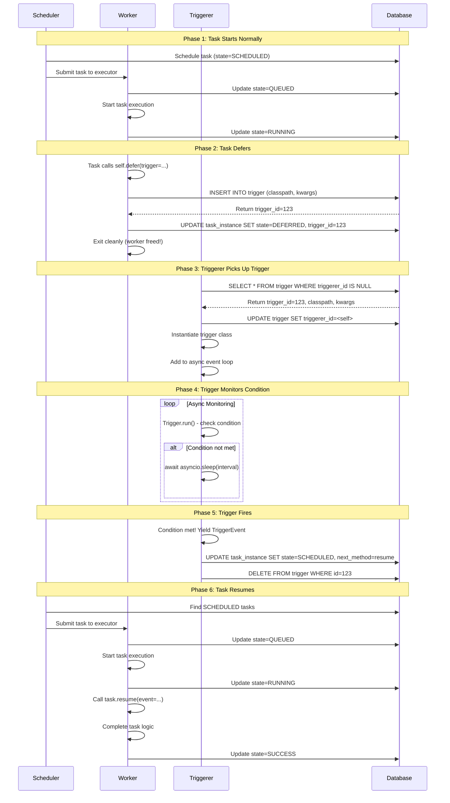

### Timeline View

```mermaid
gantt
    title Deferrable Task Timeline (Resource Efficiency)
    dateFormat  ss
    section Worker A
    Task executing    :active, t1, 00, 5s
    Worker freed      :done, t2, 05, 55s
    Task resumes      :active, t3, 60, 5s
    section Triggerer
    Idle              :done, t4, 00, 5s
    Monitoring (async):crit, t5, 05, 55s
    Trigger fires     :milestone, t6, 60, 0s
    section Task State
    RUNNING           :active, s1, 00, 5s
    DEFERRED          :crit, s2, 05, 55s
    SCHEDULED->SUCCESS:active, s3, 60, 5s
```

**Key Observation**: Worker is only occupied for **10 seconds** instead of **65 seconds** for a traditional polling task!

### Detailed Flow Diagram

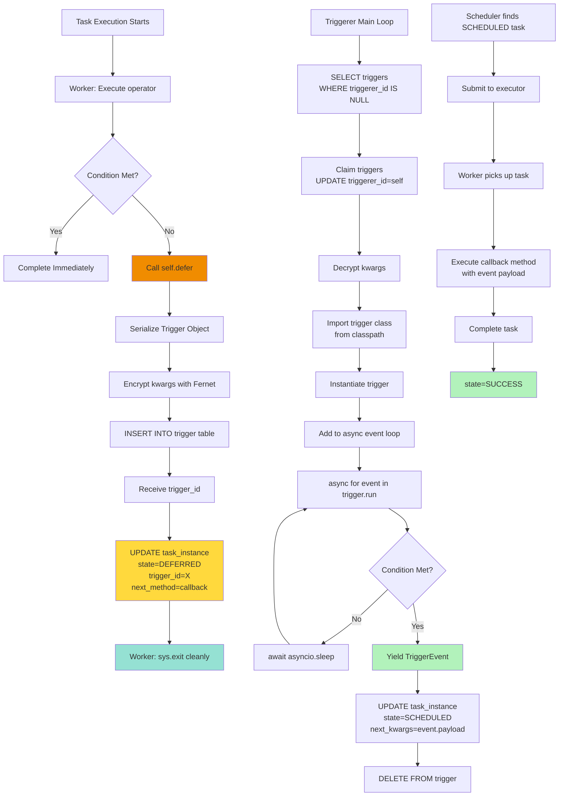


---

## Database Schema & Operations

### Trigger Table Schema

**Table**: `trigger`

```sql
CREATE TABLE trigger (
    id SERIAL PRIMARY KEY,
    classpath VARCHAR(1000) NOT NULL,  -- e.g. 'airflow.triggers.temporal.TimeDeltaTrigger'
    kwargs TEXT NOT NULL,               -- Encrypted JSON of trigger parameters
    created_date TIMESTAMP NOT NULL,
    triggerer_id INTEGER NULL           -- Which triggerer instance owns this
);
```

**Key Points**:
- `classpath`: Full Python path to trigger class (e.g., `airflow.triggers.temporal.TimeDeltaTrigger`)
- `kwargs`: **Encrypted** JSON using Fernet (same encryption as Variables/Connections)
- `triggerer_id`: FK to `job.id` - which triggerer claimed this trigger
- `created_date`: When trigger was created (for monitoring age)

### Task Instance Columns (Trigger-Related)

**Table**: `task_instance`

```sql
ALTER TABLE task_instance ADD COLUMNS:
    trigger_id INTEGER NULL,           -- FK to trigger.id
    next_method VARCHAR(1000),         -- Callback method name (e.g. 'execute_complete')
    next_kwargs TEXT,                  -- Event payload to pass to callback (JSON)
    trigger_timeout TIMESTAMP NULL;    -- When trigger should timeout
```

**Key Points**:
- `trigger_id`: Links task to its trigger (NULL when not deferred)
- `next_method`: Method name to call when trigger fires (e.g., `execute_complete`)
- `next_kwargs`: Serialized event payload from trigger
- `trigger_timeout`: Absolute timestamp when trigger should fail if not fired

### Entity Relationship Diagram

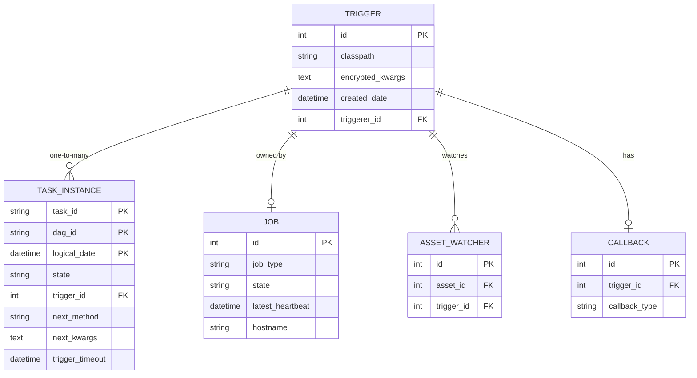

### Critical SQL Queries

#### 1. Trigger Creation (Task Defers)

**File**: `airflow/models/trigger.py:__init__`

```sql
-- Step 1: Worker inserts trigger
INSERT INTO trigger (classpath, kwargs, created_date)
VALUES (
    'airflow.triggers.temporal.TimeDeltaTrigger',
    '<encrypted_json>',  -- Fernet encrypted
    NOW()
)
RETURNING id;

-- Step 2: Worker updates task instance
UPDATE task_instance
SET state = 'deferred',
    trigger_id = <returned_id>,
    next_method = 'execute_complete',
    trigger_timeout = NOW() + INTERVAL '1 hour'
WHERE dag_id = 'example_dag'
  AND task_id = 'wait_task'
  AND run_id = 'manual_2024_01_01';
```

**Transaction**: Both operations happen in single transaction to ensure consistency.

#### 2. Triggerer Claims Triggers

**File**: `airflow/jobs/triggerer_job_runner.py:_load_triggers`

```sql
-- Fetch unclaimed triggers (with row locking to prevent race conditions)
SELECT id, classpath, kwargs, created_date
FROM trigger
WHERE triggerer_id IS NULL
   OR triggerer_id IN (
       SELECT id FROM job 
       WHERE job_type = 'TriggererJob' 
         AND (state != 'running' 
              OR latest_heartbeat < NOW() - INTERVAL '5 minutes')
   )
LIMIT <capacity - current_load>
FOR UPDATE SKIP LOCKED;

-- Claim triggers
UPDATE trigger
SET triggerer_id = <my_triggerer_id>
WHERE id IN (<claimed_ids>);
```

**Key Techniques**:
- `FOR UPDATE SKIP LOCKED`: Prevents multiple triggerers from claiming same trigger
- Detects dead triggerers via heartbeat check
- Respects capacity limit

#### 3. Trigger Fires (Resumes Task)

**File**: `airflow/models/trigger.py:submit_event`

```sql
-- Step 1: Update task instance to resume
UPDATE task_instance
SET state = 'scheduled',
    next_kwargs = '<event_payload_json>'
WHERE trigger_id = <trigger_id>
  AND state = 'deferred';

-- Step 2: Delete trigger (cleanup)
DELETE FROM trigger WHERE id = <trigger_id>;
```

**Event Payload Example**:
```json
{
  "status": "success",
  "message": "Condition met",
  "data": {"timestamp": "2024-01-01T12:00:00Z"}
}
```

#### 4. Trigger Timeout Handling

**File**: `airflow/jobs/triggerer_job_runner.py`

```sql
-- Find timed-out triggers
SELECT ti.dag_id, ti.task_id, ti.run_id, ti.trigger_id
FROM task_instance ti
WHERE ti.state = 'deferred'
  AND ti.trigger_timeout IS NOT NULL
  AND ti.trigger_timeout < NOW();

-- Mark as failed
UPDATE task_instance
SET state = 'scheduled',
    next_method = '__fail__',
    next_kwargs = '{"error": "Trigger timeout", "reason": "trigger_timeout"}'
WHERE trigger_id = <trigger_id>;

-- Cleanup trigger
DELETE FROM trigger WHERE id = <trigger_id>;
```

**Special Method**: `__fail__` is recognized by task execution code to immediately fail the task.

#### 5. Orphaned Trigger Cleanup

**File**: `airflow/models/trigger.py:clean_unused`

```sql
-- Step 1: Clear trigger_id from non-deferred tasks
UPDATE task_instance
SET trigger_id = NULL
WHERE state != 'deferred'
  AND trigger_id IS NOT NULL;

-- Step 2: Find triggers with no associated tasks
DELETE FROM trigger
WHERE id NOT IN (SELECT trigger_id FROM task_instance WHERE trigger_id IS NOT NULL)
  AND id NOT IN (SELECT trigger_id FROM asset_watcher WHERE trigger_id IS NOT NULL)
  AND id NOT IN (SELECT trigger_id FROM callback WHERE trigger_id IS NOT NULL);
```

**When Run**: Periodically by triggerer, or manually via `airflow db clean`

### Data Flow Diagram

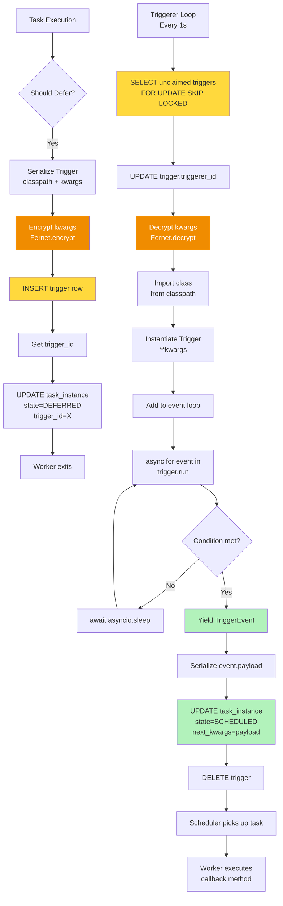

### Encryption Details

**Why Encryption?**
- Triggers may contain sensitive data (API keys, credentials, connection details)
- Uses Airflow's Fernet key (same as Variable/Connection encryption)
- Configured via `[core] fernet_key` in airflow.cfg

**Encryption Process**:

```python
# airflow/models/trigger.py
from airflow.utils.crypto import get_fernet
import json

def encrypt_kwargs(kwargs: dict) -> str:
    fernet = get_fernet()
    json_str = json.dumps(kwargs)
    encrypted_bytes = fernet.encrypt(json_str.encode('utf-8'))
    return encrypted_bytes.decode('utf-8')

def decrypt_kwargs(encrypted: str) -> dict:
    fernet = get_fernet()
    decrypted_bytes = fernet.decrypt(encrypted.encode('utf-8'))
    return json.loads(decrypted_bytes.decode('utf-8'))
```

**Example Encrypted Value**:
```
gAAAAABf... (base64 encoded Fernet token)
```


---

## Triggerer Architecture

### Process Structure

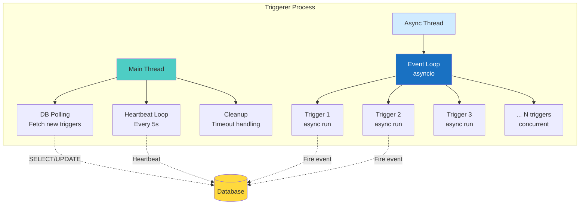

### Component Breakdown

#### 1. TriggererJobRunner (Main Thread)

**File**: `airflow/jobs/triggerer_job_runner.py`

**Responsibilities**:
- Heartbeat updates to `job` table (prove alive)
- Fetch new triggers from database
- Capacity management (max concurrent triggers)
- Signal handling (graceful shutdown)
- Database connection management

**Key Configuration**:
```ini
[triggerer]
capacity = 1000              # Max concurrent triggers per triggerer
default_capacity = 1000
job_heartbeat_sec = 5        # Heartbeat frequency
```

**Pseudo-code**:
```python
class TriggererJobRunner(BaseJobRunner):
    def __init__(self, job, capacity=None):
        self.capacity = capacity or conf.getint("triggerer", "capacity")  # Default: 1000
        self.trigger_runner = TriggerRunner(capacity=self.capacity)
    
    def _execute(self):
        """Main loop."""
        while not self.stop:
            # 1. Update heartbeat
            perform_heartbeat(job=self.job)
            
            # 2. Fetch new triggers if under capacity
            if self.trigger_runner.current_load < self.capacity:
                triggers = self._load_triggers()
                for trigger in triggers:
                    self.trigger_runner.add_trigger(trigger)
            
            # 3. Check for timeouts
            self._check_trigger_timeouts()
            
            # 4. Sleep
            time.sleep(1)
    
    def _load_triggers(self):
        """Fetch unclaimed triggers from DB."""
        available_slots = self.capacity - self.trigger_runner.current_load
        # SQL: SELECT ... FOR UPDATE SKIP LOCKED LIMIT available_slots
        triggers = session.execute(select_query).scalars().all()
        # Claim them
        for trigger in triggers:
            trigger.triggerer_id = self.job.id
        session.commit()
        return triggers
```

#### 2. TriggerRunner (Async Thread)

**File**: `airflow/jobs/triggerer_job_runner.py`

**Responsibilities**:
- Run async event loop (asyncio)
- Execute `trigger.run()` for each trigger
- Handle trigger events (fire, fail, cleanup)
- Manage trigger lifecycle

**Pseudo-code**:
```python
class TriggerRunner:
    def __init__(self, capacity):
        self.triggers = {}  # trigger_id -> trigger_instance
        self.capacity = capacity
        self.loop = asyncio.new_event_loop()
    
    def add_trigger(self, trigger_record):
        """Add trigger to event loop."""
        # Decrypt and instantiate
        trigger_class = import_string(trigger_record.classpath)
        trigger_kwargs = decrypt_kwargs(trigger_record.kwargs)
        trigger_instance = trigger_class(**trigger_kwargs)
        
        # Store and run
        self.triggers[trigger_record.id] = trigger_instance
        self.loop.create_task(self._run_trigger(trigger_record.id, trigger_instance))
    
    async def _run_trigger(self, trigger_id, trigger):
        """Run trigger in async context."""
        try:
            async for event in trigger.run():
                # Trigger fired!
                await self._handle_event(trigger_id, event)
        except Exception as exc:
            # Trigger failed
            await self._handle_failure(trigger_id, exc)
        finally:
            # Cleanup
            await trigger.cleanup()
            del self.triggers[trigger_id]
    
    async def _handle_event(self, trigger_id, event):
        """Handle trigger event (resume tasks)."""
        # UPDATE task_instance SET state='scheduled', next_kwargs=event.payload
        # DELETE FROM trigger WHERE id=trigger_id
        Trigger.submit_event(trigger_id, event)
    
    async def _handle_failure(self, trigger_id, exc):
        """Handle trigger failure."""
        # UPDATE task_instance SET next_method='__fail__'
        # DELETE FROM trigger WHERE id=trigger_id
        Trigger.submit_failure(trigger_id, exc)
```

### Capacity Management

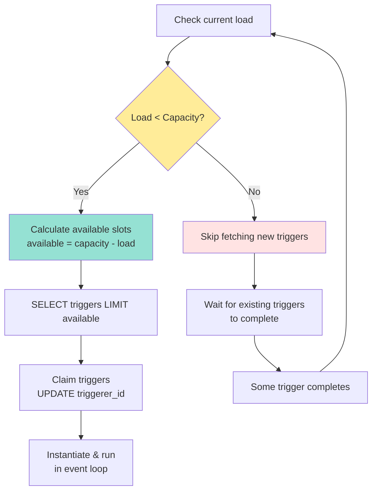

**How it works**:

1. **Initial State**: Triggerer starts, load = 0, capacity = 1000
2. **Fetch Phase**: SELECT 1000 triggers, claim them
3. **Running Phase**: All 1000 triggers running in async loop
4. **At Capacity**: Skip fetching until some triggers complete
5. **Completion**: Trigger fires → load decreases → fetch more triggers

**Example Timeline**:
```
Time  | Load | Action
------|------|-------
0:00  |    0 | Start, fetch 1000 triggers
0:01  | 1000 | At capacity, skip fetching
0:05  |  998 | 2 triggers fired, fetch 2 more
0:10  | 1000 | At capacity again
```

### Multi-Triggerer High Availability

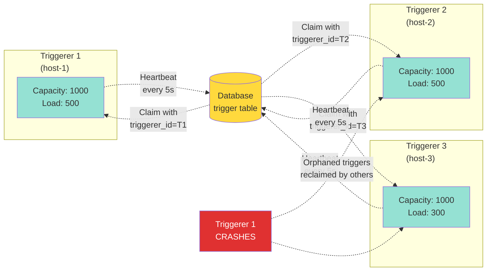

**Failover Process**:

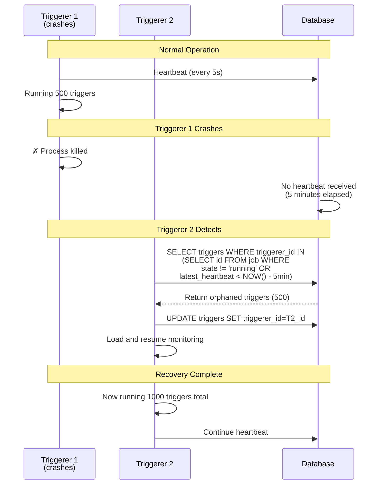

**Key Points**:
- Each triggerer has unique ID from `job.id`
- Triggers claimed with `UPDATE trigger SET triggerer_id = <my_id>`
- Dead triggerers detected via heartbeat (no update for 5 minutes)
- Orphaned triggers automatically reclaimed by healthy triggerers
- **Zero downtime**: Triggers continue running during failover

### Event Loop Internals

**Async Concurrency Model**:

```python
import asyncio

# All triggers share one event loop
loop = asyncio.new_event_loop()

# Each trigger is a coroutine
async def trigger_1():
    while True:
        # Check condition
        if condition_met():
            yield TriggerEvent(...)
            return
        await asyncio.sleep(60)  # Cooperative yield

async def trigger_2():
    # Similar
    pass

# Run all concurrently
loop.create_task(trigger_1())
loop.create_task(trigger_2())
# ... 998 more triggers

loop.run_forever()
```

**Why Async?**
- **Lightweight**: Each trigger is a coroutine (~ KB memory)
- **Cooperative**: Triggers yield control during waits
- **Scalable**: 1000s of triggers on single thread
- **vs Threads**: Would need 1000 OS threads (heavy!)

**Timeline Example**:
```
Time | Trigger 1 | Trigger 2 | Trigger 3
-----|-----------|-----------|----------
0:00 | Check     | Check     | Check
0:00 | Sleep 60s | Sleep 30s | Sleep 10s
0:10 |           |           | Check
0:10 |           |           | Sleep 10s
0:20 |           |           | Check
0:20 |           |           | FIRE!
0:30 |           | Check     |
0:30 |           | Sleep 30s |
1:00 | Check     |           |
```

All happening on **one CPU thread**!


---

## Trigger Implementation

### BaseTrigger Class

**File**: `airflow/triggers/base.py`

```python
from abc import ABC, abstractmethod
from collections.abc import AsyncIterator
from typing import Any

class BaseTrigger(ABC):
    """Base class for all triggers.
    
    A trigger exists in two contexts:
    1. Inside an Operator when passed to TaskDeferred
    2. Actively running in a triggerer worker
    """ 
    
    def __init__(self, **kwargs):
        # Set by triggerer when running
        self.task_instance = None
        self.trigger_id = None
    
    @abstractmethod
    def serialize(self) -> tuple[str, dict[str, Any]]:
        """Return (classpath, kwargs) for reconstruction.
        
        Example:
            return (
                'airflow.triggers.temporal.TimeDeltaTrigger',
                {'delta': self.delta}
            )
        """        pass
    
    @abstractmethod
    async def run(self) -> AsyncIterator[TriggerEvent]:
        """Run trigger in async context.
        
        Yield TriggerEvent when condition is met.
        Return (stop yielding) when finished.
        """        pass
        yield  # Make it an async generator
    
    async def cleanup(self) -> None:
        """Called when trigger is removed (optional)."""
        pass
```

### TriggerEvent Class

```python
from pydantic import BaseModel
from typing import Any

class TriggerEvent(BaseModel):
    """Event fired by a trigger."""
    
    payload: Any = None
    
    def __init__(self, payload, **kwargs):
        super().__init__(payload=payload, **kwargs)
    
    def __repr__(self) -> str:
        return f"TriggerEvent<{self.payload!r}>"
```

### Example Implementations

#### 1. TimeDeltaTrigger (Simple Time Wait)

**File**: `airflow/triggers/temporal.py`

```python
import asyncio
from datetime import timedelta
from airflow.triggers.base import BaseTrigger, TriggerEvent

class TimeDeltaTrigger(BaseTrigger):
    """Wait for specified time duration."""
    
    def __init__(self, delta: timedelta):
        super().__init__()
        self.delta = delta
    
    def serialize(self) -> tuple[str, dict]:
        return (
            'airflow.triggers.temporal.TimeDeltaTrigger',
            {'delta': self.delta}
        )
    
    async def run(self) -> AsyncIterator[TriggerEvent]:
        """Sleep for delta seconds, then fire."""
        await asyncio.sleep(self.delta.total_seconds())
        yield TriggerEvent({
            'status': 'success',
            'message': f'Waited {self.delta}'
        })
```

**Usage in Operator**:
```python
from airflow.operators.python import PythonOperator

class WaitOperator(PythonOperator):
    def execute(self, context):
        # Defer for 1 hour
        self.defer(
            trigger=TimeDeltaTrigger(timedelta(hours=1)),
            method_name='execute_complete'
        )
    
    def execute_complete(self, context, event=None):
        # Called after 1 hour
        return f"Waited! Event: {event}"
```

#### 2. DateTimeTrigger (Wait Until Specific Time)

```python
import asyncio
from datetime import datetime
from airflow.triggers.base import BaseTrigger, TriggerEvent
from airflow.utils import timezone

class DateTimeTrigger(BaseTrigger):
    """Wait until specific datetime."""
    
    def __init__(self, moment: datetime):
        super().__init__()
        self.moment = moment
    
    def serialize(self) -> tuple[str, dict]:
        return (
            'airflow.triggers.temporal.DateTimeTrigger',
            {'moment': self.moment}
        )
    
    async def run(self) -> AsyncIterator[TriggerEvent]:
        """Wait until moment, checking every 60s."""
        while timezone.utcnow() < self.moment:
            # Check every minute
            await asyncio.sleep(60)
        
        yield TriggerEvent({
            'status': 'success',
            'moment': self.moment.isoformat()
        })
```

#### 3. FileTrigger (Wait for File to Exist)

```python
import asyncio
import os
from airflow.triggers.base import BaseTrigger, TriggerEvent

class FileTrigger(BaseTrigger):
    """Wait for file to exist."""
    
    def __init__(self, filepath: str, poll_interval: float = 60):
        super().__init__()
        self.filepath = filepath
        self.poll_interval = poll_interval
    
    def serialize(self) -> tuple[str, dict]:
        return (
            'airflow.triggers.file.FileTrigger',
            {
                'filepath': self.filepath,
                'poll_interval': self.poll_interval
            }
        )
    
    async def run(self) -> AsyncIterator[TriggerEvent]:
        """Poll for file existence."""
        while not os.path.exists(self.filepath):
            await asyncio.sleep(self.poll_interval)
        
        yield TriggerEvent({
            'status': 'success',
            'filepath': self.filepath,
            'size': os.path.getsize(self.filepath)
        })
```

#### 4. HttpTrigger (Poll REST API)

```python
import asyncio
import aiohttp
from airflow.triggers.base import BaseTrigger, TriggerEvent

class HttpTrigger(BaseTrigger):
    """Poll HTTP endpoint until expected response."""
    
    def __init__(self, url: str, expected_status: int = 200, poll_interval: float = 30):
        super().__init__()
        self.url = url
        self.expected_status = expected_status
        self.poll_interval = poll_interval
    
    def serialize(self) -> tuple[str, dict]:
        return (
            'airflow.triggers.http.HttpTrigger',
            {
                'url': self.url,
                'expected_status': self.expected_status,
                'poll_interval': self.poll_interval
            }
        )
    
    async def run(self) -> AsyncIterator[TriggerEvent]:
        """Poll URL until expected status."""
        async with aiohttp.ClientSession() as session:
            while True:
                try:
                    async with session.get(self.url) as resp:
                        if resp.status == self.expected_status:
                            body = await resp.text()
                            yield TriggerEvent({
                                'status': 'success',
                                'http_status': resp.status,
                                'body': body[:1000]  # First 1KB
                            })
                            return
                except Exception as e:
                    # Continue polling on error
                    pass
                
                await asyncio.sleep(self.poll_interval)
```

### How Operators Use Triggers

**Defer-Resume Pattern**:

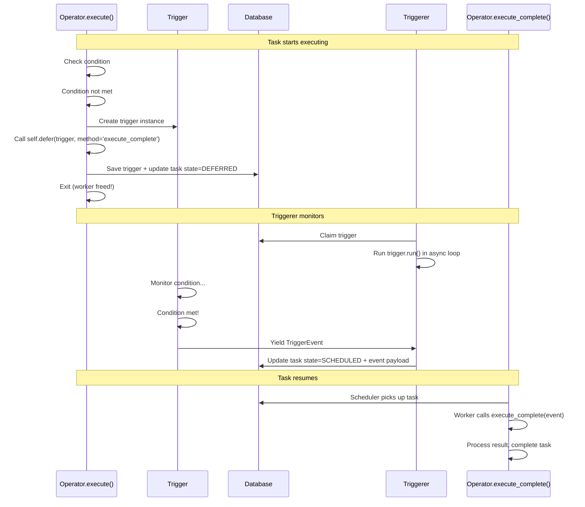

**Complete Example**:

```python
from airflow.sensors.base import BaseSensorOperator
from airflow.triggers.temporal import TimeDeltaTrigger
from datetime import timedelta

class MyDeferrableSensor(BaseSensorOperator):
    """Sensor that uses deferrable pattern."""
    
    def __init__(self, check_interval: int = 60, **kwargs):
        super().__init__(**kwargs)
        self.check_interval = check_interval
    
    def execute(self, context):
        """Initial execution."""
        if self.poke(context):
            # Condition already met!
            return True
        
        # Defer to triggerer
        self.defer(
            trigger=TimeDeltaTrigger(timedelta(seconds=self.check_interval)),
            method_name='execute_complete',
            timeout=timedelta(hours=1)  # Fail if not done in 1 hour
        )
    
    def execute_complete(self, context, event=None):
        """Called when trigger fires."""
        if self.poke(context):
            # Condition met!
            return True
        else:
            # Re-defer (condition still not met)
            self.defer(
                trigger=TimeDeltaTrigger(timedelta(seconds=self.check_interval)),
                method_name='execute_complete',
                timeout=timedelta(hours=1)
            )
    
    def poke(self, context):
        """Check condition (implement in subclass)."""
        # Example: check if file exists
        return os.path.exists('/tmp/myfile.txt')
```

### Serialization Flow

```mermaid
flowchart LR
    A[Trigger Object<br/>in Memory] --> B[serialize]<br/>classpath + kwargs
    B --> C[kwargs dict]
    C --> D[JSON.dumps]
    D --> E[Fernet.encrypt]
    E --> F[Store in DB<br/>trigger.kwargs column]
    
    F --> G[Read from DB]
    G --> H[Fernet.decrypt]
    H --> I[JSON.loads]
    I --> J[Import class<br/>from classpath]
    J --> K[Instantiate<br/>TriggerClass kwargs]
    K --> L[Trigger Object<br/>in Triggerer]
    
    style E fill:#f08c00,color:#fff
    style H fill:#f08c00,color:#fff
    style F fill:#ffd93d
    style L fill:#b2f2bb
```

**Why Serialization?**
- Trigger created in worker process
- Needs to be reconstructed in triggerer process (different machine!)
- Must be JSON-serializable (or registered with Airflow serialization)

**What Can Be Serialized?**
- Primitives: int, float, str, bool, None
- Collections: list, dict, tuple
- Datetime objects (handled by Airflow)
- Custom types: Register with `@serialized` decorator

**What CANNOT Be Serialized?**
- Lambda functions
- Local functions
- File handles
- Database connections (use connection IDs instead)


---

## State Transitions & Recovery

### Complete State Machine

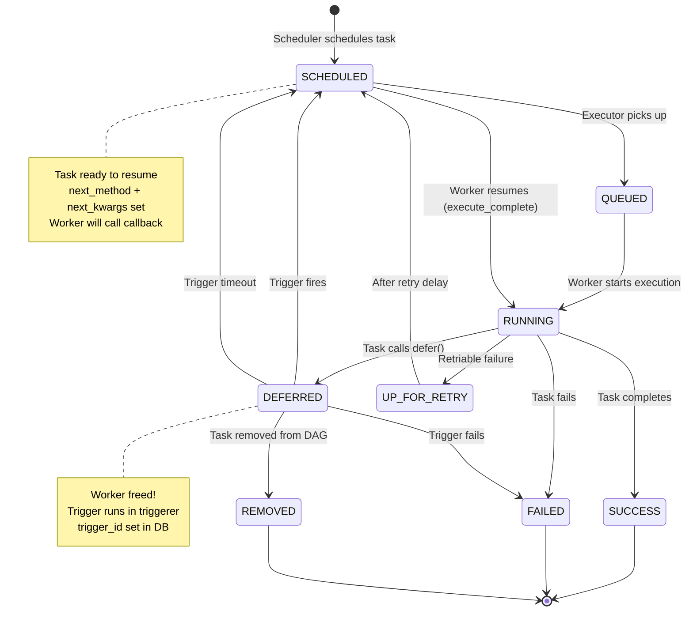

### Defer-Resume Detailed Flow

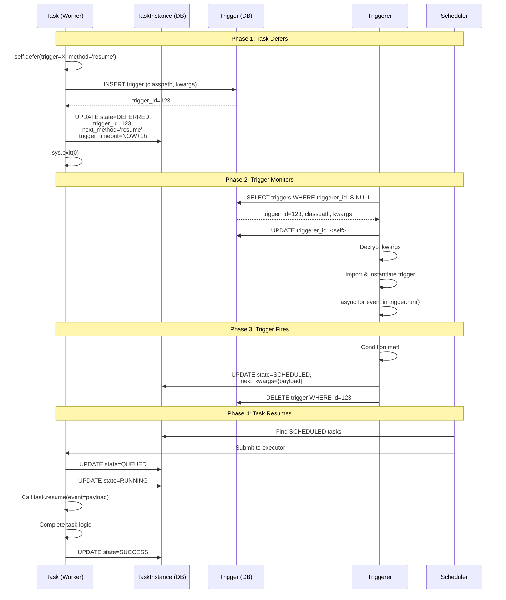

### Failure Scenarios

#### Scenario 1: Trigger Timeout

```mermaid
flowchart TD
    A[Task defers with timeout=1h] --> B[trigger_timeout = NOW() + 1h]
    B --> C[Triggerer monitors]
    C --> D{Timeout reached?}
    D -->|No| E[Trigger still running]
    E --> C
    D -->|Yes| F[Triggerer detects timeout<br/>via periodic check]
    F --> G[UPDATE task_instance<br/>state=SCHEDULED<br/>next_method='__fail__'<br/>next_kwargs={error: timeout}]
    G --> H[DELETE trigger]
    H --> I[Scheduler picks up task]
    I --> J[Worker sees __fail__ method]
    J --> K[Raise AirflowException<br/>Trigger timeout]
    K --> L[state=FAILED]
    
    style D fill:#f08c00
    style F fill:#e03131,color:#fff
    style G fill:#e03131,color:#fff
    style L fill:#e03131,color:#fff
```

**SQL for Timeout Check**:
```sql
-- Triggerer runs this periodically
SELECT ti.dag_id, ti.task_id, ti.run_id, ti.trigger_id
FROM task_instance ti
WHERE ti.state = 'deferred'
  AND ti.trigger_timeout IS NOT NULL
  AND ti.trigger_timeout < NOW();

-- Mark as failed
UPDATE task_instance
SET state = 'scheduled',
    next_method = '__fail__',
    next_kwargs = '{"error": "Trigger timeout", "reason": "trigger_timeout"}'
WHERE trigger_id IN (<timed_out_ids>);

DELETE FROM trigger WHERE id IN (<timed_out_ids>);
```

#### Scenario 2: Trigger Exception

```mermaid
flowchart TD
    A[Trigger.run raises exception] --> B[Triggerer catches exception]
    B --> C[Log error + traceback]
    C --> D[Call Trigger.submit_failure]
    D --> E[UPDATE task_instance<br/>state=SCHEDULED<br/>next_method='__fail__'<br/>next_kwargs={error, traceback}]
    E --> F[DELETE trigger]
    F --> G[Scheduler picks up task]
    G --> H[Worker calls task]
    H --> I[Task sees __fail__ method]
    I --> J[Raise AirflowException<br/>with traceback]
    J --> K[state=FAILED]
    
    style A fill:#e03131,color:#fff
    style D fill:#e03131,color:#fff
    style K fill:#e03131,color:#fff
```

**Code in Triggerer**:
```python
async def _run_trigger(self, trigger_id, trigger):
    try:
        async for event in trigger.run():
            await self._handle_event(trigger_id, event)
    except Exception as exc:
        # Trigger failed!
        import traceback
        tb = traceback.format_exception(type(exc), exc, exc.__traceback__)
        
        # Mark task as failed
        Trigger.submit_failure(trigger_id, exc=tb)
```

**File**: `airflow/models/trigger.py:submit_failure`
```python
@classmethod
def submit_failure(cls, trigger_id, exc=None, session=None):
    for task_instance in session.scalars(
        select(TaskInstance).where(
            TaskInstance.trigger_id == trigger_id,
            TaskInstance.state == TaskInstanceState.DEFERRED
        )
    ):
        task_instance.next_method = '__fail__'
        task_instance.next_kwargs = {
            'error': 'Trigger failure',
            'traceback': exc
        }
        task_instance.state = TaskInstanceState.SCHEDULED
```

#### Scenario 3: Triggerer Crash (High Availability)

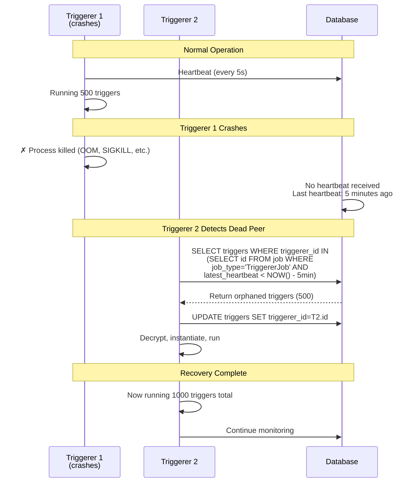

**Timeline**:
```
Time  | Triggerer 1 | Triggerer 2 | Action
------|-------------|-------------|-------
0:00  | Running 500 | Running 500 | Normal
0:05  | CRASH!      | Running 500 | T1 dies
0:06  | Dead        | Running 500 | T2 still unaware
0:10  | Dead        | Running 500 | T2 detects (5min since heartbeat)
0:11  | Dead        | Running 1000| T2 claimed orphans
```

**Key Points**:
- **5-minute grace period**: Prevents false positives from network blips
- **Automatic recovery**: No manual intervention needed
- **Trigger state preserved**: Triggers continue from where they left off
- **Zero data loss**: Trigger state stored in DB, not in memory

#### Scenario 4: Task Cleared While Deferred

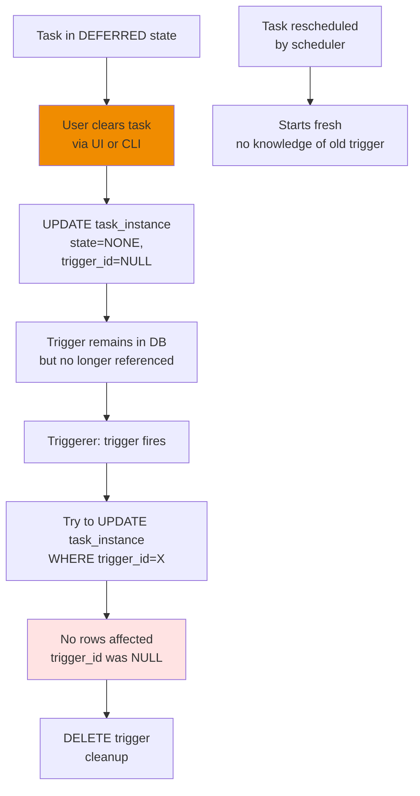

**Prevention**: Cleanup job removes unreferenced triggers periodically.

### State Transition Table

| From State | Event | To State | trigger_id | next_method | Action |
|------------|-------|----------|------------|-------------|--------|
| RUNNING | `defer()` | DEFERRED | Set | Set | Create trigger, exit worker |
| DEFERRED | Trigger fires | SCHEDULED | Clear | Set | Resume via callback |
| DEFERRED | Timeout | SCHEDULED | Clear | `__fail__` | Fail task |
| DEFERRED | Trigger fails | SCHEDULED | Clear | `__fail__` | Fail task |
| DEFERRED | Task cleared | NONE | Clear | Clear | Cleanup trigger |
| SCHEDULED | Worker picks up | RUNNING | - | - | Execute callback method |
| RUNNING | Callback completes | SUCCESS | - | - | Task done |
| RUNNING | Callback fails | FAILED | - | - | Task failed |
| RUNNING | Callback re-defers | DEFERRED | Set | Set | Re-enter defer loop |

### Recovery Strategies

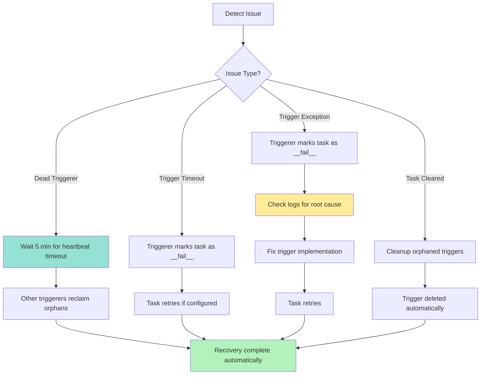


---

## Debugging Guide

### Common Issues

#### Issue 1: Task Stuck in DEFERRED State

**Symptoms**:
- Task shows `state=deferred` for extended period
- Expected trigger event hasn't fired
- No error in logs

**Debugging Steps**:

```sql
-- Step 1: Check if trigger exists
SELECT 
    t.id as trigger_id,
    t.classpath,
    t.triggerer_id,
    t.created_date,
    ti.dag_id,
    ti.task_id,
    ti.run_id,
    ti.state,
    ti.trigger_timeout,
    NOW() - t.created_date as age
FROM trigger t
JOIN task_instance ti ON ti.trigger_id = t.id
WHERE ti.dag_id = 'my_dag'
  AND ti.task_id = 'my_task'
  AND ti.run_id = 'manual_2024_01_01';
```

**Possible Causes & Solutions**:

| Finding | Cause | Solution |
|---------|-------|----------|
| No trigger row | Trigger was deleted prematurely | Check triggerer logs for errors; trigger may have failed |
| `triggerer_id IS NULL` | No triggerer claimed it | 1. Check if triggerer is running<br/>2. Check triggerer capacity |
| `triggerer_id = X` | Triggerer may have crashed | Check if triggerer job is alive:<br/>`SELECT * FROM job WHERE id=X` |
| Trigger exists but old (>1 hour) | Trigger logic has bug | 1. Check triggerer logs for exceptions<br/>2. Review trigger implementation |

**Check Triggerer Status**:
```sql
-- Find triggerer job
SELECT 
    id,
    state,
    latest_heartbeat,
    hostname,
    NOW() - latest_heartbeat as seconds_since_heartbeat
FROM job
WHERE job_type = 'TriggererJob'
ORDER BY latest_heartbeat DESC
LIMIT 5;
```

**Expected**:
- At least one job with `state='running'`
- `latest_heartbeat` within last 30 seconds

#### Issue 2: Triggerer Not Running

**Check Process**:
```bash
# List airflow processes
ps aux | grep triggerer

# Expected output:
airflow  12345  triggerer
```

**Check Job Table**:
```sql
SELECT 
    id,
    state,
    latest_heartbeat,
    hostname
FROM job
WHERE job_type = 'TriggererJob'
  AND state = 'running'
ORDER BY latest_heartbeat DESC;
```

**If No Triggerer Running**:
```bash
# Start triggerer
airflow triggerer

# Or as daemon
airflow triggerer --daemon

# Check logs
tail -f logs/triggerer/<date>/triggerer.log
```

#### Issue 3: Trigger Capacity Exhausted

**Check Capacity**:
```sql
-- Count triggers per triggerer
SELECT 
    t.triggerer_id,
    j.hostname,
    COUNT(*) as trigger_count
FROM trigger t
JOIN job j ON j.id = t.triggerer_id
GROUP BY t.triggerer_id, j.hostname
ORDER BY trigger_count DESC;
```

**If Count >= Capacity (default 1000)**:

**Solution 1: Increase Capacity**
```ini
# airflow.cfg
[triggerer]
capacity = 2000  # From 1000
```

**Solution 2: Scale Horizontally**
```bash
# Start additional triggerer instances
airflow triggerer --daemon  # On another host/container
```

**Monitor Load**:
```sql
-- Real-time capacity usage
SELECT 
    j.id,
    j.hostname,
    COUNT(t.id) as current_load,
    1000 as capacity,  -- Adjust based on your config
    (COUNT(t.id)::float / 1000 * 100)::int as utilization_pct
FROM job j
LEFT JOIN trigger t ON t.triggerer_id = j.id
WHERE j.job_type = 'TriggererJob'
  AND j.state = 'running'
GROUP BY j.id, j.hostname;
```

#### Issue 4: Trigger Timeout Not Working

**Find Expired Triggers**:
```sql
-- Tasks with expired timeouts still in DEFERRED
SELECT 
    dag_id,
    task_id,
    run_id,
    trigger_timeout,
    NOW() - trigger_timeout as overdue_by,
    state
FROM task_instance
WHERE state = 'deferred'
  AND trigger_timeout IS NOT NULL
  AND trigger_timeout < NOW()
ORDER BY trigger_timeout;
```

**If Tasks Found**:
- Triggerer may not be checking timeouts
- Check triggerer version (timeout feature added in Airflow 2.2)
- Review triggerer logs for timeout handling code
- Manually fail tasks:

```sql
UPDATE task_instance
SET state = 'scheduled',
    next_method = '__fail__',
    next_kwargs = '{"error": "Manual timeout"}'
WHERE state = 'deferred'
  AND trigger_timeout < NOW();
```

#### Issue 5: Task Fails with "Trigger failure"

**Check Error Details**:
```sql
SELECT 
    dag_id,
    task_id,
    run_id,
    next_method,
    next_kwargs
FROM task_instance
WHERE next_method = '__fail__'
ORDER BY start_date DESC
LIMIT 10;
```

**Decode Error**:
```python
import json

# From query above
next_kwargs = '{"error": "...", "traceback": "..."}'
error_data = json.loads(next_kwargs)

print("Error:", error_data.get('error'))
print("Traceback:", error_data.get('traceback'))
```

**Check Triggerer Logs**:
```bash
# Find error in logs
tail -f logs/triggerer/<date>/triggerer.log | grep -i error

# Search for specific trigger
grep "trigger_id=123" logs/triggerer/<date>/triggerer.log
```

### Useful SQL Queries

#### List All Active Triggers

```sql
SELECT 
    t.id as trigger_id,
    t.classpath,
    t.created_date,
    NOW() - t.created_date as age,
    t.triggerer_id,
    j.hostname as triggerer_hostname,
    j.latest_heartbeat,
    ti.dag_id,
    ti.task_id,
    ti.run_id,
    ti.state,
    ti.trigger_timeout,
    CASE 
        WHEN ti.trigger_timeout IS NOT NULL AND ti.trigger_timeout < NOW() 
        THEN 'TIMEOUT!' 
        ELSE 'OK' 
    END as timeout_status
FROM trigger t
LEFT JOIN task_instance ti ON ti.trigger_id = t.id
LEFT JOIN job j ON j.id = t.triggerer_id
ORDER BY t.created_date DESC
LIMIT 50;
```

#### Find Orphaned Triggers

```sql
-- Triggers with no associated task instance
SELECT 
    t.id,
    t.classpath,
    t.created_date,
    NOW() - t.created_date as age
FROM trigger t
LEFT JOIN task_instance ti ON ti.trigger_id = t.id
WHERE ti.trigger_id IS NULL
ORDER BY t.created_date;
```

#### Monitor Trigger Performance

```sql
-- Average time from defer to trigger fire (completed triggers)
SELECT 
    DATE_TRUNC('hour', ti.start_date) as hour,
    COUNT(*) as num_deferred_tasks,
    AVG(EXTRACT(EPOCH FROM (ti.start_date - ti.queued_at))) as avg_defer_seconds
FROM task_instance ti
WHERE ti.state IN ('success', 'failed')
  AND ti.trigger_id IS NOT NULL  -- Was deferred
  AND ti.start_date > NOW() - INTERVAL '24 hours'
GROUP BY DATE_TRUNC('hour', ti.start_date)
ORDER BY hour DESC;
```

#### Find Slow Triggers

```sql
-- Triggers that have been running longer than 1 hour
SELECT 
    t.id,
    t.classpath,
    t.created_date,
    EXTRACT(EPOCH FROM (NOW() - t.created_date)) / 3600 as hours_running,
    ti.dag_id,
    ti.task_id
FROM trigger t
JOIN task_instance ti ON ti.trigger_id = t.id
WHERE NOW() - t.created_date > INTERVAL '1 hour'
ORDER BY hours_running DESC;
```

### Debugging Flowchart

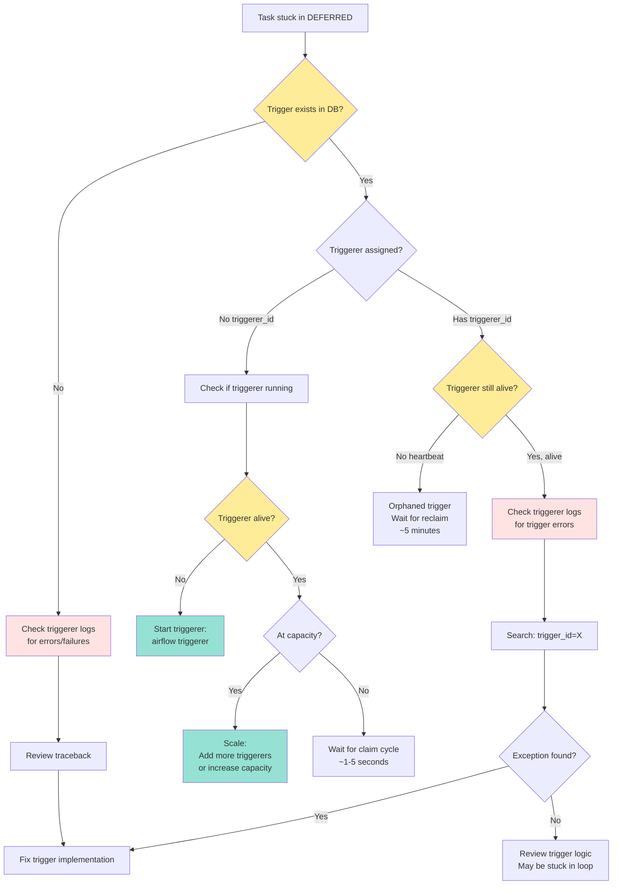

### Logging and Monitoring

#### Enable Debug Logging

```ini
# airflow.cfg
[logging]
logging_level = DEBUG

[triggerer]
logging_level = DEBUG
```

#### Key Log Messages to Watch

**Trigger Claimed**:
```
INFO - Claimed trigger {trigger_id} with classpath {classpath}
```

**Trigger Fired**:
```
INFO - Trigger {trigger_id} fired event: {event}
```

**Trigger Failed**:
```
ERROR - Trigger {trigger_id} failed with exception: {exc}
{traceback}
```

**Capacity Reached**:
```
WARNING - Triggerer at capacity ({capacity}), not claiming new triggers
```

**Orphan Detection**:
```
INFO - Detected {count} orphaned triggers from dead triggerer {triggerer_id}
```

#### Metrics to Monitor

**StatsD Metrics** (if enabled):
```python
from airflow.stats import Stats

# Track in trigger code
Stats.incr("triggers.fired")
Stats.incr("triggers.failed")
Stats.gauge("triggers.active", len(self.triggers))
Stats.timing("triggers.runtime", duration_seconds)
```

**Prometheus Metrics** (via exporter):
- `airflow_triggers_running` - Current active triggers
- `airflow_triggers_total` - Total triggers processed
- `airflow_triggers_failed_total` - Failed triggers
- `airflow_triggerer_heartbeat` - Last heartbeat timestamp

### Debugging Checklist

**Before investigating**:
- [ ] Check if triggerer process is running
- [ ] Check triggerer heartbeat (< 30s old)
- [ ] Check trigger exists in database
- [ ] Check triggerer capacity not exhausted
- [ ] Check trigger timeout not expired

**During investigation**:
- [ ] Review triggerer logs for exceptions
- [ ] Check trigger classpath is valid
- [ ] Verify trigger kwargs are correctly serialized
- [ ] Test trigger logic in isolation
- [ ] Check network connectivity (if trigger calls external APIs)
- [ ] Review database connection pool status

**After resolution**:
- [ ] Document root cause
- [ ] Add monitoring/alerting for similar issues
- [ ] Consider trigger timeout if applicable
- [ ] Review trigger implementation for improvements


---

## Performance & Capacity

### Resource Efficiency Comparison

| Metric | Traditional Sensor | Deferrable Sensor |
|--------|-------------------|-------------------|
| **Worker slots occupied** | 1 per sensor (entire duration) | 1 per sensor (only during execution) |
| **Resource usage** | High (worker process blocked) | Low (async event loop) |
| **Scalability** | Limited by worker count | Thousands per triggerer |
| **Startup overhead** | None | Slight (trigger creation + DB ops) |
| **Memory per task** | ~50-100 MB (full Python process) | ~1-10 KB (trigger object) |
| **Example**: 100 sensors waiting 1 hour | 100 worker slots × 1 hour = 100 slot-hours | 100 × (2s defer + 2s resume) = 0.11 slot-hours |

**Cost Savings Example**:
- **Traditional**: 100 workers × $0.10/hour × 1 hour = $10
- **Deferrable**: 2 workers × $0.10/hour × 0.11 hour + 1 triggerer × $0.05/hour × 1 hour = $0.07
- **Savings**: 99.3%!

### Triggerer Capacity Tuning

```mermaid
flowchart TD
    A[Monitor current load] --> B{Load consistently high?}
    B -->|Yes| C{CPU/Memory OK?}
    C -->|Yes| D[Increase capacity:<br/>[triggerer] capacity = 2000]
    C -->|No| E[Scale horizontally:<br/>Add more triggerer instances]
    
    B -->|No| F[Current capacity sufficient]
    
    D --> G[Monitor performance]
    E --> G
    G --> H{Triggers still delayed?}
    H -->|Yes| I[Check trigger implementation<br/>for blocking code<br/>avoid synchronous I/O]
    H -->|No| J[✓ Properly tuned]
    
    style B fill:#ffec99
    style C fill:#ffec99
    style D fill:#95e1d3
    style E fill:#95e1d3
    style J fill:#b2f2bb
```

**Guidelines**:
- **Default**: 1000 triggers per triggerer is usually sufficient
- **CPU-bound**: Triggers doing heavy async computation may need lower capacity (500-800)
- **I/O-bound**: Triggers waiting on network/disk can scale to 2000+
- **Memory**: Each trigger instance uses ~1-10 KB (depends on kwargs size)
- **One triggerer can typically handle**:
  - 1000 simple time-based triggers
  - 500-800 API polling triggers
  - 2000+ minimal triggers (DateTimeTrigger)

**Capacity Calculation**:
```python
# Target utilization: 70-80%
required_capacity = num_concurrent_deferred_tasks / 0.75
num_triggerers = ceil(required_capacity / 1000)
```

**Example**:
- 5000 concurrent deferred tasks
- Required capacity: 5000 / 0.75 = 6667
- Triggerers needed: ceil(6667 / 1000) = 7

### High Availability Configuration

**Scenario: 3 Triggerer Instances**

```ini
# Instance 1 (host-1)
# airflow.cfg
[triggerer]
capacity = 1000

# Instance 2 (host-2)
[triggerer]
capacity = 1000

# Instance 3 (host-3)
[triggerer]
capacity = 1000
```

**Deployment**:
```bash
# Host 1
airflow triggerer --daemon

# Host 2 (different machine/container)
airflow triggerer --daemon

# Host 3
airflow triggerer --daemon
```

**Benefits**:
- **Zero downtime**: Triggers automatically move to healthy instances
- **Load balancing**: Triggers distributed evenly (each claims 1/3)
- **Fault tolerance**: Failure of one instance doesn't affect others
- **Capacity**: Total 3000 concurrent triggers

**Monitoring**:
```sql
-- Check load distribution
SELECT 
    j.id,
    j.hostname,
    COUNT(t.id) as trigger_count,
    j.latest_heartbeat
FROM job j
LEFT JOIN trigger t ON t.triggerer_id = j.id
WHERE j.job_type = 'TriggererJob'
  AND j.state = 'running'
GROUP BY j.id, j.hostname, j.latest_heartbeat;
```

### Performance Benchmarks

**Task Startup Time**:
- **Defer operation**: 100-500ms (INSERT trigger + UPDATE task_instance)
- **Trigger claim**: 50-200ms (triggerer polling + claim)
- **Trigger fire**: 50-200ms (UPDATE task_instance + DELETE trigger)
- **Resume operation**: 100-500ms (scheduler pickup + executor submit)
- **Total overhead**: ~300-1400ms per defer/resume cycle

**Throughput**:
- **Single triggerer**: Can process 100-1000 trigger fires/second (depends on DB)
- **Trigger monitoring**: 1000 triggers × 1 check/minute = 16 checks/second (negligible CPU)
- **Bottleneck**: Usually database write throughput, not triggerer CPU

**Optimization Tips**:

1. **Batch Trigger Operations**:
```python
# Bad: Create triggers one at a time
for task in tasks:
    trigger = create_trigger()
    session.add(trigger)
    session.commit()  # Commit per trigger - slow!

# Good: Batch commits
triggers = [create_trigger() for task in tasks]
session.add_all(triggers)
session.commit()  # Single commit - fast!
```

2. **Use Appropriate Poll Intervals**:
```python
# Bad: Poll every second (wastes CPU)
trigger = FileTrigger(path='/tmp/file', poll_interval=1)

# Good: Poll every 30-60 seconds
trigger = FileTrigger(path='/tmp/file', poll_interval=30)
```

3. **Avoid Blocking Code in Triggers**:
```python
# Bad: Synchronous I/O blocks event loop
import time
async def run(self):
    while True:
        if os.path.exists(self.path):  # Blocking!
            yield TriggerEvent(...)
        time.sleep(60)  # Blocking!

# Good: Use async equivalents
import aiofiles
import asyncio
async def run(self):
    while True:
        # Use async file check or run in executor
        exists = await asyncio.to_thread(os.path.exists, self.path)
        if exists:
            yield TriggerEvent(...)
        await asyncio.sleep(60)  # Non-blocking!
```

---

## Comparison: Normal vs Deferrable Tasks

### Execution Timeline

```mermaid
gantt
    title Normal Task (Polling) vs Deferrable Task
    dateFormat  ss
    section Normal Task
    Worker occupied    :active, t1, 00, 60s
    section Deferrable
    Initial execution  :active, t2, 00, 2s
    Worker freed       :done, t3, 02, 56s
    Resume execution   :active, t4, 58, 2s
    section Triggerer
    Async monitoring   :crit, t5, 02, 56s
```

**Analysis**:
- **Normal task**: Worker blocked for 60 seconds
- **Deferrable task**: Worker occupied for only 4 seconds total
- **Efficiency gain**: 93% reduction in worker time

### Resource Usage

**Normal Task (Polling Sensor)**:
```python
class PollingSensor(BaseSensorOperator):
    def execute(self, context):
        while not self.poke(context):  # Blocks worker!
            time.sleep(self.poke_interval)  # 60 seconds
        return True
```

**Problems**:
- Worker slot occupied entire time
- Process memory: ~50-100 MB
- CPU idle most of the time (sleeping)
- Limited by worker pool size

---

**Deferrable Task**:
```python
class DeferrableSensor(BaseSensorOperator):
    def execute(self, context):
        if not self.poke(context):
            self.defer(
                trigger=TimeDeltaTrigger(timedelta(seconds=60)),
                method_name='execute_complete'
            )  # Worker freed immediately!
    
    def execute_complete(self, context, event):
        if self.poke(context):
            return True
        self.defer(...)  # Re-defer if needed
```

**Advantages**:
- Worker freed during wait
- Trigger memory: ~1-10 KB
- Scales to thousands of concurrent waits
- Single triggerer handles many tasks

### When to Use Each

```mermaid
flowchart TD
    A[Task needs to wait] --> B{Wait duration?}
    B -->|< 1 minute| C[Use normal task<br/>Overhead not worth it]
    B -->|> 1 minute| D{Frequent checks needed?}
    
    D -->|Yes, every few seconds| E[Use normal task<br/>Defer overhead adds up]
    D -->|No, checks every minute+| F{Worker pool constrained?}
    
    F -->|Yes| G[✓ Use deferrable task<br/>Free workers!]
    F -->|No, plenty of workers| H{Long waits hours/days?}
    
    H -->|Yes| G
    H -->|No| I[Either is fine<br/>Deferrable is more efficient]
    
    style G fill:#b2f2bb
    style C fill:#95e1d3
    style E fill:#95e1d3
    style I fill:#95e1d3
```

**Decision Matrix**:

| Wait Duration | Check Frequency | Worker Pool | Recommendation |
|--------------|----------------|-------------|----------------|
| < 1 min | Any | Any | **Normal task** |
| 1-10 min | < 10s | Not constrained | Normal task |
| 1-10 min | > 30s | Any | **Deferrable** |
| > 10 min | Any | Any | **Deferrable** |
| Any | Any | Constrained | **Deferrable** |
| Hours/Days | Any | Any | **Deferrable** (mandatory!) |

### Migration Guide

**Convert polling sensor to deferrable**:

```python
# BEFORE (polling - blocks worker)
from airflow.sensors.base import BaseSensorOperator
import time

class MyFileSensor(BaseSensorOperator):
    def __init__(self, filepath, poke_interval=60, **kwargs):
        super().__init__(**kwargs)
        self.filepath = filepath
        self.poke_interval = poke_interval
    
    def execute(self, context):
        while not os.path.exists(self.filepath):
            time.sleep(self.poke_interval)  # Blocks worker!
        return True

# AFTER (deferrable - frees worker)
from airflow.sensors.base import BaseSensorOperator
from airflow.triggers.file import FileTrigger
from datetime import timedelta

class MyFileSensor(BaseSensorOperator):
    def __init__(self, filepath, poke_interval=60, **kwargs):
        super().__init__(**kwargs)
        self.filepath = filepath
        self.poke_interval = poke_interval
    
    def execute(self, context):
        if os.path.exists(self.filepath):
            return True  # File already exists
        
        # Defer to triggerer
        self.defer(
            trigger=FileTrigger(
                filepath=self.filepath,
                poll_interval=self.poke_interval
            ),
            method_name='execute_complete',
            timeout=timedelta(hours=24)  # Fail after 24 hours
        )
    
    def execute_complete(self, context, event=None):
        # Trigger fired, file exists!
        return True
```

**Key Changes**:
1. Add `defer()` call instead of sleep loop
2. Implement `execute_complete()` callback
3. Set timeout to prevent infinite waits
4. Trigger handles the polling logic

### Cost Analysis Example

**Scenario**: 1000 tasks waiting for S3 files, average wait 30 minutes

**Traditional Approach**:
- Workers needed: 1000 (one per task)
- Instance type: t3.medium ($0.0416/hour)
- Duration: 0.5 hours
- **Cost**: 1000 × $0.0416 × 0.5 = **$20.80**

**Deferrable Approach**:
- Workers needed: 10 (handle startup/resume, freed during wait)
- Triggerer: 1 instance (t3.small, $0.0208/hour)
- Worker duration: ~5 minutes each
- Triggerer duration: 30 minutes
- **Worker cost**: 10 × $0.0416 × (5/60) = $0.03
- **Triggerer cost**: 1 × $0.0208 × 0.5 = $0.01
- **Total**: **$0.04**

**Savings**: $20.80 - $0.04 = $20.76 (99.8% reduction!)

---

## Summary

### Key Takeaways

1. **Deferrable tasks free worker resources** while waiting for external conditions
2. **Triggerer runs as async event loop**, can monitor thousands of triggers concurrently
3. **Database is the communication layer**: `trigger` table + `task_instance` columns
4. **High availability built-in**: Multiple triggerers automatically share load and provide failover
5. **Debugging focuses on**: trigger existence, triggerer health, capacity, logs, timeouts
6. **Use for**: Long waits (>1 min), resource-constrained environments, polling external systems
7. **Cost savings**: Can reduce infrastructure costs by 90-99% for waiting tasks

### Critical Files & Components

**Core Implementation**:
- `airflow/jobs/triggerer_job_runner.py` - Main triggerer job (main + async threads)
- `airflow/models/trigger.py` - Trigger DB model and event handling
- `airflow/triggers/base.py` - BaseTrigger class and TriggerEvent
- `airflow/models/taskinstance.py` - Task defer/resume logic

**Database Tables**:
- `trigger` - Stores trigger definitions
  - Columns: `id`, `classpath`, `kwargs` (encrypted), `created_date`, `triggerer_id`
- `task_instance` - Extended with trigger support
  - Columns: `trigger_id`, `next_method`, `next_kwargs`, `trigger_timeout`

**Key Methods**:
- `Operator.defer(trigger, method_name, timeout)` - Suspend task, create trigger
- `Trigger.serialize()` - Convert to (classpath, kwargs) for storage
- `Trigger.run()` - Async generator that yields events
- `Trigger.submit_event()` - Resume tasks when condition met
- `Trigger.submit_failure()` - Handle trigger exceptions

### Next Steps

**For Users**:
- Review provider-specific deferrable triggers (AWS, GCP, Databricks)
- Convert long-running sensors to deferrable pattern
- Monitor triggerer capacity and performance
- Set appropriate timeouts for triggers
- Consider deferrable tasks for any wait > 1 minute

**For Developers**:
- Implement custom triggers for your use cases
- Follow async best practices (no blocking I/O)
- Test trigger serialization/deserialization
- Handle exceptions gracefully in `run()` method
- Implement `cleanup()` for resource cleanup

**Monitoring**:
- Set up alerts for triggerer heartbeat failures
- Monitor trigger capacity utilization
- Track trigger age (time in DEFERRED state)
- Alert on timeout rate increases
- Monitor defer/resume cycle performance

---

*Documentation generated for Airflow deferrable tasks and triggerer component.*
*See excalidraw diagrams for visual architecture details.*
*For questions or issues, refer to the Debugging Guide section.*
