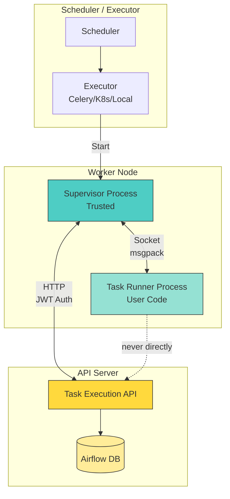
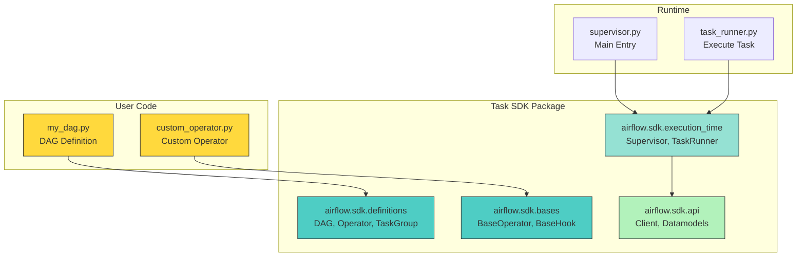
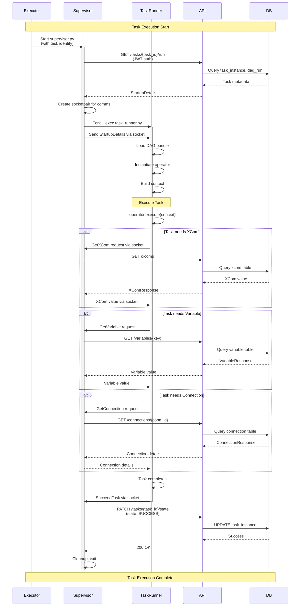
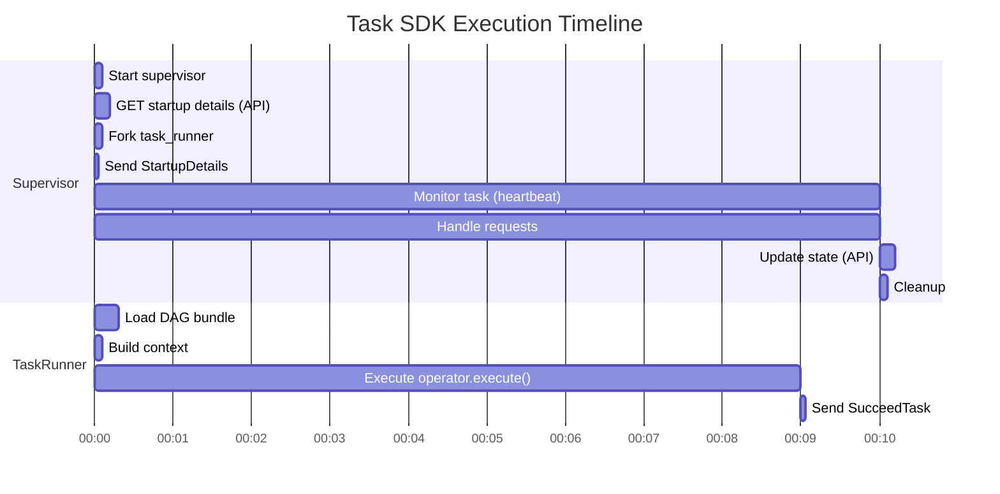
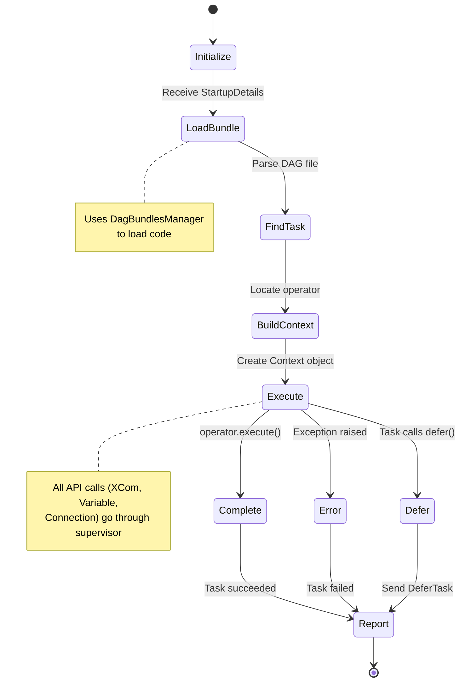
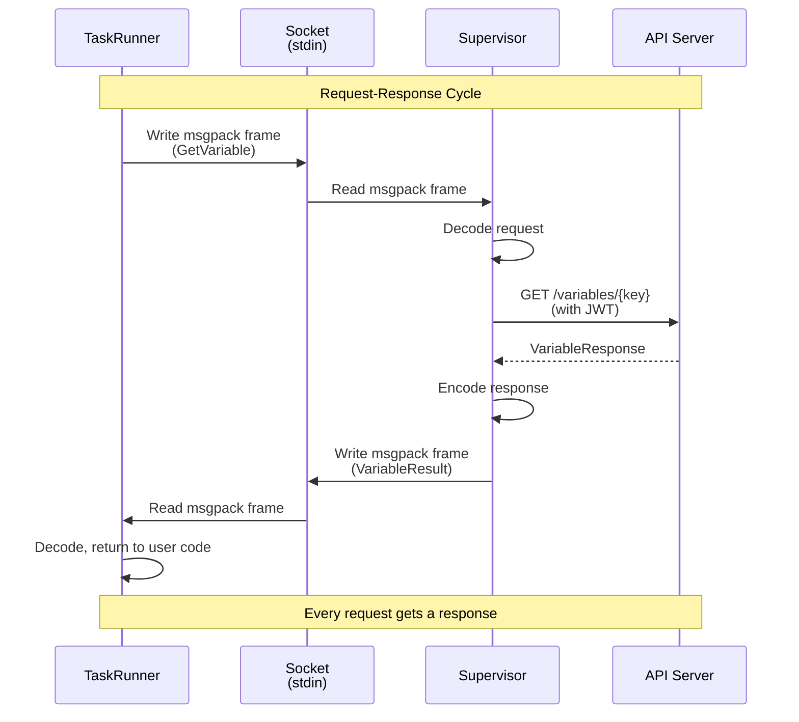
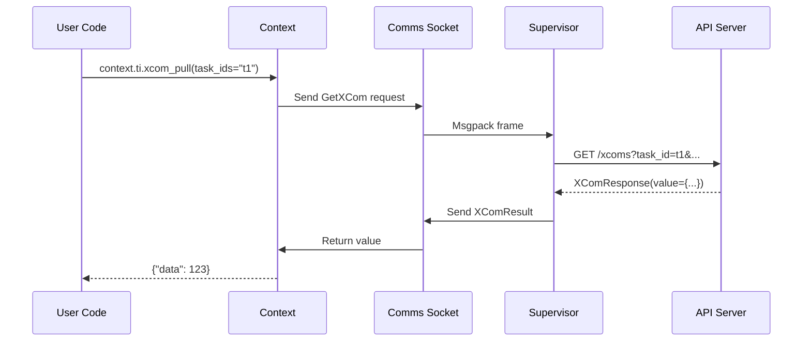
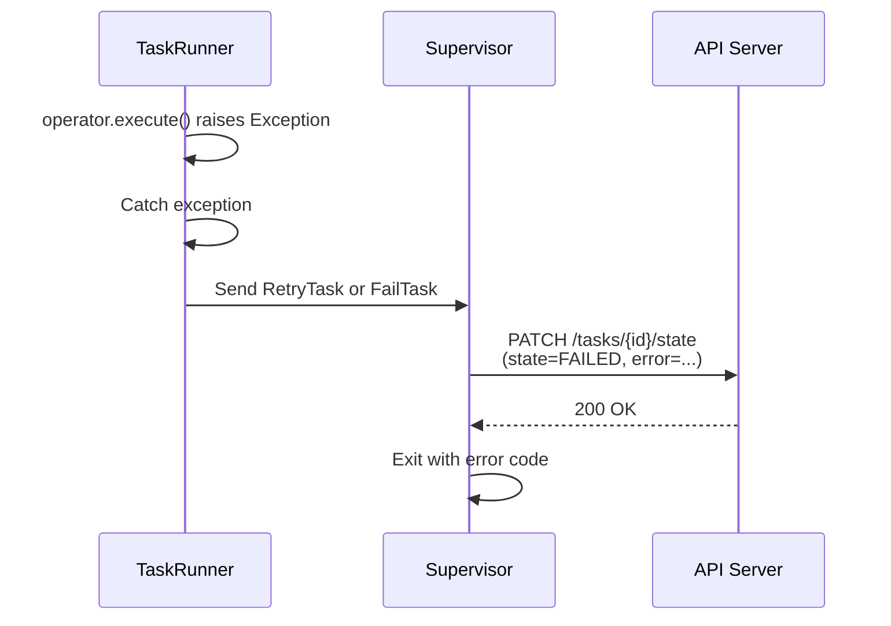

# Apache Airflow Task SDK - Architecture and Lifecycle

## Table of Contents

1. [Overview](#overview)
2. [Architecture Components](#architecture-components)
3. [Task Execution Lifecycle](#task-execution-lifecycle)
4. [Supervisor Process](#supervisor-process)
5. [Task Runner Process](#task-runner-process)
6. [Communication Protocol](#communication-protocol)
7. [API Client](#api-client)
8. [DAG Definitions](#dag-definitions)
9. [Context and XCom](#context-and-xcom)
10. [Secrets and Configuration](#secrets-and-configuration)
11. [Error Handling](#error-handling)
12. [Debugging Guide](#debugging-guide)

---

## Overview

### What is the Task SDK?

The **Apache Airflow Task SDK** is a standalone Python package that provides:

1. **DAG Definition Interfaces** - Classes for defining DAGs, tasks, operators
2. **Task Execution Runtime** - Process for running tasks independently from the scheduler
3. **Communication Protocol** - Binary protocol between supervisor and task process
4. **API Client** - HTTP client for communicating with Airflow API server

### Why Was It Created?

**Introduced in Airflow 3.0**, the Task SDK enables:

- **Separation of Concerns** - Task execution is independent from scheduler
- **Reduced Dependencies** - Tasks don't need full Airflow installation
- **Better Security** - User code never sees JWT tokens
- **Improved Performance** - Fewer HTTP connections to API server
- **Cleaner Architecture** - Clear boundaries between components

### Key Principles

1. **Two-Process Model**: Supervisor (trusted) + Task Runner (user code)
2. **Socket Communication**: Bidirectional msgpack protocol over stdin/stdout
3. **API Proxy**: Supervisor proxies all API requests from task
4. **JWT Isolation**: Task never receives authentication token
5. **Minimal Dependencies**: SDK has fewer dependencies than core Airflow



---

## Architecture Components

### High-Level Architecture



### Module Structure

**1. `airflow.sdk.definitions`** - DAG definition interfaces
- `dag.py` - DAG class
- `operator.py`, `mappedoperator.py` - Task definitions
- `taskgroup.py` - Task grouping
- `asset/` - Asset/inlet/outlet handling
- `decorators/` - @task, @dag decorators
- `context.py` - Context dataclass
- `xcom_arg.py` - XCom task dependencies
- `param.py` - DAG parameters

**2. `airflow.sdk.bases`** - Base classes for operators/hooks
- `operator.py` - `BaseOperator`
- `hook.py` - `BaseHook`
- `sensor.py` - `BaseSensor`
- `xcom.py` - `BaseXCom`
- `decorator.py` - Task decorator base
- `notifier.py` - Notification base

**3. `airflow.sdk.execution_time`** - Runtime execution
- `supervisor.py` - Supervisor process (entry point)
- `task_runner.py` - Task runner process
- `comms.py` - Communication protocol
- `context.py` - Runtime context
- `xcom.py` - XCom operations
- `secrets/` - Secrets management
- `callback_runner.py` - Callback execution

**4. `airflow.sdk.api`** - API client
- `client.py` - HTTP client
- `datamodels/` - Pydantic models
- `_generated.py` - Auto-generated from OpenAPI spec

**5. `airflow.sdk.io`** - Object store integration
- `fs.py` - Filesystem abstraction
- `path.py` - Path handling
- `store.py` - Object store backends

---

## Task Execution Lifecycle

### Complete Flow



### Execution Phases



---

## Supervisor Process

### Overview

The **Supervisor** is a trusted process that:

1. **Authenticates** with API server using JWT token
2. **Manages** task runner subprocess
3. **Proxies** API requests from task runner
4. **Heartbeats** task execution to API server
5. **Collects** logs from task runner
6. **Reports** final task state

**Source**: `airflow/sdk/execution_time/supervisor.py`

### Supervisor Responsibilities

```mermaid
flowchart TD
    Start[Supervisor Starts] --> Auth[Authenticate with API<br/>GET /tasks/{id}/run]
    Auth --> Socket[Create socketpair]
    Socket --> Fork[Fork task_runner.py]
    Fork --> Send[Send StartupDetails]
    Send --> Monitor[Monitor Loop]
    
    Monitor --> Select[select() on sockets]
    Select -->|Stdin request| HandleReq[Handle Request]
    Select -->|Logs socket| HandleLog[Forward Logs]
    Select -->|Heartbeat timer| Heartbeat[Send Heartbeat]
    Select -->|Process exit| Cleanup[Cleanup & Report]
    
    HandleReq --> APICall[Call API Server]
    APICall --> Response[Send Response]
    Response --> Monitor
    
    HandleLog --> LogForward[Forward to API]
    LogForward --> Monitor
    
    Heartbeat --> APIHeartbeat[PATCH /tasks/{id}/heartbeat]
    APIHeartbeat --> Monitor
    
    Cleanup --> FinalState[PATCH /tasks/{id}/state]
    FinalState --> Exit[Exit]
    
    style Start fill:#4ecdc4,stroke:#333
    style Monitor fill:#95e1d3,stroke:#333
    style APICall fill:#ffd93d,stroke:#333
    style Exit fill:#b2f2bb,stroke:#333
```

### Supervisor Main Loop

**Pseudocode**:

```python
def supervise(task_id, token):
    # 1. Get startup details from API
    startup = api_client.get_task_startup(task_id, token)
    
    # 2. Create socketpair for communication
    supervisor_sock, task_sock = socketpair()
    
    # 3. Fork and exec task_runner.py
    pid = fork()
    if pid == 0:  # Child
        exec(["python", "task_runner.py"], stdin=task_sock)
    
    # 4. Send startup details to task runner
    send_msgpack(supervisor_sock, startup)
    
    # 5. Monitor loop
    while True:
        ready = select([supervisor_sock, log_sock, heartbeat_timer])
        
        if supervisor_sock in ready:
            request = receive_msgpack(supervisor_sock)
            response = handle_request(request, api_client)
            send_msgpack(supervisor_sock, response)
        
        if log_sock in ready:
            log_line = log_sock.readline()
            api_client.send_log(task_id, log_line)
        
        if heartbeat_timer in ready:
            api_client.heartbeat(task_id)
        
        if process_exited(pid):
            break
    
    # 6. Report final state
    api_client.update_state(task_id, final_state)
```

### Request Handling

**Supported Requests** (see `comms.py`):

| Request Type | API Endpoint | Purpose |
|--------------|--------------|----------|
| `GetXCom` | `GET /xcoms` | Retrieve XCom value |
| `GetVariable` | `GET /variables/{key}` | Retrieve Airflow variable |
| `GetConnection` | `GET /connections/{conn_id}` | Retrieve connection details |
| `GetAssetByName` | `GET /assets?name={name}` | Get asset metadata |
| `GetAssetByUri` | `GET /assets?uri={uri}` | Get asset by URI |
| `GetDagRunState` | `GET /dag_runs/{id}/state` | Get DAG run state |
| `GetTaskStates` | `GET /dag_runs/{id}/task_states` | Get states of all tasks |
| `SucceedTask` | `PATCH /tasks/{id}/state` | Mark task as SUCCESS |
| `DeferTask` | `PATCH /tasks/{id}/state` | Defer task to triggerer |
| `RetryTask` | `PATCH /tasks/{id}/state` | Mark for retry |

---

## Task Runner Process

### Overview

The **Task Runner** is a subprocess that:

1. **Loads** DAG bundle and finds task
2. **Builds** execution context
3. **Executes** `operator.execute(context)`
4. **Sends requests** to supervisor for resources
5. **Reports** completion status

**Source**: `airflow/sdk/execution_time/task_runner.py`

### Task Runner Lifecycle



### Context Building

**Context Object** provides access to:

```python
class Context:
    # Task metadata
    task: BaseOperator
    task_instance: TaskInstance  # From API
    dag_run: DagRun  # From API
    dag: DAG
    
    # Execution metadata
    logical_date: datetime
    data_interval_start: datetime
    data_interval_end: datetime
    execution_date: datetime  # Deprecated alias
    
    # Accessors (lazy-loaded via supervisor)
    var: VariableAccessor  # var.value.my_var
    conn: ConnectionAccessor  # conn.my_conn_id
    
    # Functions
    ti: TaskInstancePydantic  # Current TI state
    run_id: str
    try_number: int
    max_tries: int
    
    # Advanced
    inlet_events: InletEventsAccessors  # Asset event data
    params: ParamsDict  # DAG/task parameters
    conf: dict  # DAG run conf
    test_mode: bool
    
    # Methods
    def xcom_pull(...) -> Any: ...
    def xcom_push(...) -> None: ...
```

### Operator Execution

```python
def run_task(startup_details):
    # 1. Load DAG bundle
    bundle_manager = DagBundlesManager()
    bundle = bundle_manager.get_bundle(startup_details.bundle_info)
    
    # 2. Parse DAG file and find task
    dag = bundle.parse_dag_file(startup_details.dag_id)
    operator = dag.task_dict[startup_details.task_id]
    
    # 3. Build context
    context = Context(
        task=operator,
        task_instance=startup_details.ti,
        dag_run=startup_details.dag_run,
        dag=dag,
        # ... other fields
    )
    
    # 4. Template rendering
    operator.render_template_fields(context)
    
    # 5. Execute!
    try:
        result = operator.execute(context)
        
        # 6. Report success
        send_to_supervisor(SucceedTask())
        
    except AirflowException as e:
        # 7. Report failure
        send_to_supervisor(FailTask(error=str(e)))
```

---

## Communication Protocol

### Protocol Design

**Key Features**:
- **Binary**: 4-byte length prefix + msgpack payload
- **Bidirectional**: Task can send requests, supervisor responds
- **Synchronous**: Request-response pattern
- **Socket-based**: Uses stdin (fd 0) as bidirectional socket

**Why not HTTP/gRPC?**
- Simpler (no server/port management)
- Lower overhead
- Built-in with process fork

### Message Format

```
+-------------------+
| 4 bytes: length   |  (big-endian uint32)
+-------------------+
| N bytes: msgpack  |  (msgpack-encoded message)
+-------------------+
```

**Example Messages**:

```python
# From task runner: Get XCom
{
    "type": "GetXCom",
    "key": "result",
    "task_id": "upstream_task",
    "dag_id": "my_dag",
    "run_id": "manual__2024-01-15T10:00:00+00:00",
    "map_index": -1
}

# From supervisor: XCom response
{
    "type": "XComResult",
    "value": {"data": [1, 2, 3]},
    "key": "result"
}

# From task runner: Task complete
{
    "type": "SucceedTask"
}
```

### Communication Flow



### Request/Response Types

**Defined in** `airflow/sdk/execution_time/comms.py`

```python
# Base classes
class ToSupervisor(msgspec.Struct):  # Task → Supervisor
    """Base for messages from task to supervisor."""

class ToTask(msgspec.Struct):  # Supervisor → Task
    """Base for messages from supervisor to task."""

# Example request
class GetXCom(ToSupervisor):
    key: str
    task_id: str
    dag_id: str
    run_id: str
    map_index: int = -1

# Example response
class XComResult(ToTask):
    value: JsonValue
    key: str
```

**msgspec Encoding**:
- Faster than JSON
- Type-safe decoding
- Compact binary format

---

## API Client

### Client Architecture

**Source**: `airflow/sdk/api/client.py`

```python
class Client:
    """HTTP client for Task Execution API."""
    
    def __init__(self, base_url: str, token: str, dry_run: bool = False):
        self.base_url = base_url
        self._client = httpx.Client(
            base_url=base_url,
            headers={"Authorization": f"Bearer {token}"},
            timeout=30.0
        )
    
    # Task operations
    def task_instances.get(self, id: UUID) -> TaskInstance: ...
    def task_instances.update_state(self, id: UUID, state: TaskInstanceState) -> None: ...
    def task_instances.heartbeat(self, id: UUID, pid: int, hostname: str) -> None: ...
    
    # XCom operations
    def xcoms.get(self, dag_id: str, task_id: str, ...) -> XComResponse: ...
    def xcoms.set(self, dag_id: str, task_id: str, key: str, value: Any) -> None: ...
    
    # Variable operations
    def variables.get(self, key: str) -> VariableResponse: ...
    def variables.set(self, key: str, value: str) -> None: ...
    
    # Connection operations
    def connections.get(self, connection_id: str) -> ConnectionResponse: ...
    
    # Asset operations
    def assets.get_by_name(self, name: str) -> AssetResponse: ...
    def assets.get_by_uri(self, uri: str) -> AssetResponse: ...
```

### API Endpoints

**Task Execution API** (`/execution/`) endpoints:

| Method | Endpoint | Purpose |
|--------|----------|----------|
| GET | `/tasks/{id}/run` | Get startup details for task |
| PATCH | `/tasks/{id}/heartbeat` | Send heartbeat |
| PATCH | `/tasks/{id}/state` | Update task state |
| GET | `/xcoms` | Get XCom value |
| PUT | `/xcoms` | Set XCom value |
| GET | `/variables/{key}` | Get variable |
| GET | `/connections/{id}` | Get connection |
| GET | `/assets` | Get asset by name/URI |
| GET | `/dag_runs/{id}/state` | Get DAG run state |

### Authentication

**JWT Token Flow**:

1. **Scheduler** generates JWT for task instance try
2. **Executor** passes token to supervisor via environment variable
3. **Supervisor** includes token in all API requests: `Authorization: Bearer <token>`
4. **API Server** validates token (signature, expiry, task identity)
5. **Task Runner** never sees token (isolation)

**Token Claims**:
```json
{
  "iss": "airflow",
  "sub": "task",
  "task_id": "abc-def-123",
  "dag_id": "my_dag",
  "run_id": "manual__2024-01-15T10:00:00+00:00",
  "map_index": -1,
  "try_number": 1,
  "exp": 1705318800,
  "iat": 1705315200
}
```

---

## DAG Definitions

### DAG Definition in Task SDK

DAGs are defined using classes from `airflow.sdk.definitions`:

```python
from airflow.sdk.definitions import DAG
from airflow.sdk.definitions.decorators import task
from datetime import datetime

with DAG(
    dag_id="example_dag",
    start_date=datetime(2024, 1, 1),
    schedule="@daily",
    catchup=False,
) as dag:
    
    @task
    def extract():
        return {"data": [1, 2, 3]}
    
    @task
    def transform(data: dict):
        return {"sum": sum(data["data"])}
    
    @task
    def load(result: dict):
        print(f"Result: {result}")
    
    load(transform(extract()))
```

### Operator Base Class

**Source**: `airflow/sdk/bases/operator.py`

```python
class BaseOperator:
    """Abstract base class for all operators."""
    
    # Template fields (Jinja2 rendering)
    template_fields: Sequence[str] = ()
    template_ext: Sequence[str] = ()
    
    # UI display
    ui_color: str = "#fff"
    ui_fgcolor: str = "#000"
    
    def __init__(
        self,
        task_id: str,
        owner: str = "airflow",
        email: str | list[str] | None = None,
        retries: int = 0,
        retry_delay: timedelta = timedelta(seconds=300),
        depends_on_past: bool = False,
        wait_for_downstream: bool = False,
        trigger_rule: TriggerRule = TriggerRule.ALL_SUCCESS,
        pool: str = "default_pool",
        queue: str = "default",
        executor: str | None = None,
        **kwargs,
    ):
        self.task_id = task_id
        self.owner = owner
        # ... store parameters
    
    def execute(self, context: Context) -> Any:
        """Derived operators must implement this method."""
        raise NotImplementedError()
    
    def pre_execute(self, context: Context) -> None:
        """Called before execute()."""
        pass
    
    def post_execute(self, context: Context, result: Any) -> None:
        """Called after execute()."""
        pass
```

### Task Decorators

**Source**: `airflow/sdk/definitions/decorators/__init__.py`

```python
@task
def my_task(param: int) -> dict:
    return {"result": param * 2}

# Equivalent to:
class _MyTaskOperator(BaseOperator):
    def execute(self, context):
        return my_task(self.param)

my_task_instance = _MyTaskOperator(task_id="my_task", param=5)
```

**Decorator Features**:
- Auto-generates operator class
- Type hints for XCom serialization
- Simplified syntax
- Supports multiple outputs, task groups, retries

---

## Context and XCom

### Context Object

**Runtime context** passed to `operator.execute(context)`:

```python
from airflow.sdk.definitions.context import Context

def execute(self, context: Context):
    # Task metadata
    task_id = context.task.task_id
    dag_id = context.dag.dag_id
    
    # Execution metadata
    logical_date = context.logical_date
    run_id = context.run_id
    try_number = context.try_number
    
    # Pull XCom from upstream
    upstream_data = context.ti.xcom_pull(task_ids="upstream_task")
    
    # Access variable (lazy-loaded via supervisor)
    my_var = context.var.value.my_variable_key
    
    # Access connection
    conn = context.conn.postgres_default
    print(conn.host, conn.port, conn.login)
    
    # Process data
    result = process(upstream_data)
    
    # Push XCom (return value auto-pushed)
    return result
```

### XCom Operations

**XCom Pull** (retrieve from supervisor):

```python
# Pull from specific task
value = context.ti.xcom_pull(
    task_ids="upstream_task",
    key="return_value",  # Default key for return values
    include_prior_dates=False
)

# Pull from multiple tasks
values = context.ti.xcom_pull(
    task_ids=["task1", "task2", "task3"],
    key="result"
)
# Returns: {"task1": val1, "task2": val2, "task3": val3}

# Pull from mapped task
value = context.ti.xcom_pull(
    task_ids="mapped_task",
    map_indexes=[0, 1, 2]
)
```

**XCom Push** (send to supervisor):

```python
# Explicit push
context.ti.xcom_push(key="my_key", value={"data": 123})

# Implicit push (return value)
def execute(self, context):
    return {"result": "success"}  # Auto-pushed to XCom
```

**Under the Hood** (when XCom is accessed):



---

## Secrets and Configuration

### Variable Access

**Lazy Variable Accessor**:

```python
# Via context (lazy-loaded)
my_var = context.var.value.my_variable_key
# Sends GetVariable request to supervisor only when accessed

# Direct Variable import (also lazy)
from airflow.sdk.definitions import Variable
value = Variable.get("my_key", default_var="default_value")
```

**Implementation**:

```python
class VariableAccessor:
    """Lazy variable accessor that sends requests to supervisor."""
    
    def __getattr__(self, key: str) -> str:
        # Send GetVariable request to supervisor
        request = GetVariable(key=key)
        response = _send_to_supervisor(request)
        
        if isinstance(response, ErrorResponse):
            raise KeyError(f"Variable {key} not found")
        
        return response.value

# In context
context.var = VariableAccessor()
```

### Connection Access

```python
# Via context
conn = context.conn.postgres_default
print(conn.host)      # "localhost"
print(conn.port)      # 5432
print(conn.login)     # "airflow"
print(conn.password)  # "airflow" (masked in logs)
print(conn.schema)    # "airflow_db"

# As dict
conn_dict = conn.as_dict()
# {"conn_id": "postgres_default", "host": "localhost", ...}
```

### Secrets Backend

**Source**: `airflow/sdk/execution_time/secrets/`

Task SDK supports secrets backends:

```python
class SecretsBackend:
    """Base class for secrets backend."""
    
    def get_conn_value(self, conn_id: str) -> str | None:
        """Get connection as URI string."""
        raise NotImplementedError()
    
    def get_variable(self, key: str) -> str | None:
        """Get variable value."""
        raise NotImplementedError()
```

**Execution API Backend** (default):
- Variables/Connections fetched via API
- Supervisor proxies requests
- Values cached in task process

---

## Error Handling

### Exception Types

**Source**: `airflow/sdk/exceptions.py`

```python
class AirflowException(Exception):
    """Base exception for Airflow."""

class AirflowTaskTimeout(AirflowException):
    """Task exceeded execution_timeout."""

class AirflowSkipException(AirflowException):
    """Skip this task and downstream."""

class AirflowFailException(AirflowException):
    """Fail task immediately without retry."""

class AirflowRuntimeError(AirflowException):
    """Runtime errors with error types."""
    error_type: ErrorType
```

### Error Reporting

**When task fails**:



**Error States**:

| Exception | Task State | Retry? |
|-----------|------------|--------|
| `AirflowSkipException` | SKIPPED | No |
| `AirflowFailException` | FAILED | No |
| `AirflowTaskTimeout` | FAILED | No |
| `AirflowException` | FAILED | Yes (if retries > 0) |
| `Exception` (generic) | FAILED | Yes |

### Timeout Handling

**Execution timeout**:

```python
from airflow.sdk.definitions import DAG, task
from datetime import timedelta

with DAG(...) as dag:
    
    @task(execution_timeout=timedelta(minutes=5))
    def my_task():
        # If execution exceeds 5 minutes, AirflowTaskTimeout raised
        time.sleep(600)  # Will timeout
```

**Implementation**:

```python
# In task_runner.py
import signal

def execute_with_timeout(operator, context, timeout):
    def timeout_handler(signum, frame):
        raise AirflowTaskTimeout(f"Task exceeded timeout: {timeout}")
    
    signal.signal(signal.SIGALRM, timeout_handler)
    signal.alarm(int(timeout.total_seconds()))
    
    try:
        result = operator.execute(context)
    finally:
        signal.alarm(0)  # Cancel alarm
    
    return result
```

---

## Debugging Guide

### Common Issues

#### 1. Task Process Not Starting

**Symptoms**:
- Task stuck in QUEUED or RUNNING
- No logs from task runner
- Supervisor logs show fork error

**Diagnosis**:

```bash
# Check supervisor logs
grep "supervisor" /opt/airflow/logs/dag_id/task_id/*/1.log

# Check if task_runner.py exists
which python
python -m airflow.sdk.execution_time.task_runner --help
```

**Solutions**:
- Ensure `apache-airflow-task-sdk` package installed
- Check Python environment (virtualenv, PATH)
- Verify DAG bundle exists and is loadable

#### 2. Communication Protocol Errors

**Symptoms**:
```
ERROR - Failed to decode msgpack frame
ERROR - Socket closed unexpectedly
```

**Diagnosis**:

```python
# Enable debug logging in supervisor
import structlog
structlog.configure(log_level="DEBUG")

# Logs will show all msgpack frames:
# DEBUG - Sending to task: {"type": "StartupDetails", ...}
# DEBUG - Received from task: {"type": "GetXCom", ...}
```

**Solutions**:
- Check msgpack version compatibility
- Ensure task process not writing to stdout (breaks protocol)
- Verify no buffer overflow (messages >100MB)

#### 3. XCom/Variable Access Fails

**Symptoms**:
```
KeyError: Variable 'my_var' not found
ValueError: XCom not found for task_id='upstream'
```

**Diagnosis**:

```python
# In task code, add debug logging
import structlog
log = structlog.get_logger()

def execute(self, context):
    log.info("Pulling XCom", task_ids="upstream")
    value = context.ti.xcom_pull(task_ids="upstream")
    log.info("Got XCom", value=value)
```

**Check via API**:

```bash
# Direct API query
curl -H "Authorization: Bearer $TOKEN"      "http://localhost:8080/execution/api/v1/xcoms?task_id=upstream&dag_id=my_dag"
```

**Solutions**:
- Ensure upstream task completed successfully
- Check XCom key is correct (default: `"return_value"`)
- Verify dag_id, run_id, map_index match

#### 4. Task State Not Updating

**Symptoms**:
- Task stuck in RUNNING after completion
- Final state not reflected in UI

**Diagnosis**:

```bash
# Check supervisor logs for API errors
grep "PATCH /tasks" /opt/airflow/logs/.../supervisor.log
grep "state update failed" /opt/airflow/logs/.../supervisor.log

# Check API server logs
grep "PATCH /execution/api/v1/tasks" /opt/airflow/logs/api_server.log
```

**Solutions**:
- Verify API server is running and reachable
- Check JWT token not expired
- Ensure task_instance row exists in DB
- Check for DB connection issues

### Debugging Commands

**1. Test API Client**:

```python
from airflow.sdk.api.client import Client
from uuid import UUID

client = Client(
    base_url="http://localhost:8080/execution/api/v1",
    token="<JWT_TOKEN>"
)

# Test connection
ti = client.task_instances.get(UUID("abc-def-123"))
print(ti.task_id, ti.state)

# Test XCom
xcom = client.xcoms.get(
    dag_id="my_dag",
    task_id="my_task",
    run_id="manual__2024-01-15T10:00:00+00:00"
)
print(xcom.value)
```

**2. Test Communication Protocol**:

```python
import msgspec
import struct

# Encode message
from airflow.sdk.execution_time.comms import GetXCom
request = GetXCom(
    key="return_value",
    task_id="upstream",
    dag_id="my_dag",
    run_id="manual__2024-01-15T10:00:00+00:00"
)

encoded = msgspec.msgpack.encode(request)
length = struct.pack(">I", len(encoded))
frame = length + encoded

print(f"Frame size: {len(frame)} bytes")
print(f"Frame: {frame.hex()}")

# Decode message
length = struct.unpack(">I", frame[:4])[0]
payload = frame[4:4+length]
decoded = msgspec.msgpack.decode(payload, type=GetXCom)
print(decoded)
```

**3. Run Task Runner Directly**:

```bash
# Bypass supervisor, run task_runner directly
export AIRFLOW__CORE__DAGS_FOLDER=/opt/airflow/dags
export __AIRFLOW_SDK_LOG_LEVEL=DEBUG

python -m airflow.sdk.execution_time.task_runner     --task-id my_task     --dag-id my_dag     --run-id manual__2024-01-15T10:00:00+00:00     --try-number 1
```

---

## Summary

This document covered the complete Task SDK architecture:

1. **Overview** - Two-process model, JWT isolation, API proxy
2. **Components** - Definitions, bases, execution_time, API client
3. **Lifecycle** - Supervisor start → Task runner fork → Execute → Report
4. **Supervisor** - Trusted process, API authentication, request proxy
5. **Task Runner** - User code, DAG loading, operator execution
6. **Communication** - Binary msgpack protocol, request-response
7. **API Client** - HTTP client, JWT auth, typed datamodels
8. **DAG Definitions** - BaseOperator, decorators, task groups
9. **Context & XCom** - Runtime context, lazy accessors, XCom ops
10. **Secrets** - Variable/Connection access via supervisor
11. **Error Handling** - Exception types, retry logic, timeouts
12. **Debugging** - Common issues, diagnostic commands

**Key Takeaways**:
- **Separation**: Task SDK separates task execution from scheduler
- **Security**: User code never sees JWT tokens
- **Performance**: Fewer HTTP connections via supervisor proxy
- **Protocol**: Binary msgpack over stdin socket
- **Lazy Loading**: Variables/Connections fetched on demand
- **Type Safety**: Pydantic models for all API datatypes

**Next Steps**:
- Review Excalidraw diagrams for visual architecture
- Explore source code in `task-sdk/src/airflow/sdk/`
- Test custom operators with Task SDK
- Monitor supervisor logs for debugging
